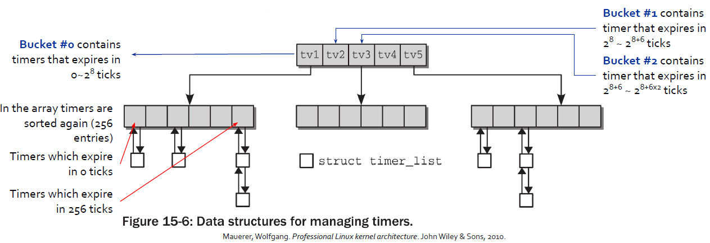
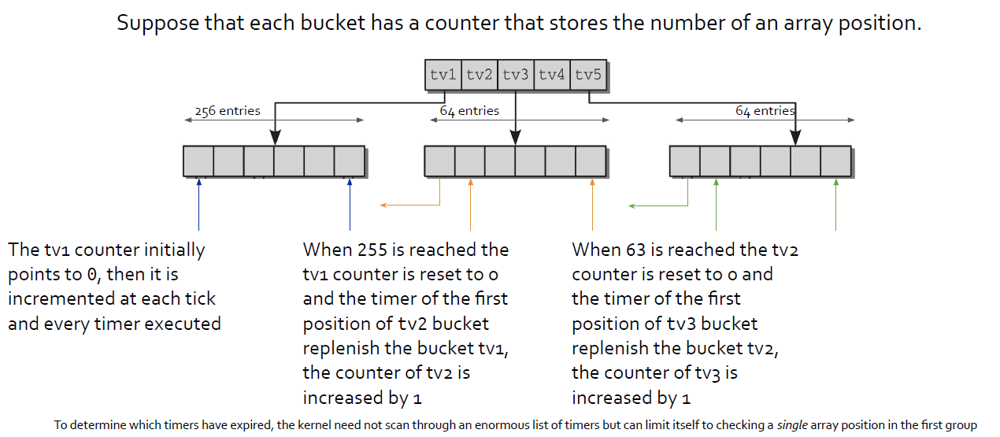

# Core concept AOSV 2020-2021

## Boot sequence (Basically slide 0)
When we click the power button the OS is not magically loaded instantaneously.
The Boot sequence is:
1. BIOS/UEFI (hw setup)
2. Bootloader stage 1 (only in bios) (jump to stage 2)
3. Bootloader stage 2 (load and start the kernel)
4. Kernel (initialize the machine)
5. Init (systemd) (basic enviroinment initialization)
6. Runlevels/Targets (initualize user env)

##### BIOS/UEFI
In order to run the Kernel first we need to launch the BIOS or from the 2010 the UEFI.
The BIOS is the first program executed after booting the pc. It perform some HW check
and initialization for starting the OS. 
The UEFI perform basically the same operation of the BIOS but in a more modular way.
##### Bootloader stage 1 
Is present only in the BIOS. Is stored in the MBR (512 bytes). The role of this 
bootloader is only to run the 2nd bootloader because in the MBR there is not enough 
space to run directly the Stage 2. Instead the UEFI launch directly the Kernel (Stage 2)
##### Bootloader stage 2
The stage 2 is concretized with GRUB (or in the previous version LILO). Its role is to
launching the kernel. And usully allow the selection of the kernel image to run.
##### Kernel
Once the kernel has take control it perform some operation before passing the control 
to the end user.
- configure HW environment
- Mount the rootFS
- Configure internal DS
- Spawn the first process called init
##### init/systemd
The init process, that nowdays is replaced with systemd is the first process launched. 
It start as a daemon and it configire the software environment, loads the default runlevel
and spawn other processes. In Linux the only way to crate a new process is using the fork function.
So each process in Linux is a fork of init.
##### Runlevel/Targhets
The targets represent the state of the machine within the context of systemd. Before the use of systemd
they were also called runlevels and they where identified by numbers.
Every target has associated a set of programs or services that needs to be run.
 


## Real Mode and Protected Mode (X86)
##### Real Mode
The Real mode is an operative mode of all x86 compatible CPUs. The name is taken from the fact 
that in real mode adresses correspond to the real location in the physical memory. Is the mode 
that the CPU is at startup by default. In this mode the CPU is in a very basic state.
It has no cache enabled, the MMU is disabled so we cannot translate addresses from logical to linear 
and to physical. Only one core of the CPU is alive and we have no memory protecion and no privilege 
level nor multitasking. We have direct access to I/O and peripheral. Only 1MB can be addressed 
(20 bit of segmented memory), this memory wrap around. Finally we can run only 16 bit code.
##### Protected Mode
The protected mode was introduced with the 80286 (1982) and it was extended with memory paging
in the 80386 (1985). Since the CPU start in real mode the protected mode must be enabled during 
the startup.

This is done using the CR0 register. The CR0 register is a control register of the CPU and by 
modifying the bit in thos register we can modify the basic operation of the processor.
In order to enable the protected mode we need to set the 0 bit to 1 and for enabling paging
the 31th bit must be set to 1.  


## Segmented Memory
Starting from the intel 8086 the adressing memory is segmented. This means that a memory location 
is referenced by segment id and offset. The **Logical Address** can be represented by seg:offset.
There are 4 bassic 16-bit segment register CS, DS, SS, ES.

Nowdays the segmentation is still present and cannot be disabled. Each asm instruction that uses memory
implicitly uses a segment register:
- jmp uses CS
- push uses SS
  
Most of the segment addresses can be loaded with mov instruction but CS only with jmp or call.

In protected mode a segment in no longer a number but it contains an index to a table of segment descriptors.
There are three type of segments: code, data and system. And the main section on the entry of this table are:
- Base linear address to base of the segment
- Limit is the size of the segment
- DPL descriptor privilege level, number from 0 to 3 to control the access to the segment

The segment descriptor are stored either in the GDT and the LDT (global/local descriptor table),
pointed by the GDTR and LDTR. Each segment register contain a segment selector Beside of the
index to the GDT also contains TI (the table indicator 0/1 = GDT/LDT) and the RPL.

In Linux kernel the segmentation is not used but sice the segmentation canno be disbled all the segment
specified code_user code_kernel data_user data_kernel have base 0 and limit max.
therefore all processes may use the same logical addresses and coincide with the linear addresses.


## Difference between BIOS/UEFI
Both BIOS/UEFI can be used at startup of the computer to initialize the HW and to load the 
chosen Kernel. **BIOS** work by using the first sector of the hard drive (MBR limited to 512 bytes) 
wich has the next address to code. The BIOS still work in 16-bit mode, limiting the amount or
code that can be executed from the ROM. **UEFI** does the same task of the BIOS but it store 
the startup in an .efi file instead in the firmware. This file is stored into a particular 
partition called EFI System Partition (ESP). This partition also contain the bootloader program.
UEFI implement also the secure boot. UEFI can allow only authentic drivers and services to load at 
boot time, making sure that no malware can be loaded at computer startup. The UEFI has also:
- Ability to use large disks partitions (over 2 TB) with a GUID Partition Table (GPT)
- 32-bit (for example IA-32, ARM32) or 64-bit (for example x64, AArch64) pre-OS environment
- Modular design


## What BIOS does (including stage 1 and 2 bootloader)
At the startup the CPU starts executing instructions located at a precise memory called **the reset vector**.
For intel x86 is placed at: **0xF000:FFF0**. On IBM pc s that memory is bounded to a ROM the so-called BIOS

The first instruction fetched by the BIOS is: **ljmp $0xf000,$0xe05b**. This starts the actual BIOS code, 
the long-jump also sets CS to 0xf000.

The usual operation that bios does are: executing POST checks, load boot order configuration, copying itself
in ram (**shadowing**) for fast access and **identifying the Stage 1 Bootloader (512bytes) using the specifiedboot**
**order and loading it in RAM at address 0000:7c0**. Finally ljump to the stage 1 bottloader.

##### Stage 1 bootloader (MBR)
The stage 1 bootloader must enable the A20 line, switch to 32-bit protected mode, setup a stack, give control to 
stage 2 bootloader.
##### Stage 2 bootloader (GRUB&UEFI)
The stage 1 bootloader (MBR) leaves the control to stage 2 bootloader which has the role of starting the kernel.
In Linux Distributions we usually have GRUB (formerly LILO), it uses /boot/grub/grub.conf for loading the startup entries.

If we have a UEFI instead of the BIOS the UEFI boot manager takes control right after powering on the machine.
It looks at the boot configuration, loads the firmware settings from the nvRAM and then uses startup files located
in a specific FAT32 partition that must be created ad hoc (ESP - EFI System Partition).


## What is the MBR
The first sector of an hdd (512 bytes) contain the MBR, wich store **executable code** to function as a loader for the 
installed operating system, and the partition table of the disk. We have only a 384 bytes program for starting the OS!


## Privileges and Protection how it works and how are implemented (DPL CPL RPL, Gates)
The privilege in the CPU is represented as a number from 0 (high priv) to 3 (low priv). 
Increasing the ring (0->3) should be allowed instead the opposite should be denied or **controlled**.

We have three privilege fields:
- **RPL** is the RequestorPL 
- **CPL** is the CurrentPL
- **DPL** is the DescriptorPL

The memory protection is enforced in two cases: when memory is accessed through a linear address, or 
when a data segment is loaded from a selector (max(cpl, rpl)<=dpl).

Accessing a segment with a higher privilege can be done only by passing trough a **gate**.
Gates are a way to control the access to higher privilege. 
Gates are represented again by descriptors. There are different kinds of gates descriptors:
- interrupt-gate descriptors
- trap-gate descriptors
- task-gate descriptors

These descriptors are referenced by the Interrupt Descriptor Table (IDT), pointed by the IDTR register


## Paging Memory (and TLB Translation Lookaside Buffer, Little of long mode in X86_64) (TEORY)
The paging is a strategy that represent the memory as a set of pages of foxed size (usually 4kb).
A page is a set of contiguous linear address. In order to enable paging, that is required before 
entering in 32-bit protected mode, some data structures need to be set up. In the MMU there is a 
Paging unit that translare the linear addresses to physical ones. The paging permit also to have a
smaller granularity for memory protection since all the request to the paging unit are checked in
order to see if the access can be granted or not.

The data structures that need to be setup are the so called page tables. The linear address id divided
in 3 or more parts (in 3 we have 2 level of indirection). We have the directory, table and offset selector.

Every process have its own page directory, But there is no need to allocate all the page tables.

Since the translation from linear to physical address can take time in order to save time we have the 
TLB (Translation Lookaside Buffer) that store the Virtual page number to the physical page number.


## Multi Core (LAPICs and APIC Bus)
For legacy reasons, startup code is always sequential and it is executed by a single core (the master).
At startup only one core is active and the others are in idle state. In order to wake all the other core
we need to use the Local Advanced Programmable Interrupt Controller (Local-APIC) wich is used to send 
inter-processor interrupts requests (IPIs).The I/O APIC contains a redirection table which is used to 
route the interrupts it receives from peripheral buses to one or moder LAPICs.

We can use the IPIs to wakeup cores, make them execite some function and more. The IPIs can be send to 
single, all, or a subset of cores.

---
**end s 01**

---

## What the kernel does in its initial life
The Stage 2 Bootloader (or UEFI) loads in RAM the image of the kernel. This image is really different 
from the one that we have at steady state (CPU start in real mode with 1MB of RAM).
The first fetched istruction is a jump to start_of_setup. During this time the kernel 
set up a stack, zeroes the bss section and then call the main(). The goal of the main is to prepare
the machine to enter in protected mode. So enable the A20 line, setup the IDT and the GDT, and setup 
the memory. It ask to the bios the avaiable memory to create a physical address map. At the end of the main
it call the go_to_protected_mode() that setup the PE in CR0 and setup the data segment and a temporary stack.
Then jump to startup_32() #primary (in protected mode) here set the segment to known value, load a new stack,
clear again the bss, locate the actual position in memory and call extract_kernel().

After the decompression of the kernel the true image of the kernel can run and this is done with a ljump to 
startup_32() (now in the kernel decompressed). This function set the environment for first linux process.
It initialize the segmentation register, clear again the bss, build the page table, enable paging, create 
the final IDT, and finally jump to arch dependent kernel entry point (start_kernel()).


## Kernel Page tables (how are set, where, and what are their particularities)(initialization and bootstrapping)(PRACTICAL)
During the initialization the steady-state kernel must take control of the available physical memory. 
When starting the kernel must have an early organization setup out of the box. And so the kernel use a 
set of statically generated page tables.

On 32bit architecture, the process address space is divided in two parts: user/kernel (first 3GB)
kernel only (last 1GB from 0xc0000000). What should be kept in mind is that addresses lower than 
0xc0000000 (value often referred as PAGE_OFFSET) depend on the specific process, the others are 
the **same for every process and equal to the corresponding entries of the Master Kernel Page General Directory**.

After the system initialization this set of pages tables (Master Kernel Page Global Directory) is never 
used by any process or kernel thread, but the highest entries will be the reference model for the
corresponding entries of the Page Global Directories of every regular process in the system.

A provisional Page Global Directory (PGD) is initialized statically during the kernel
compilation, while the provisional Page Tables are initialized by startup_32().

Suppoding that all the kernel segment, the privisional page table and the dynamica area fits 8 MB
ew need 2 pages of 4MB. The objective of this phase of paging is to allow these 8MB of RAM to be easily
addressed both in real mode and protected mode (bootstrapping). That memory area the physical address 
must be equal to the virtual one. This strategy is realized by declaring statically 4 entries in the swapper_pg_dir:
- Entry 0 and 0x300 (768) point to pg0
- Entry 1 and 0x301 (769) point to pg1

**The main data structures for memory management in the kernel are:**
- Kernel Page Tables: keeps the memory mapping for kernel level code and data
- Core Map: keeps the status information for any frame (or page) of the physical memory and the free memory frames for any NUMA node


## How physical memory is managed (including the main struct, NUMA architectures)(see also s3)
Today the architecture of a computer  allow to organize memory in nodes (NUMA NODES). This representation is because the memory access latency
heavely depends on the distance between CPU and the memory bank. So for example if we have more than one CPU, each CPU should use the memory node
closer to the CPU. In the linux kernel each node is represented by the struct pg_data_t and all nodes are kept into a linked list NULL terminated.
The physical memory is divided in three areas: the ZONE_DMA, the ZONE_NORMAL and the ZONE_HIGHMEM. The ZONE_DMA is mapped by the kernel in the 
lower part of the memory and is destinarted to ISA (Indistry Standard Architecture) devices (in X86 is the first 16MB). Then The ZONE_NORMAL is 
direclty mapped by the kernel into the upper region of the memory (for X86 from 16MB to 896MB). Finally the ZONE_HIGHMEM is not directly mapped 
by the kernel and for X86 start from 896MB to the end of the avaiable memory. (page table is usually located at the top begining of ZONE_NORMAL)
The fundamantal data structure used for physical frame allcoation is the **struct page**(mem_map_t), this struct is associated to each physical frame 
avayable in the system. In this struct are present the flag if the page (if locked, dirty etc..), the usage counter that need to be zero in 
order to free the page and come link to the list where all the page belongs. 


## Bootmem vs Memblock allocator ( see also book )
### What is the role of the bootmem allocator?
The bootmem allocator is needed durindg the boot phase in order to allocate portion of the memory when the proncipal memory allocator aka
Buddy allocator or the SLAB allocator are not alredy loaded and initialized. It uses a bitmap to see wich 4kb pages are free or busy. 
So even if is not as performant as the buddy and the SLAB is used ad bootime when there are only few request for allocating memory. 
Is required because it's unpractical to initialize all the core kernel data structure at compile time (only the memory map of the 
initial kerne image is initialized at compile time). 
After the boot the mem_init() function frees all the memory to the buddy allocator.
The bootmem allocator was replaced with the memblock allocator (from version 5+).
### What is the role of the Memblock allocator?
The memblock allocator is a method to manage the region at the early boot time. When the user kernel memory allocator (SLAB and Buddy)
are not alredy running. the memblocl dofferently to the bootmem doesn't uses a bitmap but uses collection of memory region to keep track
of allocated memory regions. Memblock sees the memory syystem as a set of continuous regions. And there are different types of this regions.
There are collection for **memory** for **reserved** and **physmem** regions. The memory regions contains the memory avauable to the kernel
may differ from the physical memory. Then there are the reserved memory, that are the memory regions alredy allocated. And then there are 
the physmem that is the representation of all the physical memory. 
After the boot the mem_init() function frees all the memory to the buddy allocator.


## main operation of start_kernel()
1. setup_arch() that initializes the architecture
2. build_all_zonelists() - **builds the memory zones**
3. page_alloc_init() / mem_init() - the steady state allocator (**Buddy System**) is **initialized** and the boot one removed
4. sched_init() - initializes the **scheduler**
5. trap_init() - the final **IDT** is built
6. time_init() - the **system time** is **initialized**
7. kmem_cache_init() - the **slab allocator** is initialized
8. arch_call_rest_init() / rest_init() - prepares the environment
   1. kernel_thread(kernel_init) - starts the kernel thread for process 1 is created
      1. kernel_init_freeable() -> prepare_namespace() -> initrd_load() - **mountsthe initramfs**, a temporary filesystem used to start the init process
      2. run_init_process() -> kernel_execve() - **Execute /bin/init**
   2. cpu_startup_entry() -> do_idle() - starts the **idle process**

---
**end s 02**

---

## What is the ZONE Wathermarks
The zone wathermarks are a sort of indicator of  the level of usage of the ZONE MEM.
These wathermarsk are used by the daemon kswapd in order to function correctrly.

Each ZONE (LOW NORMAL HIGH) has three wathermarks that kelp to keep track the pressure of 
a zone is under. The three wathermarks are:
- pages low: the daemon kswapd is woken up by the buddy allocator
- pages min: the allocator will do the kswapd work in a synchronous fashion
- pages high: at this level the pages are balanced and the daemon kswapd is put on sleep.

## Buddy System
The buddy allocator is an allocator that try to solve the external fragmentation problem.
The buddy system allocator keeps all the free pages grouped into 11 list of block with 
the same size of contiguous frames (1,2,4,8,16,32,64,128,256,512,1024) each frame correstpond to 4MB.

The data structures used by the algorithm are:
- the **mem_map array**, that is the **core map**. Actually, each zone is concerned with a subset of the mem_map elements
- an **array of eleven elements of free_area_t**, one for each group size. 

##### Allocation
Suppose that you want to allocate 256 contiguous page frames, the algorithm check if there is
a free 256 block, if not it checks in the list of 512. If it exists it allocates 256 pages for satisfying
the request and the other 256 are added into the list of free 256-page-frame blocks. If there is
no free 512-page block the kernel looks for next larger block, 1024. If it exists, it allocates 256
of the 1024 page frames to satisfy the request, then inserts the first 512 of the remaining 768
into the list of free 512-page-frame blocks and the last 256 pages frames into the list of free
256-page-frame blocks.
##### Deallocation
When freeing memory, the kernel attempts to merge a pair of buddy blocks of size b together
into a single block of size 2b. Only if (i) they have the same size, (ii) they are contiguous, (iii)
the physical address of the first block is multiple of 2 ⨉ b ⨉ 2^12.


## What is the High Memory
On x86 the kernel directly maps only ZONE_DMA and ZONE_NORMAL for a total of 896MB. But we have 
more than 4GB of RAM and in a sistem with 32-bit addressing 4GB is the limit. So we have more 
physical memory than the virtual addressable one. And there was the need to introduce the hughmem.

In the kernel address space (on IA-32 sys) there is a section called persistent mappings for mappings
pages from zone highmem. This is the solution to map all the memory that exceed the 896MB of the zone 
normal into the persistent mappings area (that is not persistent). 

The kernel virtual address spaces from address PKMAP_BASE to FIXADDR_START is reserved
for a PKMap, namely a Persistent Kernel Map located near the end of the address space.
There are about 32MB of page table space for mapping pages from high memory into the
usable space.

For mapping pages, a simple PT of 1024 entries is stored at the beginning of the PKMap area
to allow the temporary (very short time) mapping of up to 1024 pages from high mem with
functions kmap() and kunmap().


## How is done the Memory finalization
The finalization of memory management is done within the function mem_init() which is in
charge of destroying the bootmem allocator, calculating the dimensions of low and high
memory and printing out an informational message to the user.

The free_all_bootmem is called by each NUMA node and in the end it calls
free_all_bootmem_core which does the following For each unallocated pages known to the allocator of that node:
- clears the PG_RESERVED bit
- set usage count to 1
- call __free_pages() so that the buddy allocator can build its free lists

Free all pages used for the bitmap and give them to the buddy allocator.
When free_all_bootmem returns all the pages in ZONE_NORMAL have been given to the buddy
allocator, the rest of free_pages_init initializes the high memory.

At this point, the boot memory allocator is no longer required, and the buddy allocator is the
main physical page allocator for the system. Note also that not only is the data for the boot
allocator removed, but also all code that was used to bootstrap the system.

## FAST Allocators (Quicklist and SLAB)
Generally in the kernel, fixed size data structures are very often allocated and released. And in this
situation the buddy system does not scale. the Buddy system on each numa node is protected by a spinlock
and internal fragmentation can rise too much in this kind of situation.

So for allocating this fixed structures that requires a frequent allocation and deallocation, for 
example the allocation or release of page tables the function that does that relies on Kernel-level
fast allocators.

There are two kind of fast allocator:
- **Quicklist** used only for paging
- **SLAB allocator**

##### Quicklists
The Quicklists are used for inplementing the page table function (pgd,pmd/pte_alloc). We have three quicklist
for each CPU. And generally the implementation are the same for all the arch.

One method is the one of using the LIFO (Last-In First-Out) approach. During the allocation,
one page is popped off the list, and during free, one is placed as the new head of the list. This
is done while keeping a count of how many pages are used in the cache.
If a page is not available in the cache, then it will be allocated by using the Buddy System.
##### SLAB 
The main idea of the SLAB is to have chaces of the commonly used objects kept in a initialied state.
The SLAB allocator consists of a variable number of caches, linked together by a doubly linked list called cache chain.
Each cache manage its own kind of objects. And each cache mantains a block of cotiguous pages in memory called slabs.

The SLaB try to: (1) allocating small blocks of memory to help eliminate internal fragmentation, (2) caching commonly 
used blocks so that the system does not wait time allocating, initializing and destroying object and (3) better usage 
of L1 and L2 caches by aligning objects.

##### 1 small blocks to eliminate internal fragmentation
Two sets of caches are maintained for allocating objects from 2^5 (32KB) to 2^17 (131’072KB)
bytes. One for DMA and one for standard allocation. One for DMA and one for standard allocation.
These caches are called size-N (or size-N(DMA)), where N is the size of the allocation and they 
are allocated with the function kmalloc().
##### 2 caching commonly used blocks
When a new slab is created a number of objects are packed into it and initialized using a
constructor if available. When an object is free’d, it is left in a initialized state so the next
allocation will be faster
##### 3 better usage of L1 and L2 caches (coloring)
If there is space left over after objects packed into a slab, the remaining space is used to color
the slab. Coloring is used for having objects in different line of CPU caches which helps ensure
that objects from the same slab cache will unlikely flush each other.


## CPU caches and False Sharing problem
Caches lines are generally small (32/64 bits), the macro L1_CACHE_BYTES sets the number of bytes for the L1 cache.

Independently of the mapping scheme, close addresses fall in the same line but cache-aligned
addresses fall in different lines. We need to cope with cache performance issues at the level of
kernel programming (typically not of explicit concern for user level programming).

In some processors between a slower memory and a High speed register is placed a cache (High speed memory). When a read to this slower memory 
is requested a portion of this memory is stored inside the cache (this in order to optimize the time for reading on the same spot of memory).
The false cache sharing problems occurs when in the same cache line there are two value (eg fst and snd in a struct) that are not logically 
relate one to the other and so, for example if we have on the same line a costant value and a counter even if the costant value is the same
during the time of the execution of the program whenever the counter is updated the cache line is uotdated and so alco the value of the 
costant value. so even if the costant value is the same each time need to be reloaded from memory when is read after that the counter is 
updated. The solution for this is project well the data structure and place as distant as possible two value that are no logically related.

## Large Allocations and vmalloc (vmalloc and kmalloc)
It is preferable when dealing with large amounts of memory to use physically contiguous pages in memory both for cache-related 
and memory-access-latency reasons. But due to external fragmentation problems with the buddy allocator, this is not always possible.

Linux provides a mechanism through vmalloc() where non-contiguous physical memory can be used that is contiguous in virtual memory.
In the kernel address space there are a space limited to 128MB for vmalloc.
##### vmalloc vs kmalloc
Allocation size:
- Bounded for kmalloc (cache aligned): the boundary depends on the architecture and the Linux version. Current implementations handle up to 8KB
- 64/128 MB for vmalloc
  
Physical contiguousness
- Yes for kmalloc
- No for vmalloc

Effects on TLB
- None for kmalloc
- Global for vmalloc (transparent to vmalloc users)

---
fst day 

**end s 03**

---

## What are the System Calls and how works (also dispatcher and parameter in x86 trough register)
The system calls are a way that Linux offer to user mode processes to interacting with HW devices.
So the System calls are interfaces to interact with HW devices. This has several advantages: 
making programming easier, increasing system security, increasing the programs portability.

There is a difference between an API and a system call. Since the former is and function definition 
that wrap the syscall and the latter is an explicit request to the kernel made via a software interrupt.
The POSIX standard only refers to API and not to system calls, a system that is POSIX compliant offers 
the set of POSIX APIs.

##### Syscall handler (dispatcher)
When a User Mode process invokes a system call the CPU switches to Kernel Mode and starts
the execution of a kernel function. In the 8086 system calls can be invoked in two ways but
both end with a jump to an assembly language function that is called the system call handler.
Each system call is identified by a system call number which must be expressed by the user
mode process before starting the invoking process. This must usually be passed in the EAX
register. (the kernel does not set errno, that is set by wrapper routines)
The system call handler is very similar to other exception handlers.

The system call handler, when invoked:
1. saves the content of most registers in the Kernel Mode stack
2. handles the system call by invoking a corresponding C function called system call service routine (via a call)
3. after completing the execution of the system call the registers are loaded with the values saved in the Kernel Mode stack and the CPU is switched back to User Mode

To associate each system call number with its corresponding to the corresponding service
routine the kernel uses a system call dispatch table, which is stored in a fixed size array called
sys_call_table array and has NR_syscall entries (289 in v2.6).
Remind that NR_syscall is not the actual number of implemented system calls, is only the size
of the possible maximum number of system calls, therefore there are free slots.

System calls are special function. The parameters are alway passed trought the CPU register because the system calls are function that 
cross user and kernel space, and for this reason neighter the user mode stack nor the kerner stack can be used. The syscall dispathcer 
then copies the paramethers from the CPU registers into the kernel stack.  In a X86 machine the register are used followind this order
here: eax, ebx, ecx, edx, esi, edi and ebp. And this is usefoul for portability because the dispatcher then place the register in the 
right spot in the stack and this help for portability reason.


## How the syscall can be invoked in x86 (int 0x80 and sysenter)
On the x86 architecture the syscalls can be invoked using the INT 0x80 instruction or the SYSENTER instruction 
(supported from the kernel 2.6 after pentium II). The handlers for the two methods are system_call() and sysenter_entry(). 
The INT 0x80 instruction is registered as a trap gate and this instruction is slow because need to perform all the security check for 
an interrupt. Instead the sysenter instruction is more fast (is also called Fast System Call by intel) because it provides a faster way 
to switch from user mode and kernel mode using three MSR register. Obviously a libc wrapper can call the sysenter instruction only if the 
CPU and the kernel support it and in order to doing that the libc invoke the __kernel_vsyscall() in the vsyscall page where is placed at 
boot time the more performant way to invoke a syscall.
When a User mode process invoke a syscall the CPU switch to Kernel mode and start the execution of a kernel function. Both the INT 0x80
and the sysenter instruction end with a jump to the syscall handler (dispatcher). Each syscall is identified by a number (in x86 in eax register) 
the dispatcher use this identifier by searching in the syscall table to identify the right syscall routine. The syscall handler is similar 
to other exception handler. The syscall handler forst store the context of most of the register, then via a call invoke the C function 
(syscall service routine find by the dispatcher searching into the syscall table) then after the syscall ser routine and the execution 
the user mode context is Restored with in eax the output of the syscall. The paramether of the syscall are passed all (up to 6) in the CPU
register because the syscall is a function that cross user and kernel mode and so neighter the user nor kernel stack can be used. This
is usefoul also for portability reason because only a little portion of the code change from changing the architecture of the machine
(the portion of store and restore the registers) 


## Kernel can call a syscall? why cannot use the same approach as in the user mode (kernel wrapper routines)
##### from kernel threads
Although system calls are used mainly by User Mode processes, they can also be invoked by
kernel threads, which cannot use library functions. To simplify the declarations of the
corresponding wrapper routines, Linux defines a set of seven macros called _syscall0
through _syscall6, where the number in the name is the number of the pass-able
parameters (excluding the system call number) (_syscallX(type, name, type1, arg1, ....)).

The wrapper routine to the fork() system call could be _syscall0(int, fork)

##### in kernel
System calls are, as stated above, interaction points between userspace and the kernel.
Therefore, system call functions such as sys_xyzzy() or compat_sys_xyzzy() should only be
called from userspace via the syscall table, but not from elsewhere in the kernel. 


## What is the vsyscall page and the vDSO 
The vsyscall page had several limitations:
- it was fixed in size
- it was allocated always at the **same address in processes**
  
The vDSO that stands for Virtual Dynamic Shared Object has been introduced for solving the
security issues of the vsyscall architecture. The vDSO is dynamically allocated which solves
security concerns. The vDSO links are provided via the glibc library. The linker will link in the glibc
vDSO functionality, provided that such a routine has an accompanying vDSO version, such as
gettimeofday system call. When your program executes, if your kernel does not have vDSO
support, a traditional syscall will be made.
The vDSO is a small shared library that the kernel automatically maps into the address space
of all user-space applications. Applications usually do not need to concern themselves with
these details as the vDSO is most commonly called by the C library. This way you can code in
the normal way using standard functions and the C library will take care of using any
functionality that is available via the vDSO.


---
**end s 04**

---

## Interrupt vs Exceptions
An Interrupt signal usually is an electric signal. This interrupt signal alter the sequence
of istruction that the CPU execute. When an Interrupt Signals is received by a CPU, the CPU
need to switch to another activity (interrupt handler in kernel mode) running at the expense 
of the same process that was running when the interrupt occurred.

Interrupt handilng is a high sensitive task. It need to satisfy the following constraints:
- The process that receives the signal must **go out of the interrupt as soon as possible** and
  **defer** the work to be executed later. (critical part / deferrable part).
- The **nesting** should be allowed as much as possible (so interrupt signal to an interupt handler)
- Even if nesting allowed should be present critical regions in which interrupts must be temporarily 
  disabled and these regions must be used only in case of strict necessity

There are two kind of Interrupt Signals:
- Synchronous  (called exceptions) 
- Asynchronous (called interrupts)
##### exceptions
Are produced by the CPU control unit while executing instructions, they are generated 
after the execution of an instruction. Can be generated when the CPU detects an anomalous condition,
(**Processor-detected exceptions**) according to the eip (Instruction Pointer) value they are divided in:
- **Fault** can generally be corrected, eip is the address that caused the fault so the instruction 
  will be re-executed returning from the Int. Handler
- **Traps** debugging purposes, eip points to the next instruction after the trapping one.
  are reported immediately after the execution of trapping instruction
- **Aborts** the eip cannot be restored to a precise position Handler, process will be terminated.

Or can be generated at request of programmer (**Programmed Exceptions**) triggered by the instructions 
int, int3, into and bound. These interrupts are treated like traps and they are often called also 
software interrupts they are used for implementing syscall or debugging purposes.

##### interrupts
Are generated by other HW devices in an asynchronous fashion. Usually are generated 
by timers and I/O devices. And can be divided in two categories:
- **Maskable Interrupts**. All interrupts requests (IRQs) issued by I/O devices are maskable.
- **Non-maskable Interrupts**. A few critical events are non-maskable, like hw failures


## How IRQs and Inter-Processor Interrupts work
Each hardware device controller capable of issuing interrupts requests usually has a single
output line designated as the Interrupt Request line (IRQ). All of these lines are connected to
the input pins of a hardware circuit called the Programmable Interrupt Controller which performs 
the following actions:
```python
while true:
   if (one or more IRQ line are active):
      selected = IRQ line active with lower pin
      vector = convert(selected)
      expose_to_io(vector)
      signal_to_INTR() # bloking until CPU ack signal
      clear_INTR_line()
```

Each IRQ line can be disabled, those interrupt are not lost since the PIC sent this
interrupt to the CPU as soon the interrupt are re-enabled. Enabling and disablig the
interrupt are not the same as masking or unmasking.
- **enabling/disabling** is done by communicating with the **PIC**
- **masking/unmasking** is done by **clearing and setting the IF flag** in the EFLAGS register,

In a single CPU the PIC can be connected with the INTR line of the CPU. But in a multicore system
the pic need to be in contact with all the core (we don't want that only a sigle core handle all the 
interrupts). So the Inter introduced on multicore system the APIC (Advanced Programmable Interrupt
Controller), and each core has its own Local-APIC. All the LAPICs are connected to an external
I/O APIC.

In the APIC the interrupt priority is written in the redirection table (while in the PIC was given by 
the lowest number). In the APIC (in a multicore system) External interrupts can be distributed in two ways:
1. **Static Distribution**. IRQ signal delivered to LAPICs listed in the proper entry of the redirection table
2. **Dynamic Distribution**.IRQ signal delivered to LAPIC of the processor that is executing the process with lowest priority.

A multi-APIC system also allows to generate inter-processor interrupts (IPI), by using the ICR
register. The IPIs are a critical part of a SMP system, in Linux they are used for exchanging
messages between the CPUs.


## Activation Scheme for Interrupts and Exceptions
The Interrupt Descriptor Table associates each interrupt or exception vector with address of
the corresponding interrupt or exception handler. Similarly to the GDT, each entry of the table
corresponds to an interrupt or exception vector and consists of 8-byte descriptor. Thus we need 
256*8=2048 bytes to store the table. The IDT is pointed by the IDTR register so it can be anywhere 
in memory.

There are different types of entries:
- **Interrupt Gate** Are **used to handle interrupts**. Transferring the control the CPU 
  **clears the IF flag disabling the maskable interrupts**. 
- **Trap Gate** Are **used to handle exceptions**. Same as Interrupt Gates but **the IF flag is not cleared**. 
- **Task Gate** These gates were intended to be used for process switch, **today they are no more used**.

The check if an interrupt arrived is done after the execution of every asm instruction. Then, if
the check is positive, the following steps are executed:
1. determining the vector i (o<= i <= 255) associated with the interrupt/exception
2. read the i entry in the IDT referred by IDTR
3. get the base address of the GDT from GDTR and read the segment descriptor for that
4. If CPL < segment DPL --> General Protection Error
5. If programmed exception and if gate DPL < CPL -> General Protection Error
6. If CPL is different from segment DPL (there is a context switch)
7. If there was a fault CS and EIP are loaded with the logical address of the instruction 
   that caused the exception so that it can be executed again
8. EFLAGS, CS and EIP are saved in the stack
9. If the exception carries an error code it is saved in the stack
10. CS and EIP are loaded with the reference to the Interrupt Handler from the i entry of IDT

Every interrupt or exception gives rise to a kernel control path or separate sequence of
instructions that execute in Kernel Mode on behalf of the current process. These paths may
arbitrarily nested by another interrupt handler, thus giving rise to a nested execution of kernel
control paths.

The price to pay for allowing nested kernel control path is that an interrupt handler must
never block, i.e. no process switch can be done while an interrupt handler is running because
we have saved the context in the Kernel Stack of the previous process.


## Exception Handling 
The majority of the exception are intepreted by linux as error condition, and most of the 
time the Kernel send to the process that generated the exception a signal.
But in some cases the Linux kernel exploits exceptions to manage HW resources more 
efficently as in the case of Page Fault.

The standard structure of an exception is the following:
1. **save** context in kernel stack
2. **handle** the exception (c function)
3. **exit** restore the context

The C functions which handle the exceptions are registered during trap_init().

The only task gate is referring to the Double Fault exception, because it denotes a serious
kernel misbehaviour. Therefore, exception handler does not trust the value in esp register.
A Double Fault occurs when an exception is unhandled or when an exception occurs while the
CPU is trying to call an exception handler.


## Fixup and Pagefault Handler
In general, there may be the case that when a user space process calls a system call it passes a
parameter to a memory area. When this pointer is passed to Kernel Space the kernel may
check it in on of the two ways:
- check if the address belongs to the process address space
- check if the address is lower than PAGE_OFFSET

The first, more time consuming so the second is performed nowdays. the idea is to the defer
as later as possible the true check.

access_ok() only performs a coarse check but if it passes then the address can be still not be
valid for that process, therefor a Page Fault can be raised when:
1. kernel attempts to address a page **but the frame does not exist or it is read-only**;
2. kernel addresses a page  but **the corresponding entry in the Page Table has not been yet initialized**;
3. there is **bug in the kernel or an hardware error**;
4. a system call service routine attempts to read or write into a memory area whose address has been passed as a **system call parameter** by it does **not belong to the process address space**.

In the first case the kernel checks if the linear address belongs to the process, in the second
case it is again easy to recognize by looking at the Master Kernel Page Table entry. But how
the other two cases?

##### Fixup
Only a small group of function and macos are used to access the process address space within the kernel
thus if the exception is caused by an invalid parameter the instruction that caused it must be included 
in one of the functions.

For this reason, the addresses of these functions are put in a exception table and the
do_page_fault() handler will look at the table: if it includes the address of instruction that
triggered the exception the error is caused by a system call parameter, otherwise by a more
serious bug.

The kernel exception table is stored in the __ex_table section of the kernel and each entry
contains:
- **insn** that is the **address of an instruction that accesses the process address space**
- **fixup** that is the **address of the assembly code which solves the problem**. 

Activation step of fixup:
1. access to invalid address e.g. from get_user()
2. MMU generates exception
3. CPU calls do_page_fault
4. do page fault calls search_exception_table()
5. search_exception_table looks up the address of current->eip in the exception table and return the address of the fixup
6. do_page_fault modifies its own return address to point to the fault handle code and returns
7. execution continues in the fault handling code:


## Interrupt Handling (I/O)
An I/O Interrupt Handler must be enough flexible to service several devices at the same time,
but the IRQ lines are in general shared by multiple devices, so reading only the IRQ line
number it will be not sufficient to understand which device issued it.

There are two different situations:
1. **IRQ Sharing**. The interrupt handler executes all the interrupt routines related to the 
   devices that share the IRQ line. Every ISRs is always executed
2. **IRQ Dynamic Allocation**. An IRQ line is associated with a device at the last possible
   moment, for instance only when device is in use. In this way two devices cannot
   obviously use the same line at the same time.

The Interrupt Handler performs the following operations:
1. save the IRQ value and the register in the kernel mode stack
2. send the ack to the PIC
3. Execute all the ISRs related to that IRQ line (so of all the devices that uses that IRQ line)
4. terminate with ret_from_intr()


## Inter-Processor Interrupts (IPIs) Handling
In multi-core systems, an interrupt/trap event is delivered to only one core:
- other cores might be running other threads of the same application. This can lead to race conditions 
  or inconsistent state, due to the replication of hardware
- the hardware is time-shared across threads

We need a way to propagate an interrupt/trap event to other cores.

##### IPIs 
IPIs are interrupts also used to trigger the execution of specific operating system functions on
other cores. IPI are used to enforce cross-core activities (e.g. request/reply protocols) allowing
a specific core to trigger a change in the state of another. IPIs are generated at firmware level,
but are processed at software level:
- **synchronous** at the sender
- **asynchronous** at the receiver

And there are at least two priority for IPIs: High priority lead to immediate processing of the IPI
Low priority lead to queueing the requests.

The Linux kernel makes use of three kinds if inter-processor interrupts:
- **RESCHEDULE_VECTOR** force a CPU core to reschedule the process
- **INVALIDATE_TLB_VECTOR** force all the CPU to invalidate the TLB
- **CALL_FUNCTION_VECTOR** force all the CPU to run a function passed by the sender.

In order to send to the cores wich function they need to execute there is the need to register a 
specific action associated with the firing of an IPI.

Older version of the kernel were relying on a global data structure protected by a lock, 
but this solution was not very performant. Instead from Kernel 5.0, there is a per-CPU linked list 
of registered functions and associated data to process. Concurrent access relies on the lock-free list.


## Software Interrupts (SoftIRQs and Tasklet)
The SoftIRQ and the Tasklet are to deferring the non-critical work of the interrupt.
The main steps carried out on a deferrable function are the following:
1. **Initialization** Define a new deferrable function
2. **Activation** Marks the function as “pending” to be run the next time the kernel schedules a 
   round of executions of deferrable functions.
3. **Masking** Selectively disable a function so that it will be not executed even if activated
4. **Execution** Executes a pending deferrable function with other functions of the same type

Linux uses a limited number of softirqs. In general, Tasklets are used because are easier to
write and they do not need to be reentrant

##### Activation
The checks for pending softirq should be performed periodically but without too much
overhead. Here’s a list of significant points in the kernel in which the check is done:
- when softirqs are enabled on local CPU;
- when do_IRQ() finished processing;
- after a timer interrupt on LAPIC;
- after a CALL_FUNCTION_VECTOR;
- when a ksoftirqd/n kernel thread is wakened.

##### execution
The __do_softirq() reads the bit mask of the local CPU and executes the deferrable
functions corresponding to every set bit. While executing a softirq, another softirq may pop up
and in order to avoid that __do_softirq() never regain control to user processes it only
executes a fixed number of iterations, the remaining softirqs will be handled by ksoftirqd
daemon.

## Difference between SoftIRQs and Tasklet
Tasklets are built on top the SoftIRQs and the term softirq which often appears in the kernel
source refers to both of them. The main differences between these two kinds of deferrable
functions are:
SoftIRQs are statically allocated, they can run concurrently on several CPUs (even if
they are of the different type, they are reentrant functions and must explicitly protect
their data structures with spinlocks. While Tasklets are initialized at runtime (for instance 
when mounting a kernel module), they do not need to worry about race conditions on data structures 
since they are strictly controlled by the kernel. Tasklets of the same type are always serialized, 
they cannot run concurrently, they do not need to be reentrant.


## Difference between Tasklet and Work Queues
The worker queues have been introduced in Linux 2.6. They are similar to the deferrable
functions, but they are run by ad-hoc kernel-level worker threads.

Worker Queues always run in process context and they can perform blocking operations but
this does not mean that they can access user address space (as the deferrable functions).
Executing in process context is the only way for performing blocking operations (e.g.
accessing data to disk), remind that no process switch can occur in interrupt context.

Instead the Tasklet have been introduced in Linux 2.3. And they cannot sleep because
it run in SoftIRQ context, a tasklet always runs in the interrupt context and they 
are guaranteed to never be run concurrently on more than one CPU.


---
**end s 05**

---

## What are the main Clock and Time Circuits
The kernel mantain two way to keep track of the time:
1. keeping the current time and date
2. maintaining timers, mechanisms that are able to notify the kernel or a user program that a certain interval of time has elapsed

Time measurements are performed by hardware circuits based on oscillators.
In the 8086 architecture the CPU interacts with clock circuits that keep track of the time of day
and timer circuits, programmed by the kernel so that they issue interrupts at a desired time.

We have:
- Real Time Clock (RTC), independent of all the other chips and keeps track of the time of day, ticking even if the PC is off
- Timestamp Counter (TSC) it is a counter incremented from an external oscillator
- Programmable Interval Timer (PIT) its role is similar to an alarm clock it issues an interrupt at the wnd of the time
- CPU Local Timer (in the LAPIC) is similar to PIT but local to the processor.
- High Precision Event Timer (HPET) provides a number of programmable timers.

The Linux timekeeping architecture is a set of data structures and functions related to the flow
of time. There are some differences in time keeping between a multi and a single processor
architecture:
- in a **single-processor** system **all** time-keeping activities are triggered by interrupts **raised by a global timer**
- in a **multi-processor** system **general activities** (e.g. software timers) are triggered by the
   **global timer** but **CPU-specific activities** (e.g. monitoring the execution time of the
   current process) are triggered by the **local APIC timer**

Today we have only high-resolution timers (low-resolution timers or timer wheel timers are based
on the high-resolution timers)

The Clock Events are the foundation of periodic events. High Resolution Timers are based on
the Clock Events abstraction, whereas the low-resolution mechanism can come or from a
low-resolution clock device or from the high resolution subsystem. Two important tasks for
which low-resolution timers assume the responsibility are:
- handling the global jiffies counter
- perform per-process accounting

The jiffies variable is a counter that stores the number of elapsed ticks since the system was
started. It is increased by one when a timer interrupts occurs.


## How Work the Timer Wheel (low-resolution timers)
Timers allow a generic function to be activated at a later time, they can be dynamically
created and destroyed. Timers are associated with deferrable functions Linux does not 
guarantee that activation takes place at exact time

Earlier versions of the kernel used a single timer list sorted according to the expiration time.
This was significantly unreliable and inefficient. Newer versions of the kernel introduced the
so-called Timer Wheel a nested structure for efficiently retrieving timers.

We have multiple bucket. Bucket #0 contains timers that expires in 0~2^8 ticks
Bucket #1 contains timer that expires in 2^8 ~ 2^8+6 ticks Bucket #2 contains
timer that expires in 2^8+6 ~ 2^8+6x2 ticks.

2^8 = 256
2^6 = 64

The Bucket #0 contains 256 ticks (and linked list of timer that elapses for each tick)
the Bucket #1 contains another array of timers but this time is 64 item and each item has
2^8 ticks. A pointer is incremented each tick and point from 0 to the 255 position on 
bucket 0. When it reaches the 255 the pointer in the bucket 0 return to point to 0 
and the bucket 0 is filled with the timers contained in the first position of the 
array in the 1 bucket than the pointer in the 1 bucket will point to the next position
on the array and so on.





## Generic Time Subsystem
There are three main abstractions for providing time in the kernel:
- **Clock Sources** are the backbox of time management each clock provides a monotonically increasing counter with read only access
- **Clock event devices** add the possibility of equipping clocks with events that occurs in the future.
- **Tick Devices** extend the clock event sources to provide a continuous stream of tick events that happen periodically.

There are then two kinds of clocks:
- **global clock** that is responsible for providing the periodic tick for updating jiffies
- **local clock** one for each CPU for performing process accounting, profiling and high-resolution timers

The handling of timer interrupts are handled according to the top/bottom half paradigm
The top half executes the following actions:
- registers the bottom half
- increments jiffies
- checks whether the CPU scheduler needs to be activated, and in the positive case flags need_resched

## Watchdogs
A watchdog is a component that monitors a system for “normal” behaviour and if it fails, it
performs a system reset to hopefully recover normal operation.
This is a last resort to maintain system availability or to allow sysadmins to remotely log after
a restart and check what happened. In Linux, this is implemented in two parts:
- a kernel-level module which is able to perform a hard reset
- a user-space background daemon that refreshes the timer

At kernel level, this is implemented using a Non-Maskable Interrupt (NMI). The userspace
daemon will notify the kernel watchdog module via the /dev/watchdog special device file that
user space is still alive.

---
snd day

**end s 06**

---

## Memory barriers

## Spinlocks and Seqlocks

## Semaphore

## RCU

---
**end s 07**

---

## Common File Model

## /proc FS

## /sys FS

## What are the Kobjects

## Char vs Block devices

---
**end s 08**

---

## runlevels and targets

## systemd 

---
**end s 09**

---

## Describe the PCB

## How a new process is created (fork and exec) (initial step of a program)

## OOM killer 

## Process starting 

## ELF format

## Static relro vs Dynamic relro (PLT and GOT)

---
trd day

**end s 10**

---

## Describe the main Scheduler algorithm in the history of linux

## What is a scheduler

## Context Switch

---
**end s 11**

---

## Host vs Native Hypervisor

## Software-based Virtualization

## Ring De-Privileging

## Paravirtualization

## Hardware-assisted Virtualization (VT-x)

## Shadow Page Tables and Nested / Extended Page Tables (EPT)

## Containers 

## Cgroups

## Namespaces

## Container Runtimes and Docker

---
**end s 12**

---

## User Authentication

## Internet Security

## Secure Operating Systems

---
frth day

**end s 13**

---

# Lab arguments

## How to build the Kernel

## Write ASM in c

## Kernel Modules

## Hot Patching
