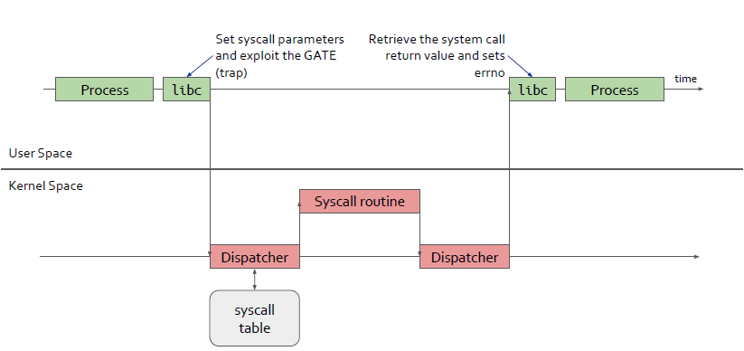
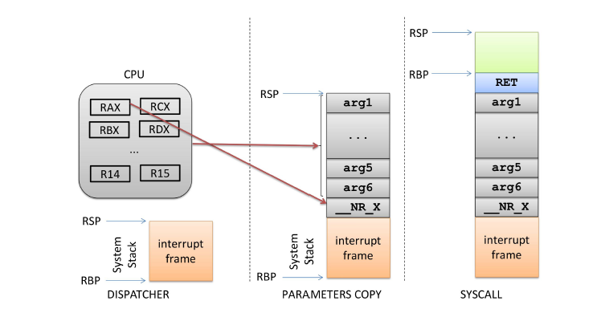
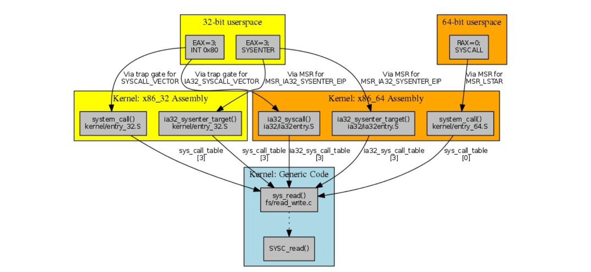

# Advanced Operative Systems and Virtualization

[[_TOC_]]

# System Calls

## Outline
1. Introduction
2. Handler/Dispatcher
3. Invoking Process
   1. User space invoking process
   2. Kernel wrapper routines
   3. X86_64 Invoking process
4. vDSO
5. Conclusion

# Introduction
Operating Systems offer processes running in User Mode a set of interfaces to interact with hardware devices. **This layer of protection between applications and hardware has several advantage:**

1. make programming easier (no studing low lwvel stuff)
2. invreasing system security, kernel can check the accuracy of the request before attempting to satisfy it
3. increasing the program portability (can be execited on every kernel that provides the same set of interfaces)

Linux implements most interfaces between User Mode and Kernel mode by means of system calls.

## POSIX APIs
There is a difference between an API and a system call. Since the first is an function definition and the second is an explicit request to the kernel made via a software interrupt.

Most of the the system calls API that are provided to programmers are given by the libc and they refer to **wrapper routines** whose purpose is the one of invoking a system call.

Usually, each system call has a corresponding wrapper routine but the converse is not true:
- the API could offer services directly in User Mode
- a single API function could make several system calls
- some API could wrap extra functions, for instance **malloc()**, **calloc()** and **free()** all use the **brk() system call** to enlarge or reduce the process heap and they keep track of the allocations.

**The POSIX standard only refers to API and not to system calls, a system that is POSIX compliant offers the set of POSIX APIs.**

# Handler / Dispatcher
## System Calls Handler
When a User Mode process invokes a system call the CPU switches to Kernel Mode and starts the execution of a kernel function. In the 8086 system calls can be invoked in two ways but both end with a jump to an assembly language function that is called the **system call handler**.

Each system call is **identified** by a **system call number** which must be expressed by the user mode process before starting the invoking process. This must **usually** be **passed** in the **EAX** register. All the system calls return an integer value, in general a positive or 0 indicates success, while negative values indicate error, in particular the negation of the error code -- **the kernel does not set errno**, that is set by wrapper routines.

The system call handler, when invoked:
1. saves the content of most registers in the Kernel Mode stack
2. handles the system call by invoking a corresponding C function called **system call service routine** (via a **call**)
3. after completing the execution of the system call the registers are loaded with the values saved in the Kernel Mode stack and the CPU is switched back to User Mode



## System Call Dispatch Table

To associate each system call number with its corresponding to the corresponding service routine the kernel uses a **system call dispatch table**, which is **stored** in a **fixed size array** called **sys_call_table** array and has **NR_syscall** entries (289 in v2.6), the nth entry of the array contains the address to the service routine for the syscall n.

Remind that **NR_syscall** is **not** the actual **number** of **implemented** system calls, is **only** the size of the **possible maximum number of system calls**, therefore **there are free slots**.

**In general the not-used entries points to sys_ni_syscall() which is the service routine for the “Non-implemented” system calls that always returns -ENOSYS.**

# Invoking Process
### Entering and Exiting a System Call

Native applications can invoke a system call in two different ways:
1. **int $0x80** was the only way in older versions of the kernel
2. **sysenter** introduced from Pentium II and supported from kernel 2.6

Similarly, the kernel can exit from a system call in two ways:
1. **iret**
2. **sysexit**

The handlers for the two methods are:
1. **system_call()**
2. **sysenter_entry()**

However maintaining the **compatibility** of both strategies int/iret and sysenter/sysexit is **not easy** as it might look for different reasons, for example the **kernel should allow to execute the system call even if the sysenter instruction is not supported**.

### int $0x80
**The 0x80 is registered during the trap_init() function as a trap gate.**

### sysenter/sysexit (Fast syscall)
The int assembly instruction is inherently slow, because it performs several consistency and security checks. The sysenter instruction is called Fast System Call by Intel, since it provides a faster way to switch from User to Kernel Mode, **the instruction make use of three MSR registers**

- SYSENTER_CS_MSR (segment selector of the kernel code segment)
- SYSENTER_EIP_MSR the linear address of the kernel entry point
- SYSENTER_ESP_MSR the kernel stack pointer

Obviously a libc wrapper **can use the systenter** instruction **only** if **both** the **CPU** and the **Linux kernel supports it**. This compatibility problem has a non-trivial solution.


During the kernel initialization phase the function **sysenter_setup()** **builds** a page frame called **vsyscall page**, **containing a tiny ELF dynamic library**. When a process issues an **execve()** system call to start executing an ELF program, the code in the **vsyscall page is dynamically linked to the process address space**. **The code in that page uses the best available instruction to issue a system call**, int $0x80 or sysenter.

Whenever a wrapper routine in the libc must invoke a system call it calls the function **__kernel_vsyscall()**, in the vsyscall page.

### sysenter/sysexit (Procedure)

###### sysenter
1. CS register set to the value of (SYSENTER_CS_MSR) (points to __KERNEL_CS)
2. EIP register set to the value of (SYSENTER_EIP_MSR) (points to sysenter_entry())
3. SS register set to the sum of (8 plus the value in SYSENTER_CS_MSR)
4. ESP register set to the value of (SYSENTER_ESP_MSR)

###### sysexit
1. CS register set to the sum of (16 + SYSENTER_CS_MSR)
2. EIP register set to the value contained in the EDX register
3. SS register set to the sum of (24 + SYSENTER_CS_MSR)
4. ESP register set to the value contained in the ECX register

### Parameter Passing

Independently by int/ret or sysenter/sysexit the **system call handler has always at least one parameter**: the **system call number**, always **passed in the eax register**.

The parameters of ordinary C functions are usually passed in the stack (CDECL standard) but since system calls are special functions that cross user and kernel lands, neither the user mode nor the kernel mode stacks can be used. For this reason the **parameters** are **written** in **CPU** **registers** before issuing the system call. The syscall dispatcher then copies the parameters stored in the CPU registers onto the Kernel Mode stack before invoking the system call service routine because the latter is a standard C function.



However, passing parameters in registers requires two conditions:
- the length is maximum the length of a register (32bit)
- the number of parameters cannot exceed six

In any case we can use pointers to memory areas. The registers used are in **order eax, ebx, ecx, edx, esi, edi and ebp.** The register copy in the stack is done by the SAVE_ALL macro and the return code of the syscall is always put in eax.

In some cases, even if the system call does not use parameters, we need to know the content of CPU registers (e.g. do_fork()), in these cases a single parameter of type pt_regs allows the service routine to access the values saved in the kernel mode stack by SAVE_ALL.

## User Space Invoking process
The mapping to system call numbers for using in a user space program are defined in the header **include/asm-xxx/unistd.h**.

In that header we will find:
- **system call numerical codes** numbers used to invoke a syscall for userspace and also a displacement in the syscall table for kernel space
- **Kernel Wrapper Routines** standard macros to let userspace access the gate to the Kernel (there is a macro for each range of parameters, from 0 to 6)

### syscall()
syscall() is a construct that has been added in kernel 2.6 for the Pentium 3 chip, it is implemented through glibc (stdlib.h) and its role is to trigger a trap to execute a generic system call.

The first argument is the system call number, the other parameters are the input for the system call code. The function is based on new x86 instructions: sysenter / sysexit or syscall/sysret (initially for AMD chips).

### complete path
If the kernel supports the vsyscall this is the complete path for calling a system call, suppose that you called syscall() from User Space, the function calls __kernel_vsyscall(), then:
1. If the **CPU does not support sysenter** the function is:
```assembly
__kernel_vsyscall:
    int $0x80
    ret
```

2. If the **CPU supports sysenter** the function is:
```assembly
__kernel_vsyscall:
    pushl %ecx
    pushl %edx
    pushl %ebp
    movl  %esp, %ebp
    sysenter
```
#### (1) int $0x80 path
1. **int** **raises** the **interrupt** at **0x80** index, that is a **Trap Gate** associated to the handler **system_call()** routine, namely the **System Call Dispatcher**
2. The dispatcher **saves the CPU registers** in the **stack** with **SAVE_ALL** **macro**
3. The **validity** of the system call number is **checked** against the NR_syscalls number 
   1. If **not valid** the function stores -**ENOSYS** in the **eax** position in the stack and then jumps to **resume_userspace()**
   2. **Otherwise** the the **system call service routine is called** with the number passed in eax
4. When the **system call** service routines **terminates** **system_calls gets** its **return** code from eax and stores it the eax position in the stack
5. The kernel checks if there is some other work to do before returning in user mode (e.g. other interrupts, this will be clearer in next lectures)
6. **RESTORE_ALL** restores the contents of registers

#### (2) sysenter
1. **ebp, edx and ecx content are saved in the stack** and **esp** is **copied** in **ebp**
2. the sysenter assembly instruction **switches the CPU in kernel mode** directly **at** the function **sysenter_entry()**, the System Call Handler
3. Sets up the kernel stack pointer
4. Enable local interrupts with sti command
5. Performs some operations that emulates the int assembly instruction
6. **Invokes the System Call Service Routine** is invoked **exactly** **like** **int $0x80** at the start of system_call()
7. The sysexit assembly instruction is used for returning in User Mode 


## Kernel Wrapper Routines

Although system calls are used mainly by User Mode processes, they can also be invoked by kernel threads, which cannot use library functions.

To **simplify the declarations** of the corresponding **wrapper routines**, **Linux** **defines** a set of **seven macros** called **_syscall0** through **_syscall6**, where the **number** in the name is the **number of the pass-able parameters** (**excluding the system call number**).

```c _syscallX(type, name, type1, arg1, ....) ```

###### example
The wrapper routine to the fork() system call could be:  
```c _syscall0(int, fork)```

The wrapper routine to write() could be:  
```c _syscall3(int, write, int, fd, const char*, buf, unsigned int, count)```

**Do not call system calls from kernel.**

System calls are, as stated above, interaction points between userspace and the kernel. Therefore, **system call functions such as sys_xyzzy() or compat_sys_xyzzy() should only be called from userspace via the syscall table, but not from elsewhere in the kernel**. If the syscall functionality is useful to be used within the kernel, needs to be shared between an old and a new syscall, or needs to be shared between a syscall and its compatibility variant, it should be implemented by means of a “helper” function (such as ksys_xyzzy()). This kernel function may then be called within the syscall stub (sys_xyzzy()), the compatibility syscall stub (compat_sys_xyzzy()), and/or other kernel code.

### syscall table
The kernel level system call table is defined in specific files:
- for Kernel 2.4.20 on i386 it is defined in **arch/i386/kernel/entry.S**
- for Kernel 2.6 is in **arch/x86/kernel/syscall_table32.S**
- more recent versions: **arch/x86/entry/syscalls/syscall_32.tbl**

The entries in the table keep a reference to the kernel-level system call implementation and typically, the kernel-level name of the system call service routine resembles the one used at application level but starts with the **“sys_”** prefix.

## x86_64 Invoking process
On x86_64 by AMD, there is a similar Fast System Call strategy that is based on the syscall and sysret assembly instructions. Again:

- it is based on MSR registers
- it is involved in the **vsyscall page, now improved and called vDSO**

### Syscall Calling Conventions
``` c
/*
* Register setup:
* rax system call number
* rdi arg0
* rcx ret.address for syscall/sysret, userspace arg3
* rsi arg1
* rdx arg2
* r10 arg3 (--> to rcx for userspace)
* r8 arg4
* r9 arg5
* r11 eflags for syscall/sysret, temporary for C
* r12-r15,rbp,rbx saved by C code, not touched.
*
* Interrupts are off on entry.
* Only called from user space.
*/
```
#### Compatibility
Intel x86_64 ISA and AMD are similar but they are not the same. In particular:
- In 64-bit Long Mode - only SYSCALL works on both ISAs. (SYSENTER doesn't work on AMD.)
- In Legacy Mode - only SYSENTER works on both ISAs. (SYSCALL doesn't work on Intel.)
- There's no single instruction that works on both Intel and AMD in Compatibility Mode (SYSENTER doesn't work on AMD and SYSCALL doesn't work on Intel), but there's no need for one. A 32-bit kernel will stay in Legacy Mode after boot.

# vDSO
## From vsyscall to vDSO
The vsyscall page had several limitations:
- it was fixed in size
- it was allocated **always at the same address in processes**


The **vDSO** that stands for Virtual Dynamic Shared Object has been **introduced** for **solving the security issues of the vsyscall** architecture. The **vDSO is dynamically allocated** which solves security concerns. The vDSO links are provided via the glibc library. The linker will link in the glibc vDSO functionality, provided that such a routine has an accompanying vDSO version, such as gettimeofday system call. When your program executes, if your kernel does not have vDSO support, a traditional syscall will be made.

## Exposing vDSO

```c 
#include <sys/auxv.h>
void *vdso = (uintptr_t) getauxval(AT_SYSINFO_EHDR);
```

The **vDSO** is a **small shared library** that the **kernel** automatically **maps into the address space** of **all user-space applications**. Applications usually do not need to concern themselves with
these details as the **vDSO** is **most commonly called** **by the C library**. This way you can code in the normal way using standard functions and the C library will take care of using any functionality that is available via the vDSO.


# Conclusions

