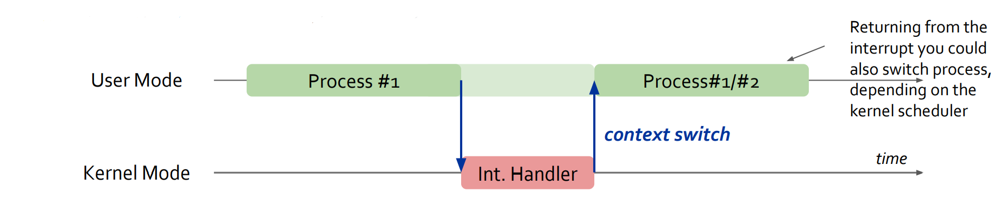
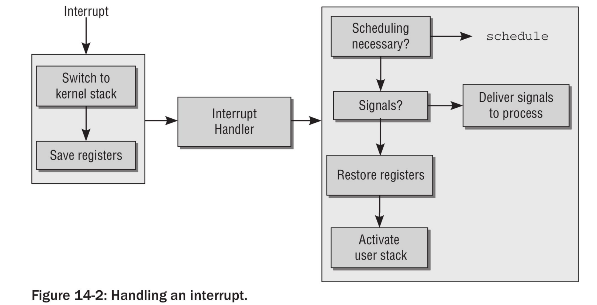
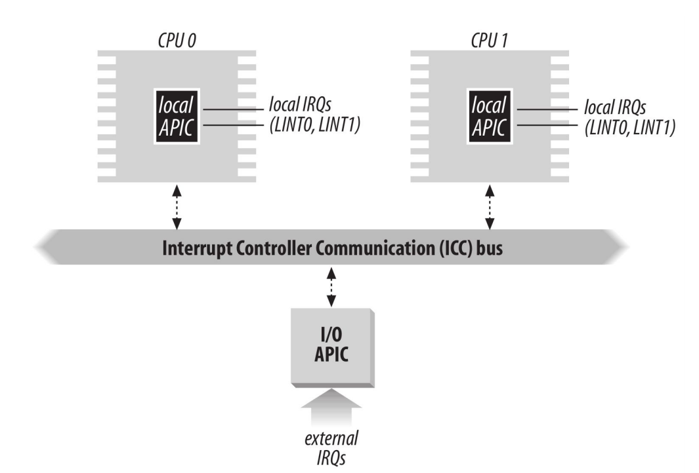
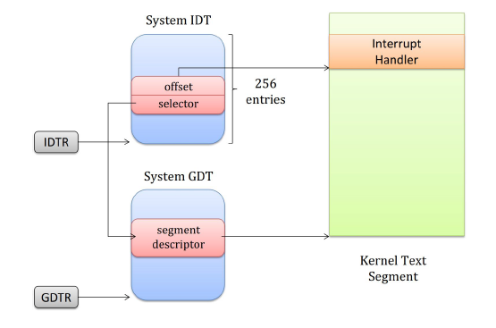
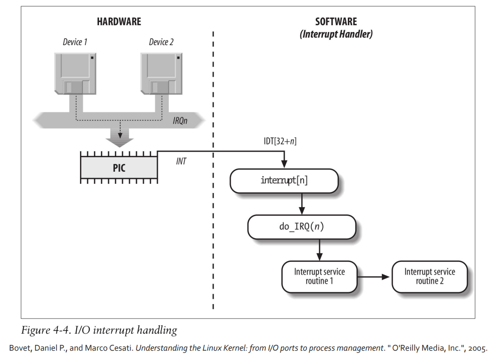
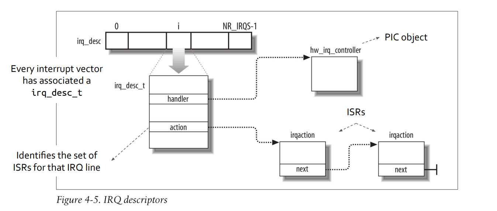
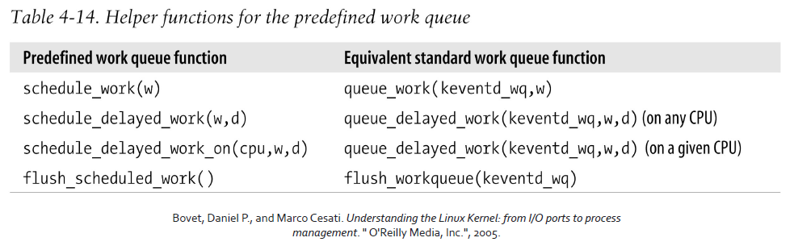

# Advanced Operative Systems and Virtualization

[[_TOC_]]

# Interrupt Management

## Outline

1. Introduction 
2. IRQs and Inter-Processor Interrupts
3. The IDT and the activation cheme
4. Exception Handling
   1. Fixup page fault handler
5. Interrupt handling
   1. I/O interrupts
   2. Inter-Prosessor interrupts (IPIs)
6. Software interrupts (SoftIRQs)
7. Tasklet
8. Work Queues

# Introduction 

**What is an interrupt?**

Usially an interrupt (electrical signal) is defined as an event that alters the sequence of instruction executed by a processor. There are two kinds of interrupts: 
- **sync**: this kind of interrupts are produced by the CPU control unit while executing instructions, they are generated after the execution of an istruction. **Usually generated by:**
  - programming errors (kernel delivers signal to the program es **SIGKILL**)
  - ususl conditions in which the kernel must find a solution (**Page Fault**)
- **async**: instead this kind of interrupts are generated by other HW devices at **arbitrary** times with respect the CPU clock signals (usually generated by timaers)

**What is the role of an interrupt signal?**

When an interrupts tignal arrives the CPU must necessarily stop what it's currently doing and **switch** to a new activity saving the current context of the CPU with a **context switch** (it save EIP + CS and other things in the kernel mode stack and places the address of the interrupt type into the program counter). But instead of the swotching to another process now it switch to a kernel code that runs at expense of the same process that was running when the interrupt occurred.
**The interrupt handler is lighter than a process**.






Interrupt handling is one of the most sensitive tasks performed by the kernel because it must satisfy the following constraints:
1. since the interrupts can come at any time, the kernel shuld also continue the executing of the process so **it must go out from the interrupts as soon as possible and defer the demanding work to be executed later** Interrupts has always a critical part and a deferrable part.
2. since the interrupts can come at any time the kernel might be handling one of them while another one occurs (**nesting**) this should be allowed much as possible since keeps I/O devices busy
3. even if nesting is allowed (2) there should be present critical regions in which interrupts must be temporarily disabled and these regions must be used only in case of strict necessity.


## Classification

The Intel Documentation classifies interrupts and exceptions as follows:
- **Interrupts**
  - Maskable Interrupts: When an interrupt is masked is temporarily ignored by the CPU. All IRQs issued by I/O are of this kind.
  - Non-Maskable Interrupts: ex HW failure are non-maskable
- **Exceptions**
  - Processor-detected exceptions: generated when the CPU detects an anomalous condition according to the eip (Instruction Pointer) value they are divided in
    - Faults:  can generally be corrected **eip is the address that caused the fault so the instruction will be re-executed returning from the Int. Handler**
    - Traps: are reported immediately after the execution of trapping instruction, **eip points to the next instruction after the trapping one**. Traps were essentially used for **debugging purposes**
    - Abort: represents **serious errors**, the **eip cannot be restored** to a precise position returning from the Int. Handler, **process will be terminated**
  - Programmed Exceptions: occurs at the request of the programmer. They are triggered by the instructions int, int3. These interrupts are treated like traps are **often called also software interrupts** they are **used** for implementing **syscall** or **debugging purposes**.


# IRQs and Inter-Processor Interrupts

**Each** hardware device controller capable of issuing interrupts requests usually has a **single output line designated as the Interrupt Request line** (IRQ). 

All of **these lines** are **connected** to the input pins of a hardware circuit called the **Programmable Interrupt Controller** (PIC - usually Intel 8259A with the 8086 processor) which performs the following actions:

1. monitor the IRQ lines and of two or more lines are enabled select the one that has a lower pin number
2. If a raised signal occur on an IRQ line:
   1. the signal is converted to a vector 
   2. stores the vector in an interrupt controller I/O port so the cpu can read it 
   3. sends signal to the INTR pin of the processor
   4. wait until the CPU ack the interrupts signal by writing into one os the PIC ports, this clear the INTR line.
3. goto 1

The n-th IRQ line is associated with the vector n+32. Each IRQ line can be selectively disabled, **disabled interrupts are not lost**, since the PIC send them to the CPU as soon as they will be re-enabled.

Enabling and disabling interrupts is not the same as masking and unmasking:
- **enabling/disabling** is done by **communicating** with the **PIC**
- **masking/unmasking** is done by **clearing and setting** the **IF** flag in the **EFLAGS** **register**, that is done **with cli and sti assembly instructions**

## Multicore processors

If we are on a single CPU the output line of the PIC can be connected to the INTR line of the CPU, directly. On multicore systems, Intel introduced a new PIC controller, called the APIC (Advanced Programmable Interrupt Controller), each microprocessor has a Local-APIC with:
- 32bit registers
- internal clock and local timer
- two additional lines LINT0 LINT1 reserved for local APIC interrupts.

All the LAPICs are connected to an external I/O APIC



The I/O APIC has 24IRQ lines, a 24-entry Interrupt Redirection Table, programmable registers and a message unit for sending and receiving APIC messages over the bus. The interrupt priority is not given by the lowest number but it is written in the redirection table, that in the end translates external interrupts into a message to one or more APIC units. External interrupts can be distributed in two ways:

- **Static Distribution** . The IRQ signal is delivered to the LAPICs listed in the proper entry of the redirection table
- **Dynamic Distribution** The IRQ signal is delivered to the LAPIC of the processor that is executing the process with lowest priority. This is done by programming the TPR register inside the LAPIC.


**A multi-APIC system also allows to generate inter-processor interrupts (IPI), by using the ICR register. The IPIs are a critical part of a SMP system, in Linux they are used for exchanging messages between the CPUs.**

# The IDT and the Activation Scheme




The **Interrupt Descriptor Table** associates each interrupt or exception vector with address of the corresponding interrupt or exception handler. **Similarly** to the **GDT**, **each entry** of the table corresponds to an **interrupt or exception vector** and consists of 8-byte descriptor (on x86 or 16-byte on x86_64). Thus we need 256*8=2048 bytes to store the table. The IDT is pointed by the IDTR register so it can be anywhere in memory.

As we already discussed there are different types of entries:
- **Interrupt Gate** entries
- **Trap Gate** entries
- *Task Gate* entries

## Traps

Differently from interrupts, trap management does not automatically reset the interruptible-state of a CPU core (IF), therefore critical sections in the trap handler must explicitly mask and then re-enable interrupts (cli and sti instructions).

For SMP/multi-core machines this **might not be enough to guarantee correctness (atomicity)** while handling the trap. The kernel uses **spinlocks**, based on atomic test-and-set primitives:
- cmpxchg
- xchg
- use the prefix lock before the instruction (e.g. **lock** incl)

## Hardware Handling of Interrupts/Exceptions

The check if an interrupt arrived is done after the execution of every asm instruction. Then, if the check is positive, the following steps are executed:

1. determining the vector i (o<= i <= 255) associated with the interrupt/exception
2. read the i entry in the IDT referred by IDTR
3. get the base address of the GDT from GDTR and read the segment descriptor for that
4. If CPL < segment DPL --> General Protection Error
5. If programmed exception and if gate DPL < CPL -> General Protection Error
6. If CPL is different from segment DPL (there is a context switch)
   1. the TR register is read to access to the TSS segment of the running process
   2. SS and ESP registers are loaded with proper values associated to the new privilege level 
   3. In this new stack, the old SS and ESP are saved
7. If there was a fault CS and EIP are loaded with the logical address of the instruction that caused the exception so that it can be executed again 
8. EFLAGS, CS and EIP are saved in the stack
9. If the exception carries an error code it is saved in the stack
10. CS and EIP are loaded with the reference to the Interrupt Handler from the i entry of IDT

After the interrupt, the iret asm instruction is called. If you pushed an error code in the stack you need to pop it before executing iret. 

Then the iret instruction:
1. Loads the CS, EIP and EFLAGS registers with the values saved in the stack
2. Checks if the interrupted process had the same privilege of the Interrupt Handler (looking at the CPL of the handler and the current CPL). If so, iret concludes the execution
3. Loads SS and ESP from the stack returning to the stack of the old privilege level
4. Examines the content of DS, ES, FS and GS registers. If any of these registers contains a DPL lower than the CPL then the register is cleared, this is done for security reasons.

Every interrupt or exception gives rise to a kernel control path or separate sequence of instructions that execute in Kernel Mode on behalf of the current process. These paths may arbitrarily nested by another interrupt handler, thus giving rise to a nested execution of kernel control paths.

## nested execution of Ex./Int. Handlers
The **price to pay** for allowing **nested** kernel control path is that an **interrupt handler must never block**, i.e. no process switch can be done while an interrupt handler is running because we have saved the context in the Kernel Stack of the previous process.

In general, most **exceptions** are **raised when in User Mode**, however the **Page Fault exception can occur in Kernel Mode**, when a page is not in RAM (e.g. swapped). When there is a Page Fault, the **current process must be put in sleep therefore the Page Fault exception never gives 
rises to further exceptions**.

An interrupt handler may preempt both other interrupt handlers and exceptions but an exception handler never preempts an interrupt handler, the only “exception” is the Page Fault, but Interrupt Handlers never performs operations that gives rise to page faults.

In multiprocessor systems there are several parallel kernel control paths, so an exception may start on a CPU and end on another due to the process switch.

# Exception Handling

Most of the exception are interpreted by Linux as errpr condittions. Whene one of them occurs, the kernel sends a signal to the process that caused the eception. But is it not alwais the case.

In some cases Lunux exploits exception to manage hardware resources more efficently, for example the Page Fault.

**The standard strucure of an exception is the following:**

1. **Save** the content of most registers in the kernel mode stack
2. **Handle** the exception by using a C function
3. **Exit** with ret_from_exception() function

The C functions which handle the exceptions are registred during trap_init().

### The double fault exception 
The only task gate is referring to the double fault exception, because it denotes a serius kernel misbehaviour. Therefore, exception handler does not trust the value in esp register.

*A Double Fault occurs when an exception is unhandled or when an exception occurs while the CPU is trying to call an exception handler. Normally, two exception at the same time are handled one after another, but in some cases that is not possible. For example, if a page fault occurs, but the exception handler is located in a not-present page, two page faults would occur and neither can be handled. A double fault would occur.*

**A double fault will always generate an error code with a value of zero. The saved instruction pointer is undefined. A double fault cannot be recovered. The faulting process must be terminated**

### Exception Handlers

The generic exception handler handler_name is composed by the following assembly instructions:

```asm
handler_name:
    pushl $0 # only for some exceptions
    pushl $do_handler_name
    jmp error_code
```

Three ops:

1. push $0, the control unit does not put in the stack the hw error code
2. push **$do_*handler_name***, that is the address of the exception handler
3. jump to error_code, that is the same for every exception, the blok perform a set of operations in order to prepare the call to *do_handler_name*. The invoked functions receives its arguments on resogter rather than in the stack (as __switch_to() that we will later)

### do_*handler_name*()

The name of the functions which implements exception handling always starts with the prefix do_. Most of these functions in the end call invoke do_trap() to store the hardware error code and the exception vector in the process descriptor and then send a suitable signal. 

The signal is handled in user mode, if the programmer defined a signal handler, otherwise in Kernel Mode and the kernel usually kills the process.


The exception **handler** **must determine** if the **error** happened in **User** Mode **or** in **Kernel** Mode and in this latter case if it was due to an invalid argument passed to a system call, because in this particular case the kernel uses a Fix-Up code. In any other case the kernel call the function die() which prints a dump in the screen and kills the process (remember the kernel oops).

## Fixups and Page Fault Handler

### Accessing Memory and System Calls
In general, there may be the case that when a user space process calls a system call it passes a parameter to a memory area. When this pointer is passed to Kernel Space the kernel may check it in on of the two ways:

- check if the address belongs to the process address space
- check if the address is lower than PAGE_OFFSET

The **first**, **more time consuming**, was used by the earlier versions of the kernel, from 2.2 the second check is performed. Obviously **this is a very coarse checking so the idea is to the defer as later as possible the true check**. The check is done by access_ok() macro.

```c
int access_ok(const void * addr, unsigned long size){
    unsigned long a = (unsigned long) addr;
    if ( a + size < a || 
         a + size > current_thread_info()->addr_linig.seg)
        return 0;
    return 1;
}
```

### The page fault

access_ok() only perform a coarse check but if it passes then the address can be still not be valid for that process, therefor a Page Fault can be raised when:

1. the kernel attempts to address a page belonging to the process address space but the frame **does not exist** or it is **read-only**;
2. the kernel addresses a page belonging to its address space but the corresponding entry in the Page Table has **not** been yet **initialized**;
3. there is **bug** in the kernel or an hardware **error**;
4. a system call service routine attempts to read or write into a memory area whose address has been passed as a system call parameter by it does not belong to the process address space;

In the first case the kernel checks if the linear address belongs to the process, in the second case it is again easy to recognize by looking at the Master Kernel Page Table entry. But how the other two cases?

### The Exception Tables

Only a small group of functions and macros are used to access the process address space within the kernel (e.g. get_user(), ...), thus if the exception is caused by an invalid parameter the instruction that caused it **must be included in one of the functions**.

For this reason, the addresses of these functions are put in a exception table and the do_page_fault() handler will look at the table: if it includes the address of instruction that triggered the exception the error is caused by a system call parameter, otherwise by a more serious bug.

The kernel exception table is stored in the __ex_table section of the kernel and each entry contains:
- insn that is the address of an instruction that accesses the process address space
- fixup that is the address of the assembly code which solves the problem. These instructions in general are put in the .fixup section of the kernel code segment 

The do_page_fault() executes the following statements:
```c
if((fixup = search_exception_tables(regs->eip))){
    regs->eip = fixup->fixup;
    return 1;
}
```

### **RECAP Fixup activation steps**

1. access to invalid address e.g. from get_user()
2. MMU generates exception
3. CPU calls do_page_fault
4. do page fault calls search_exception_table()
5. search_exception_table looks up the address of current->eip in the exception table and returns the address of the associated fault handle code, the fixup.
6. do_page_fault modifies its own return address to point to the fault handle code and returns.
7. execution continues in the fault handling code:
   1. EAX becomes -EFAULT (== -14)
   2. DL becomes zero (the value we "read" from user space)
   3. execution continues at local label 2 (address of the instruction immediately after the faulting user access).

# Interrupts Handling

As we discussed, most exceptions are handled simply by sending a unix signal to the process that caused the exception. So the action to be taken will be executed as soon as the process receives the signal, this does not hold for interrupts since they can also arrive long after the process to which they are related so a signal does not make sense.

The interrupt handling changes according to the type of the interrupt raised:
- **I/O Interrupts** are received every time that an I/O device requests attention to the kernel. The interrupt handler must query the device to setup proper actions;
- **Timer Interrupts**. The LAPIC timer has issued an interrupt, this notifies the kernel that some time has passed
- **Inter-processor Interrupts (IPI)**. A CPU issued an interrupt to another CPU. On multicore systems, we must ensure, for instance, that different cores synchronize with each other in some circumstances

## I/O Interrupts
An **I/O Interrupt Handler** must be enough **flexible** to **service** **several devices** at the **same time**, but the **IRQ** lines are in general **shared** by multiple devices, so **reading only the IRQ line number it will be not sufficient to understand which device issued it**.

There are 2 different situation:
1. **IRQ Sharing**. The interrupt handler executes several interrupt service routines (ISRs), each routine is related to each device that shares the IRQ line. Every ISRs is always executed.
2. **IRQ Dynamic Allocation**. An IRQ line is associated with a device at the last possible moment, for instance only when device is in use. In this way two devices cannot obviously use the same line at the same time.

In any case, when handling an interrupt **not every action that you need to perform has the same priority**, this because when you handle an interrupt on a line all the other signals are ignored. Therefore the handling must be as quick as possible.

Linux differentiate in three categories the actions that should be carried out in a interuupt handler

1. **Critical**.  Actions like **acknowledging the IRQ** to the PIC **updating the data structure shared by the device and the CPU**. These action are **critical** and **quick**, they **must be executed immediately** with maskable interrupts disabled (you **cannot be interrupted**).
2. **Non-Critical**. Actions like **updated the data structure accessed only by the CPU** (e.g. understanding **which key has been pressed on the keyboard**). These action **can finish quickly** and they are **executed immediately** but with the interrupts enabled (you** can be interrupted**).
3. **Non-Critical Deferrable**. Actions like **copying a buffer content into the process address space** (e.g. sending the keyboard line buffer to the terminal handler process). These actions **may be delayed for a long time interval**, the **user process will wait** (e.g. sleep) for the data. These actions are executed by means of separate functions (SoftIRQs and Tasklets).

**In any case**, the Interrupt Handler performs the **following operations**:

1. Save the IRQ value and the register in the kernel mode stack
2. send the ACK to PIC, this allowing further interrupts in that line
3. Execute the ISRs for all the devices that shares that IRQ line
4. Terminate with ret_from_intr()




### Multiple Kernel Mode stacks
The struct that represents a process is couple with a data structure which represents the Kernel Mode stack. If it is declared (at compile time) as 8KB size, the stack will be used for any kind of kernel activity, otherwise if we declare it as 4KB size three types of stacks will be used (a C union):

- the **exception** stack, used for handling exceptions (including system calls). One for each process;
- the **hard IRQ** stack, used for handling interrupts. One for each CPU;
-  the **soft IRQ** stack, used for handling deferrable activities (SoftIRQs and Tasklets). One for each CPU.

### Interrupt Handler Activation

As in the exceptions, when the CPU receives the interrupts it starts executing the code found in the corresponding gate of the IDT. For doing this, there is a context switch and registers must be saved and restored. 


Saving the registers is the first task of the interrupt handler, as in the exceptions there is a stub code that is executed before the true interrupt handler, that is do_IRQ.

In **modern Linux kernel** versions the **do_IRQ has been removed** in favour of a **more efficient implementation of handlers**. The execution path is optimized for different types of interrupts, that are:

- Level type - the signal voltage is above a certain threshold (e.g. > 5V)
- Edge type - the signal is positive or negative
- Simple type - simple interrupt handling with no chip interaction
- Fast EOI type - the signal allows a fast End-of-Interrupt interaction
- Per CPU type - interrupt is per cpu

**The rest of the rationale behind the interrupts remains more or less the same.**


## Inter-Processor Interrupts (IPIs)

On **single core machines**, interrupt/trap **events** are **managed** by **running operating system code on the single core** in the system. This is **sufficient** to **ensure consistency** **also in multithreaded applications**. In multi-core systems, an interrupt/trap event is **delivered to only one core**:

- **other cores might be running other threads of the same application**, though. This can lead to **race conditions** or inconsistent state, due to the replication of hardware
- the hardware is time-shared across threads

We **need a way to propagate an interrupt/trap event to other cores**, if needed. The same problem holds for synchronous requests from userspace implemented without using traps (e.g., via the vDSO).

**IPIs are interrupts also used to trigger the execution of specific operating system functions on other cores**. IPI are used to enforce cross-core activities (e.g. request/reply protocols) allowing a specific core to trigger a change in the state of another. IPIs are generated at firmware level, but are processed at software level:

- **synchronous** at the sender
- **asynchronous** at the receiver

At least two priority levels are available: 
- **High** priority leads to immediate processing of the IPI at the recipient (a single IPI is accepted and stands out at any point in time)
- **Low** priority generally lead to queueing the requests and process them in a serialized way


Usages of IPIs are:
- waking up additional cores
- execution of the same function across all the CPU cores (cross-core kernel synchronization)
- change of the hardware state across multiple cores in the system (e.g. TLB)

The immediate handling of the IPI is allowed when there’s no need to share data across cores, as for example the system halt due to a kernel panic.

The kernel provides a set of macros and functions to easily trigger IPIs, the different IPI kinds of interrupt are referred as IPIs Vectors.

The Linux kernel makes use of three kinds if inter-processor interrupts:
- CALL_FUNCTION_VECTOR (0xfb) it is sent to all CPUs but the sender forcing that CPU to run a function passed by the sender. The handler is called call_function_interrupt(). This is used for example for halting the system. This is interrupt is usually triggered by the function smp_call_function();
- RESCHEDULE_VECTOR (0xfc) when a CPU receives this type of interrupt, the corresponding handler named reschedule_interrupt() limits itself to acknowledging the interrupt, the rescheduling is done when returning from the interrupt;
- INVALIDATE_TLB_VECTOR (0xfd) it is sent to all the CPU but the sender forcing them to invalidate the TLB, the handler is invalidate_interrupt().

IPIs are used to scheduled multiple cross-core tasks, but a single vector exists (CALL_FUNCTION_VECTOR). There is the need to register a specific action associated with the firing of an IPI. Older version of the kernel were relying on a global data structure protected by a lock, but this solution hampers scalability and performance.

From Kernel 5.0, there is a per-CPU linked list of registered functions and associated data to process. Concurrent access relies on the lock-free list.


# Software Interrupts (SoftIRQs)

We already introduced the necessity of deferring the non-critical work when handling an interrupt. The basic idea behind this strategy takes the name of top-half/bottom-half:

- the **top-half** executes a minimal amount of work which is mandatory to later finalize the whole interrupt management. The top-half code is managed according to a **non-interruptible** scheme and it is in charge of scheduling the bottom-half task by queuing a record into a proper data structure;
- the **bottom-half** **finalizes the work** to be done for completing the interrupt handling. The bottom-half executes the deferred work with **interrupts enabled**.

### SoftIRQs and Tasklets

Linux uses two kinds of non-urgent and interruptible kernel functions:
- the **deferrable functions**, that are softIRQs and tasklets;
- those executed by means of some work queues.

Tasklets are built on top the SoftIRQs and the term softirq which often appears in the kernel
source refers to both of them. The main differences between these two kinds of deferrable
functions are:


- **SoftIRQs** are **statically** allocated, they can run **concurrently** on several CPUs (even if
they are of the different type, they are **reentrant** functions and must explicitly protect
their data structures with spinlocks;
- **Tasklets** are initialized at **runtime** (for instance when mounting a kernel module), they do
**not need to worry about race conditions** on data structures since they are strictly
controlled by the kernel. Tasklets of the same type are always **serialized**, they cannot run
concurrently, **they do not need to be reentrant**.

**The main steps carried out on a deferrable function are the following**

1. **Initialization**. Define a new deferrable function, this is done when the kernel boots or when a module is loaded
2. **Activation**. Marks the function as “pending” to be run the next time the kernel schedules a round of executions of deferrable functions.
3. **Masking**. Selectively disable a function so that it will be not executed even if activated.
4. **Execution**. Executes a pending deferrable function with other functions of the same type.

**SoftIRQs** are **also called software interrupts** **but** keep in mind that they are **different** from the programmed exceptions.


The checks for pending softirq should be performed periodically but without too much overhead. Here’s a list of significant points in the kernel in which the check is done:
- when softirqs are enabled on local CPU;
- when do_IRQ() finished processing;
- after a timer interrupt on LAPIC;
- after a CALL_FUNCTION_VECTOR;
- when a ksoftirqd/n kernel thread is wakened.


### Execution - do_softirq()

If there is a pending softirq then the function do_softirq() is invoked. The function:
1. checks if invoked in a interrupt context or softirqs are disabled, if yes returns
2. executes local_irq_save()
3. checks if there are pending softirq
4. calls do_softirq_own_stack() if needed, this function switches to the softirq stack if needed and calls __do_softirq()
5. calls local_irq_restore()


The __do_softirq() reads the bit mask of the local CPU and executes the deferrable
functions corresponding to every set bit. While executing a softirq, another softirq may pop up
and in order to avoid that __do_softirq() never regain control to user processes it only
executes a fixed number of iterations, the remaining softirqs will be handled by ksoftirqd
daemon.

### ksoftirqd
In modern kernel versions, each CPU has its own ksoftirqd/n kernel thread (where n is the
logical number of the CPU). Each ksoftirqd runs the ksoftirq() function which essentially
executes the following loop:

```c
for(;;){
   set_current_state(TASK_INTERRUPTIBLE);
   schedule();
   // now in task running state
   while(local_softirq_pending()){
      preempt_disable();
      do_softirq();
      preempt_enable();
      cond_resched();
   }
}
```


# Tasklets


Tasklets are the preferred way to implement deferrable functions in I/O drivers or in kernel
modules. As already introduced, tasklets are built on top of two softirqs named HI_SOFTIRQ
and TASKLET_SOFTIRQ, they differ only in priority since several tasklets may be associated
with the same softirq, each carrying its own function.

For using a tasklet you need to allocate the tasklet_struct by means of the macro
DECLARE_TASKLET and then call one of the following functions to enable/disable it:

- ```tasklet_enable(struct tasklet_struct *tasklet)```
- ```tasklet_hi_enable( struct tasklet_struct *)```
- ```tasklet_disable(struct tasklet_struct *tasklet)```
- ```void tasklet_schedule(struct tasklet_struct *tasklet)```


Unless a tasklet reactivates itself, every tasklet activation triggers at **most one** execution of
the tasklet function. Management of tasklets is such that a tasklet of the same kind cannot be
run concurrently on two different cores


Tasklets are run using Soft IRQs. Enable functions are mapped to Soft IRQs lines:
- tasklet_enable() mapped to TASKLET_SOFTIRQ
- tasklet_hi_enable() mapped to HI_SOFTIRQ


No real difference between the two, except that do_softirq() processes HI_SOFTIRQ before
TASKLET_SOFTIRQ. All non-disabled Tasklets are executed, before the corresponding SoftIRQ
action completes.
Remember that they are run with HardIRQs enabled.

**In the latest version of the kernel the Tasklets API is deprecated in favour of Threaded IRQs.**

The Tasklet API (but also the SoftIRQ) will be removed because the top-half of an IRQ is
executed in a kernel thread by using the function request_threaded_irq() for allocating a
IRQ line.


# Work Queues

The worker queues have been introduced in Linux 2.6. They are similar to the deferrable
functions, but they are run by ad-hoc kernel-level worker threads.

Worker Queues always run in process context and they can perform blocking operations but
this does not mean that they can access user address space (as the deferrable functions).
Executing in process context is the only way for performing blocking operations (e.g.
accessing data to disk), remind that no process switch can occur in interrupt context.


A work queue is defined by the workqueue_struct whose field worklist points to a doubly
linked list of pending functions.

### Creating a queue

The function create_workqueue(“foo”) allows to create a new work queue and also creates
n worker threads (where n is the number of CPUs). You can use the function
create_singlethread_workqueue() for creating a work queue with only one thread. You can
destroy the queue with the function destroy_workqueue().

After creating a queue you can use:
- queue_work() for inserting a function (packaged in a work_struct) to the queue
- queue_delayed_work() for inserting a function that will be executed when after the passed time delay

A worker thread continuously loop inside the function worker_thread() that most of the time
is sleeping if there is no function to be executed.
Sometimes it may be necessary to wait until all pending functions are executed, in that case,
the function flush_workqueue() can be used.

In most cases, creating a whole set of worker threads in order to run a function is overkill.
Therefore, the kernel offers a predefined work queue called events, which can be freely used
by every kernel developer.

To use the predefined queue you can use the following functions:
