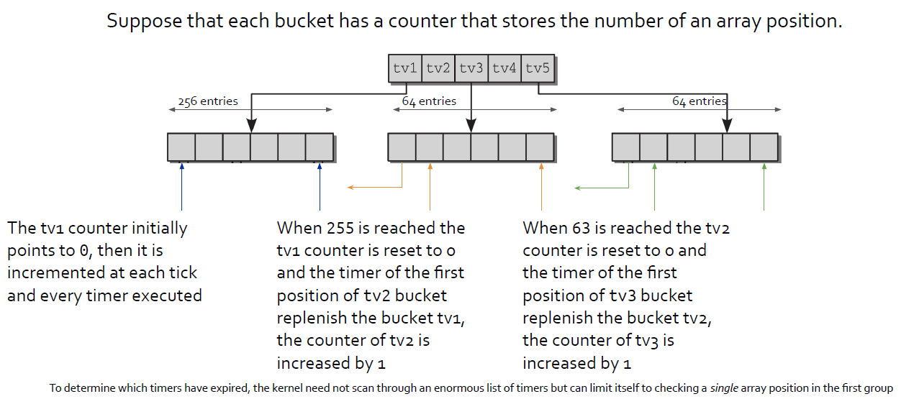

# Advanced Operative Systems and Virtualization

[[_TOC_]]

# Time Management

## Outline
1. Introduction
2. Timekeeping Architecture
   1. Low-resolution Timers
   2. Generic Time Subsystem
3. Watchdogs

# Introduction

A computer would be useless if programs would not have the possibility to keep track of time passing. This fundamental facility is handled by the kernel in two ways:
1. keeping the current time and date so they can be returned to user programs (e.g. time(), gettimeofday(), ...)
2. maintaining timers, mechanisms that are able to notify the kernel or a user program (e.g. setitimer() and alarm()) that a certain interval of time has elapsed.

In the 8086 architecture the CPU interacts with clock circuits that keep track of the time of day
and timer circuits, programmed by the kernel so that they issue interrupts at a desired time.
We have:

- **Real Time Clock (RTC)**, which is **independent of all the other chips** and **keeps track of the time of day**, ticking **even if the PC is off**. The RTC is capable of issuing periodic interrupts on IRQ8 and can be programmed and used as an alarm. Linux uses the RTC only for time and date (/dev/rtc).
- **Timestamp Counter (TSC)**, it is a **counter incremented from an external oscillator** connected at the CLK pin of the CPU, it can be read with the asm instruction rdtsc.
- **Programmable Interval Timer (PIT)**, its role is **similar to an alarm clock of a microwave oven**, when timer ends it does not ring a bell but it issues an interrupt. The PIT can be programmed also for ticking at periodic intervals, these ticks are as a beat time for all the kernel activities, as a metronome.
- **CPU Local Timer** (in the LAPIC) is **similar to PIT** but **local** to the processor.
- **High Precision Event Timer** (HPET), provides a number of programmable timers .

# Timekeeping Architecture

Linux must carry on several time-related activities, for instance, the kernel periodically:
- updates the time elapsed since the startup
- updates time and date
- determines, for every cpu, how long the current process has been running and preempts it if it exceeded its time slot
- update resource usage statistics
- checks whether the interval of time associated with each software timer has elapsed

The Linux timekeeping architecture is a set of data structures and functions related to the flow
of time. There are some differences in time keeping between a multi and a single processor
architecture:
- in a single-processor system all time-keeping activities are triggered by interrupts raised by a global timer
- in a multi-processor system general activities (e.g. software timers) are triggered by the global timer but CPU-specific activities (e.g. monitoring the execution time of the current process) are triggered by the local APIC timer


The entire kernel timing subsystem wraps around timers. **Timers can be divided** into:
- **classic** timers available since the first version of the kernel, their resolution is usually **4ms** and they are called **low-resolution** timers or timer wheel timers
- **high-resolution** timers, they have a **precision of nanoseconds**, useful especially for **media-oriented applications**

Independently of the resolution, **the kernel distinguishes between**:
- **Time-outs** that represent **events that are bound to happen after some time**, e.g. expect a packet within the next 10 seconds. In general, resolution is not important for this kind of timers;
- **Timers** that are used for **implementing temporal sequences**, e.g. a sound card driver could issue data in small and periodic time intervals. These timers usually requires high resolution;


### Clock Events & Ticks

The Clock Events are the foundation of periodic events. High Resolution Timers are based on
the Clock Events abstraction, whereas the low-resolution mechanism can come or from a
low-resolution clock device or from the high resolution subsystem. Two important tasks for
which low-resolution timers assume the responsibility are:
- handling the global jiffies counter
- perform per-process accounting

## Low-resolution Timers

The jiffies variable is a counter that stores the number of elapsed ticks since the system was
started. It is increased by one when a timer interrupts occurs.

In the 8086 the jiffies variable is of 32bit in size so it wraps in about 50 days, this because a long
long (64bit) could not allow an atomic increment. This is true even today, with kernel 5.11.

jiffies and jiffies_64 matches in their less significant bits and therefore the must point to
the same memory location or same register. For achieving this, the two variables are declared
separately but the linker merges them, in 64bit machine they are the same but in 32bit
jiffies is the upper (or lower depending on endianness) of jiffies_64.

### Dynamic Timers
Timers allow a generic function to be activated at a later time, they can be dynamically
created and destroyed and they can be assigned to the kernel itself or to a process. For this
reason, we need an efficient way for managing timers in the kernel. Timers are associated with
deferrable functions **Linux does not guarantee that activation takes place at exact time**

APIs
- ```void init_timer(struct timer_list *timer);```
- ```void setup_timer(struct timer_list *timer, void (*function)(unsigned long),unsigned long data);```
- ```int mod_timer(struct timer_list *timer, unsigned long expires);```
- ```void del_timer(struct timer_list *timer);```
- ```int timer_pending(const struct timer_list *timer);```

Timers are prone to race conditions (e.g., if resources are released). They should be deleted
before releasing the resources.

#### The Timer Wheel

Earlier versions of the kernel used a single timer list sorted according to the expiration time.
This was significantly unreliable and inefficient. Newer versions of the kernel introduced the
so-called Timer Wheel a nested structure for efficiently retrieving timers. For understanding
the principle of operation we will consider simplified example.





## Generic Time Subsystem

There are three main abstractions for providing time in the kernel:
- **Clock Sources** (struct clocksource) that are the backbox of time management. Essentially each clock provides a monotonically increasing counter with read only access;
- **Clock event devices** (struct clock_event_device) add the possibility of equipping clocks with events that occurs in the future.
- **Tick Devices** (struct tick_device) extend the clock event sources to provide a continuous stream of tick events that happen periodically. A dynamic tick may stop a tick device if requested.

There are then two kinds of clocks:
- a **global clock** that is responsible for **providing** the periodic **tick** for **updating** **jiffies** (old PIT)
- one **local clock** for each CPU for performing process accounting, profiling and high-resolution timers


The handling of timer interrupts are handled according to the top/bottom half paradigm (using Task Queues, which have now been removed from the Kernel). The top half executes the following actions:
- registers the bottom half
- increments jiffies
- checks whether the CPU scheduler needs to be activated, and in the positive case flags need_resched (more on this later)

### High Resolution Timers

High resolution timers are based on the ktime_t type (nanosecond scalar representation) rather than jiffies.

High resolution timers heavily depends on the architecture wrt the low-resolution ones. They:
- are arranged in a red-black tree
- they are independent of periodic ticks, they are not based on jiffies

Low-resolution timers are based on high-resolution ones.

# Watchdogs

A **watchdog** is a component that **monitors** a system for **“normal”** **behaviour** and if it fails, it **performs** a system **reset** to **hopefully recover normal operation**.

This is a last resort to maintain system availability or to allow sysadmins to remotely log after a restart and check what happened. In Linux, this is implemented in two parts:
- a kernel-level **module** which is able to perform a hard reset
- a **user-space** background **daemon** that refreshes the timer

At kernel level, this is implemented using a Non-Maskable Interrupt (NMI). The userspace daemon will notify the kernel watchdog module via the /dev/watchdog special device file that user space is still alive.

```c
while (1) {
    ioctl(fd, WDIOC_KEEPALIVE, 0);
    sleep(10);
}
```