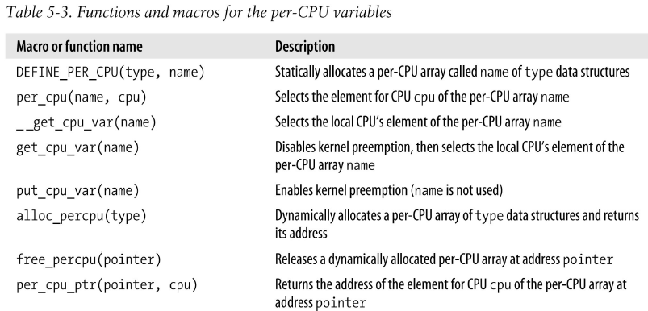
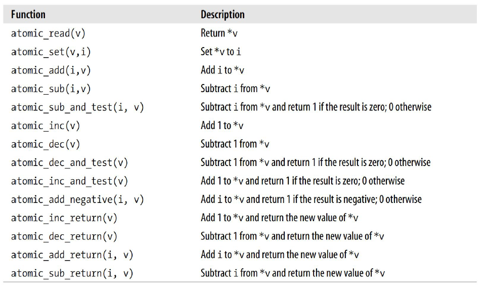
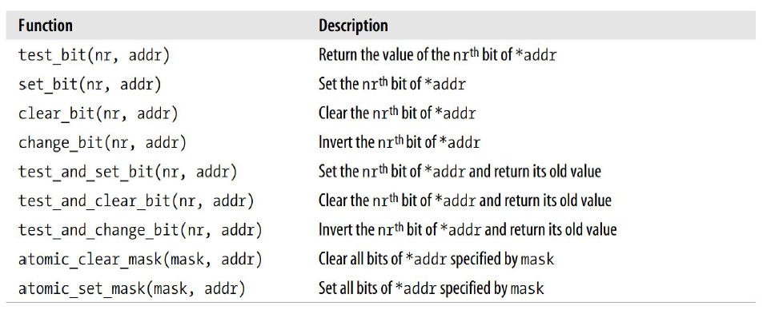
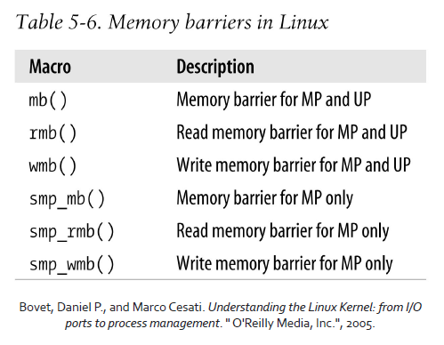
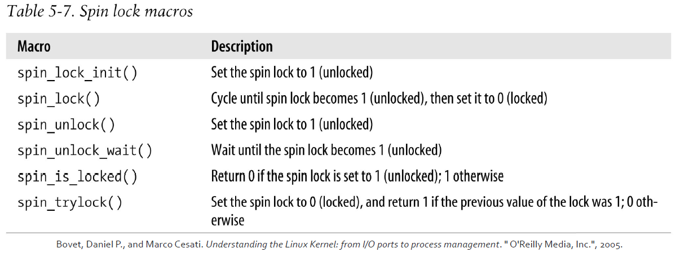
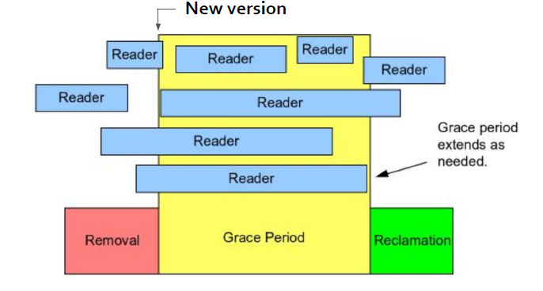
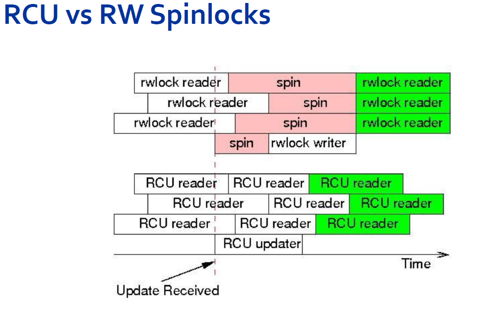

# Advanced Operative Systems and Virtualization

[[_TOC_]]

# Concurrency in the Kernel

## Outline

1. Introduction
2. Synchronization
   1. Per-CPU Variables
   2. Atomic operations
   3. Memory Barriers
   4. Spinlocks
   5. Seqlocks
   6. RCU
   7. Semaphores


# Intriduction

concurrency properties:
- **safety**: nothing wrong happens, it is also called correctness *What does it mean for a program to be correct?* Intuitively, if we rely on locks, changes happen in a non-interleaved fashion, resembling a sequential execution. We can say a parallel execution is correct only because we can associate it with a sequential one, which we know the functioning of
- **liveness**: eventually something good happens (also called progression) , opposed to starvation

The linearizability property tries to generalize the intuition of correctness. We call history a
sequence of invocations and replies generated on an object by a set of threads.
A sequential history is a history where all the invocations have an immediate response.

A history is called **linearizable** if:
- invocations/responses can be reordered to create a sequential history
- the so-generated sequential history is correct according to the sequential definition of the object
- If a response precedes an invocation in the original history, then it must precede it in the sequential one as well

An object is linearizable if every valid history associated with its usage can be linearized.

#### Progress condtions
- **Deadlock-free**: some thread acquires a lock eventually
- **Starvation-free**: every thread acquires a lock eventually
- **Lock-free**: some method call completes
- **Wait-free**: every method call completes
- **Obstruction-free**: every method call completes, if they execute in isolation

# Synchronization

You can think about the **kernel** as a **waiter** that needs to **serve requests** from **two** kinds of **customers**: **normal** customers and **bosses**.

The policy adopted is the following:
1. if a boss calls when the waiter is idle, the waiter serves the boss
2. if a boss calls when the waiter is serving a normal customer the waiter stops and serves the boss
3. if a boss calls when the waiter is servicing another boss it stops and start servicing the second, when done it continues to serve the first
4. when a boss induces the waiter to leave the current normal customer, the waiter after the last request from the bosses may decide to temporarily drop the old customer to pick a new one

**Obviously a normal customer is a system call from a user space process and a boss is an interrupt.**

### Kernel Preemption
The last waiter’s rule corresponds to the so-called kernel preemption (included from kernel 2.6). In general a **kernel** is **preemptive** if a **process switch may occur while the replaced process is executing a kernel function**, that is when it runs in kernel mode.


In the linux kernel:
- a process in kernel mode may relinquish voluntarily the CPU (e.g. for sleeping), we call this a planned process switch, however in preemptive kernels even if a process is in kernel mode reacts to asynchronous events that may lead to a process switch, we call this a forced process switch;
- all processes are switched with the switch_to() macro, both in preemptive and non-preemptive kernels a process switch occurs when a process has finished some thread of kernel activity and the scheduler is invoked, however in non-preemptive kernels a process cannot be replaced unless it is about to switch to User Mode.

**Preemption is managed with three counters, if the sum is greater than zero the preemption is disabled:**
- the kernel is executing an Interrupt Service Routine
- deferrable functions are disabled
- preemption has been explicitly disabled (preempt_disable())

### When Synchronization is Necessary
A **race condition** can occur when the outcome of the **computation** **depends** on **how two or
more interleaved kernel control path are nested**. A critical region is a section of the code that
must be completely executed by the kernel control path that enters it before another kernel
control path can execute it.

Suppose that two different interrupt handlers need to access the same data structure, all
statements that access the data structure must be put in a critical region. On a single CPU you
can disable the interrupts and the preemption, but this is not enough in a multi-processor
system.

### When Synchronization is not Necessary

We can recap some circumstances that do **not** require **synchronization**:
- **critical parts** of the interrupt handlers, which **runs with interrupt disabled**
- **interrupt** handlers, **softirqs** and **tasklets** are all **non-preemptable**
- a kernel control path performing interrupt handling cannot be interrupted by a kernel control path for running a deferrable function or a system call service routine
- **softirqs** and **tasklets** are **not interleaved on a given CPU**
- the **same tasklet** **cannot** be **executed** **simultaneously** on **several** **CPUs**

Therefore:
- code interrupt handlers and softirqs as reentrant functions
- **use per-CPU variables in softirq and tasklets** since they do not require synchronization
- a **data structure used in only one kind of tasklet does not require synchronization**


## per CPU variables

Explicit synchronization has a cost and if it can be avoided we gain in performances. The
simplest technique for avoiding it is to declare per-CPU variables. Obviously they do not
protect against asynchronous functions and preemption with reschedule on another core,
therefore they can be used only in particular cases or even protected with other
synchronization systems.



## atomic operation

Several assembly instructions are of type “**read-modify-write**” (RMW), that is they access a
memory location **twice**, the first time to read and the second to write a new value.

Suppose that two control path running on two CPUs try to RMW at the same memory location
at the same time by using a non-atomic operations. Accessing are serialized by the chip, so
when the first read has completed, the second reads the (old) value. Both the CPUs try to write
the same (new) value and again accesses are serialized so both write are eventually executed.
However, the global result is wrong.

To solve this problem we need to use instructions that are **atomic** at **chip** **level**. They the
following.

In the 8086 architecture the we have:
- instructions that make zero or one aligned memory access, they are atomic
- RMW instructions (such inc or dec) are atomic only in a uniprocessor system
- RMW instructions prefixed by lock are always atomic, even on multiprocessor
- instructions prefixed by rep are not atomic

Since you cannot tell the compiler when to use atomic instructions the kernel defines different facilities.




## memory barriers

Compilers may reorder assembly instructions differently from the C code for optimization
reasons. However, when dealing with synchronization this mechanism must be avoided.

An *optimization barrier* primitive ensures that the **assembly** language instructions
**corresponding** to **C statements placed before the primitive** are **not mixed by the compiler** with
**asm** instructions **corresponding to C statements placed after the primitive**.

The macro barrier() expands to asm **volatile(“” ::: “memory”)**. This does not ensure
that the asm instructions will not be mixed by the CPU. For this necessity we can define a
**memory barrier**, that ensures that the operations placed before the primitive are finished
before starting the operations placed after the primitive.

In the 8086 architecture, the following instructions act as memory barriers:
- all instructions that operates on I/O ports (eg. in, out)
- all instructions prefixed by lock
- all instructions that write into control/system/debug registers (even cli, sti, etc.)
- lfence, sfence, and mfence implements read/write/rw memory barriers
- a few special assembly instructions, like iret

img below kernel facilities for using memory barriers.


## spinlocks

**A widely used synchronization technique is locking.** When a kernel thread needs to access to a critical region it must acquire a lock on it.

**Spinlocks** are a **special** kind of **locks** **designed to work in a multiprocessor environment**. If the
kernel control path finds a lock open it **acquires the lock and continues the execution**,
**otherwise** it **“spins”** **around repeatedly executing a instruction loop**. Therefore the **kernel**
**control path remains running on the CPU (and it can be preempted)**, kernel preemption is
disabled during the critical region.

The Kernel API, on the right, is based on atomic operations



### APIs
```c
#include <linux/spinlock.h>
spinlock_t my_lock = SPINLOCK_UNLOCKED;
spin_lock_init(spinlock_t *lock);
spin_lock(spinlock_t *lock);
spin_lock_irqsave(spinlock_t *lock, unsigned long flags);
spin_lock_irq(spinlock_t *lock);
spin_lock_bh(spinlock_t *lock);
spin_unlock(spinlock_t *lock);
spin_unlock_irqrestore(spinlock_t *lock, unsigned long flags);
spin_unlock_irq(spinlock_t *lock);
spin_unlock_bh(spinlock_t *lock);
spin_is_locked(spinlock_t *lock);
spin_trylock(spinlock_t *lock)
spin_unlock_wait(spinlock_t *lock);
```

### Read/Write Spinlocks

Read and write spinlocks have been introduced to increase the amount of concurrency inside
the kernel. They allow several kernel control paths to simultaneously read the same data
structure, as long as no kernel control path modifies it. For writing we need to acquire the
write version of the lock.

```c
rwlock_t xxx_lock = __RW_LOCK_UNLOCKED(xxx_lock);
unsigned long flags;
read_lock_irqsave(&xxx_lock, flags);
// critical section that only reads the info ...
read_unlock_irqrestore(&xxx_lock, flags);
write_lock_irqsave(&xxx_lock, flags);
// read and write exclusive access to the info ...
write_unlock_irqrestore(&xxx_lock, flags);
```

## seqlocks

When using r/w **spinlocks**, **requests** issued by the kernel control path have **all the same priority**: readers must wait until the writer has finished and the vice versa.

**Seqlocks** are **similar** to r/w **spinlocks**, except that **they give much higher priority to writers**: a write can proceed even if readers are active. Therefore **a writer never waits but a reader may be forced to read the same data until it gets a valid copy**.

```c 
#include <linux/seqlock.h>
seqlock_t lock1 = SEQLOCK_UNLOCKED;
// or
seqlock_t lock2;
seqlock_init(&lock2);
write_seqlock(&the_lock); // Increases the sequence counter
/* Make changes here */
write_sequnlock(&the_lock); // Increases again, so while writing counter is odd otherwise even
```

**Readers do not acquire a lock but they check the sequence number.**

```c 
unsigned int seq;
do {
    seq = read_seqbegin(&the_lock); //Retrieve the sequence number
    /* Make a copy of the data of interest */
} while read_seqretry(&the_lock, seq); // checks whether the initial number was odd and if it changed
```

## RCU

RCU is another **synchronization technique** designed to protect data structures that are mostly
accessed for reading by several CPUs. RCU allows many readers and many writers to proceed
concurrently (an improvement over seqlocks which allows only one writer to proceed) and it is
**lock-free**. 

The keys idea consist of limiting the scope of RCU:

- **only data structures that are dynamically allocated and referenced by means of pointer can be protected by RCU**
- no kernel control path can sleep inside a critical region protected by RCU

In general, **writers perform updates by creating new copy**, **readers read from the old copy** therefore multiple copies allows readers and writers to read data concurrently. 

This is achieved with three fundamental mechanisms:

1. publish-subscribe for **insertion**
2. wait for pre-existing RCU readers to complete for **deletion**
3. maintain multiple versions of RCU-updated objects for **read**

### insertion

```c
struct foo {
    int a;
    int b;
    int c;
};
struct foo *gp = NULL;
/* . . . */
// from here
p = kmalloc(sizeof(*p), GFP_KERNEL);
p->a = 1;
p->b = 2;
p->c = 3;
gp = p;
// to here ths is not always correct
```

```c
struct foo {
    int a;
    int b;
    int c;
};
struct foo *gp = NULL;
/* . . . */
p = kmalloc(sizeof(*p), GFP_KERNEL);
p->a = 1;
p->b = 2;
p->c = 3;
rcu_assign_pointer(gp, p);
// The “Publish-Subscribe”.
// The function prevents write side
// reordering that could break publishing
```

### reading

```c
if (p != NULL) {
    do_something_with(p->a, p->b, p->c); // is not always correct
}
```

```c
rcu_read_lock();   // Prevent memory reclamation - but do not prevent concurrent writing!
p = rcu_dereference(gp); // The function prevents read side reordering that could break publishing
if (p != NULL) {
    do_something_with(p->a, p->b, p->c);
}
rcu_read_unlock(); // Prevent memory reclamation - but do not prevent concurrent writing!
```

### deletion

#### Wait pre-existing RCU readers

But **how long** do we have to wait before its safe to reclaim an old version? Until all readers
have finished reading? No, that’s too strong! If new readers picked up a newer version we
don’t need to wait for them to finish - we just need to wait for **readers** who might be **reading**
the **version** we want to **reclaim**.



There are two functions for deferring deletion:
- synchronize_rcu() (synchronous)
- call_rcu() (asynchronous)

```c
struct foo {
    struct list_head list;
    int a;
    int b;
    int c;
};
LIST_HEAD(head);
/* . . . */
p = search(head, key);
if (p != NULL) {
    list_del_rcu(&p->list);
    synchronize_rcu();
    kfree(p);
}
```

#### Garbage Collection

An old version of a data structure can be still accessed by readers. It can be freed only after that all readers have called rcu_read_unlock().

A writer cannot waste to much time waiting for this condition, for this reason call_rcu() registers a callback function to free the old data structure.

Callbacks are activated by a dedicated SoftIRQ action (if you remember there was one with RCU in the name).




## semaphores

A semaphore implements a locking primitive that allows waiters to sleep until the desired resource becomes free. Linux offers two kinds of semaphores:
- **Kernel Semaphores**, which are used only by kernel control path
- **System V IPC Semaphores**, which are used by user space processes

A **kernel semaphore** is **similar** to a **spinlock** in that it does not allow a control path to proceed unless the lock is open. However, **differently** from a spinlock when a kernel control path **tries** to **acquire** the **lock** the **process is suspended**. For this reason, **semaphores can be used only within a process context** (obv. Interrupt handlers and deferrable functions cannot use them).

| func | desc |
|------|------|
|```void sema_init(struct semaphore *sem, int val)```| Dynamically initialize a Semaphore |
|```int __must_check down_interruptible(struct semaphore *sem);```| Acquire Semaphore, decrement count and set task to TASK_INTERRUPTIBLE state |
|```int __must_check down_killable(struct semaphore *sem);```| Acquire Semaphore, decrement count and set task to TASK_KILLABLE state |
|```int __must_check down_trylock(struct semaphore *sem);```| Try and acquire the Semaphore, if lock is unavailable – do not wait for lock to be acquired |
|```int __must_check down_timeout(struct semaphore *sem, long jiffies);```|  Try to acquire the Semaphore and exit if timeout expires |
|```void down(struct semaphore *sem);```| Acquire a Semaphore |
|```void up(struct semaphore *sem);```| Release a Semaphore  |

### Read/Write Semaphores

Read/Write semaphores are exactly like the spinlock counterpart but the process is allowed to sleep.

- ```void down_read(struct rw_semaphore *sem) - lock for reading;```
- ```int down_read_trylock(struct rw_semaphore *sem) - try lock for reading;```
- ```void down_write(struct rw_semaphore *sem) - lock for writing;```
- ```int down_write_trylock(struct rw_semaphore *sem) - try lock for writing;```
- ```void up_read(struct rw_semaphore *sem) - release a read lock;```
- ```void up_write(struct rw_semaphore *sem) - release a write lock;```