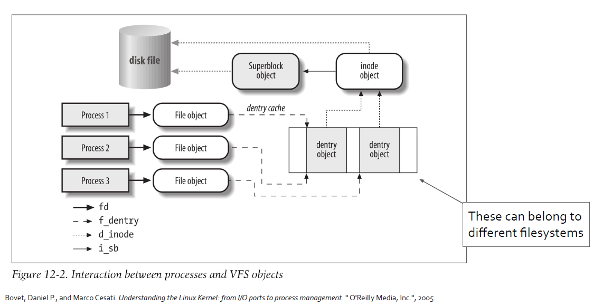
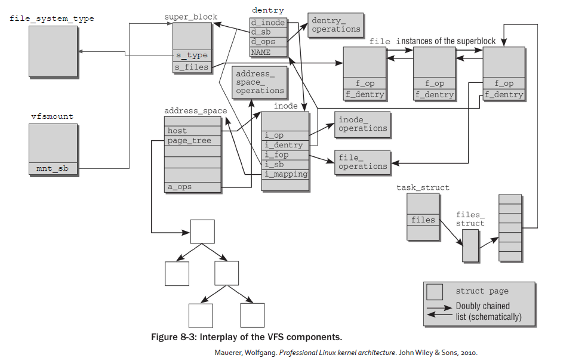

# Advanced Operative Systems and Virtualization

[[_TOC_]]

# Virtual File System

## Outline

1. Introduction
2. The Common File Model
   1. Operations
3. Pathname Lookup
4. Files
5. The /proc filesystem
6. The /sys filesystem
7. Device Management
   1. Char Devices
   2. Block Devices
   3.  Devices and VFS
   4.  Classes
   5.  udev


# Introduction

The **VFS** is a **software** **layer** which **abstracts** the actual implementation of the **devices** and/or the **organization** of the **files** on a storage system. The VFS exposes a uniform interface to userspace applications.

The **main** **roles** of the virtual filesytem are:
- keeping track of available filesystem types;
- **associating** (and de-associating) **devices** with instances of the appropriate filesystem.
- do any **reasonable** generic processing for **operations** involving **files**.
- when filesystem-specific operations become necessary, vector them to the filesystem in charge of the file, directory, or inode in question.


### Supported File Systems

The filesystems supported by the VFS can be grouped in:
- **Disk-based Filesystems**
- **Network Filesystems**
- **Special Filesystems** (/proc /sys)

### File System Representation

The VFS representation has a two fold nature, one in RAM and one on disk.

In **RAM** we have a **partial** or **full** **representation** of the current structure and the content of the FS.

On the **device** we have the **full** **representation** of of the current structure and the content of the FS but **possibly outdated**.


The data access and manipulation comprehends:
- a **FS-independent** part, that is the interface towards other subsystems within the kernel
- a **FS-dependent** part, that is the code for managing data in that particular filesystem

**Connecting the two parts**: any filesystem object that can be a directory, a device or a file is
**represented** in **RAM** via specific **data structures**. Each data structure **keeps a reference** to the
**functions** that **talks directly to the device**, if any. That reference is reached by means of a
kernel API interface (like read(), write(), etc.). Function pointers are used to reference
actual drivers' functions.


# The common file model

**The key idea behind the VFS is to introduce a common file model capable of representing all the possible filesystems.** This means that each physical filesystem implementation must translate its physical organization into the VFS’s common file model.

The **Common File Model** consists of the following “*object*” types:

- **superblock**
Stores the information concerning a mounted filesystem, this object **corresponds** to a
**filesystem control block** stored on disk
- **inode**
Stores general information about a specific file, this **corresponds** to to a **file control block**
stored on disk, each inode has a unique number associated to it
- **file**
Stores the **information** about the **interaction** between an **open file and a process**, this
exists **only in kernel memory** when a process opens a file
- **dentry**
Stores the **information** about the **linking** of a **directory** entry with the **corresponding** **file**,
each FS stores this information in its own particular way.





### Filesystem types

The *file_system_type* structure describes a file system (it is defined in include/linux/fs.h), it keeps information related to:
- the file system name
- a pointer to a function to be executed upon mounting the file system (superblock-read)

#### ramfs

Ramfs is a very simple filesystem that exports Linux's disk caching mechanisms (the page
cache and dentry cache) as a dynamically resizable RAM-based filesystem.

With ramfs, **there is no backing store**. Files written into ramfs allocate dentries and page
cache as usual, but there's nowhere to write them to.

**Ramfs can eat up all the available memory:**
- tmpfs is a derivative, with size limits
- only root should be given access to ramfs


#### rootfs

Rootfs is a special instance of ramfs (or tmpfs, if that's enabled), which is always present in 2.6 systems.

It provides an empty root directory during kernel boot. Rootfs cannot be unmounted and this has the same idea behind the fact that init process cannot be killed.

During kernel boot, another (actual) filesystem is mounted over rootfs (remember initramfs/initrd).


### File system mounting

In most traditional Unix-like kernel, each filesystem can be mounted once, the command used is for instance

```mount -t ext4 /dev/sda1 /mnt```

However in Linux it is possible to mount the same filesystem n times, this means that its root
directory can be accessed through n mount points. This means that each mount point
(represented by the struct vfsmount) will point to the same superblock

Mounted filesystems form a hierarchy: the mount point of a filesystem might be the directory
of a second filesystem, which in turn is already mounted over a third filesystem and so on.
```c
struct vfsmount {
	struct list_head mnt_hash;
	struct vfsmount *mnt_parent;	/* fs we are mounted on */
	struct dentry *mnt_mountpoint;	/* dentry of mountpoint */
	struct dentry *mnt_root;	/* root of the mounted tree */
	struct super_block *mnt_sb;	/* pointer to superblock */
#ifdef CONFIG_SMP
	struct mnt_pcp __percpu *mnt_pcp;
	atomic_t mnt_longterm;		/* how many of the refs are longterm */
#else
	int mnt_count;
	int mnt_writers;
#endif
	struct list_head mnt_mounts;	/* list of children, anchored here */
	struct list_head mnt_child;	/* and going through their mnt_child */
	int mnt_flags;
	/* 4 bytes hole on 64bits arches without fsnotify */
#ifdef CONFIG_FSNOTIFY
	__u32 mnt_fsnotify_mask;
	struct hlist_head mnt_fsnotify_marks;
#endif
	const char *mnt_devname;	/* Name of device e.g. /dev/dsk/hda1 */
	struct list_head mnt_list;
	struct list_head mnt_expire;	/* link in fs-specific expiry list */
	struct list_head mnt_share;	/* circular list of shared mounts */
	struct list_head mnt_slave_list;/* list of slave mounts */
	struct list_head mnt_slave;	/* slave list entry */
	struct vfsmount *mnt_master;	/* slave is on master->mnt_slave_list */
	struct mnt_namespace *mnt_ns;	/* containing namespace */
	int mnt_id;			/* mount identifier */
	int mnt_group_id;		/* peer group identifier */
	int mnt_expiry_mark;		/* true if marked for expiry */
	int mnt_pinned;
	int mnt_ghosts;
};
```

```c
struct super_block {
	struct list_head	s_list;		/* Keep this first *///////////////////   
	dev_t			s_dev;		/* search index; _not_ kdev_t */
	unsigned char		s_dirt;
	unsigned char		s_blocksize_bits;
	unsigned long		s_blocksize;
	loff_t			s_maxbytes;	/* Max file size */
	struct file_system_type	*s_type; //////////////////////////////////////
	const struct super_operations	*s_op; ////////////////////////////////
	const struct dquot_operations	*dq_op;
	const struct quotactl_ops	*s_qcop;
	const struct export_operations *s_export_op;
	unsigned long		s_flags;
	unsigned long		s_magic;
	struct dentry		*s_root; //////////////////////////////////////////
	struct rw_semaphore	s_umount;
	struct mutex		s_lock;
	int			s_count;
	atomic_t		s_active;
#ifdef CONFIG_SECURITY
	void                    *s_security;
#endif
	const struct xattr_handler **s_xattr;

	struct list_head	s_inodes;	/* all inodes */
	struct hlist_bl_head	s_anon;		/* anonymous dentries for (nfs) exporting */
#ifdef CONFIG_SMP
	struct list_head __percpu *s_files;
#else
	struct list_head	s_files;
#endif
	/* s_dentry_lru, s_nr_dentry_unused protected by dcache.c lru locks */
	struct list_head	s_dentry_lru;	/* unused dentry lru */
	int			s_nr_dentry_unused;	/* # of dentry on lru */

	struct block_device	*s_bdev;
    //...
    //...
}
```

```c
struct dentry {
	/* RCU lookup touched fields */
	unsigned int d_flags;		/* protected by d_lock */
	seqcount_t d_seq;		/* per dentry seqlock */
	struct hlist_bl_node d_hash;	/* lookup hash list */
	struct dentry *d_parent;	/* parent directory */ //////////////////////
	struct qstr d_name; /////////////////////////////////////////////////////
	struct inode *d_inode;		/* Where the name belongs to - NULL is //////
					 * negative */
	unsigned char d_iname[DNAME_INLINE_LEN];	/* small names */

	/* Ref lookup also touches following */
	unsigned int d_count;		/* protected by d_lock */ ///////////////////
	spinlock_t d_lock;		/* per dentry lock */
	const struct dentry_operations *d_op; ///////////////////////////////////
	struct super_block *d_sb;	/* The root of the dentry tree */ ///////////
	unsigned long d_time;		/* used by d_revalidate */
	void *d_fsdata;			/* fs-specific data */

	struct list_head d_lru;		/* LRU list */
	/*
	 * d_child and d_rcu can share memory
	 */
	union {
		struct list_head d_child;	/* child of parent list */
	 	struct rcu_head d_rcu;
	} d_u;
	struct list_head d_subdirs;	/* our children *////////////////////////////
	struct list_head d_alias;	/* inode alias list */
}; 
```

```c
struct inode {
	/* RCU path lookup touches following: */
	umode_t			i_mode;
	uid_t			i_uid;
	gid_t			i_gid;
	const struct inode_operations	*i_op; //////////////////////////////////
	struct super_block	*i_sb; //////////////////////////////////////////////

	spinlock_t		i_lock;	/* i_blocks, i_bytes, maybe i_size */
	unsigned int		i_flags;
	struct mutex		i_mutex;

	unsigned long		i_state; ///////////////////////////////////////////
	unsigned long		dirtied_when;	/* jiffies of first dirtying */

	struct hlist_node	i_hash;
	struct list_head	i_wb_list;	/* backing dev IO list */
	struct list_head	i_lru;		/* inode LRU list */
	struct list_head	i_sb_list;
	union {
		struct list_head	i_dentry;
		struct rcu_head		i_rcu;
	};
	unsigned long		i_ino;
	atomic_t		i_count; /////////////////////////////////////////////////
	unsigned int		i_nlink;
	dev_t			i_rdev;
	unsigned int		i_blkbits;
	u64			i_version;
	loff_t			i_size;
#ifdef __NEED_I_SIZE_ORDERED
	seqcount_t		i_size_seqcount;
#endif
	struct timespec		i_atime;
	struct timespec		i_mtime;
	struct timespec		i_ctime;
	blkcnt_t		i_blocks;
	unsigned short          i_bytes;
	struct rw_semaphore	i_alloc_sem;
	const struct file_operations	*i_fop;	//////////////////////////////////
                     /* former ->i_op->default_file_ops */ 
	struct file_lock	*i_flock;
	struct address_space	*i_mapping;
	struct address_space	i_data;
    //...
    //...
}
```

Each inode can always appear in one of the following **circular doubly linked lists**:

- list of valid **unused** inodes, they are mirroring on disk but they are not used by any process, they are not dirty and i_count is 0
- list of **in-use** inodes, they are mirroring on disk and used by some process, they are not dirty and i_count > 0
- list of **dirty** inodes

Moreover, inodes objects are also included in a **hash table** that speeds up the search of the
inode object when the kernel knows both the inode number and the address of the superblock
corresponding to the FS that includes the file.

### VFS and PCB

In the PCB, struct fs_struct *fs points to information related to the current directory and
the root directory for the associated process. fs_struct is defined in include/fs_struct.h

```c
struct fs_struct {
    int users;
    spinlock_t lock;
    seqcount_t seq;
    int umask;
    int in_exec;
    struct path root, pwd; |--
} __randomize_layout;        |
                             |
struct path { <---------------
    struct vfsmount *mnt;
    struct dentry *dentry;
} __randomize_layout;


```

## Operations

Super block operations are described by the struct super_operations. They:

- manage statistic of the file system
- create and manage i-nodes
- flush to the device updated information on the state of the file system

**Some File Systems might not use some operations** (think of File Systems in RAM). Functions
to access statistics are invoked by system calls statfs() and fstatfs().

```c
struct super_operations {
   	struct inode *(*alloc_inode)(struct super_block *sb);
	void (*destroy_inode)(struct inode *);
	void (*free_inode)(struct inode *);

   	void (*dirty_inode) (struct inode *, int flags);
	int (*write_inode) (struct inode *, struct writeback_control *wbc);
	int (*drop_inode) (struct inode *);
	void (*evict_inode) (struct inode *);
	void (*put_super) (struct super_block *);
	int (*sync_fs)(struct super_block *sb, int wait);
	int (*freeze_super) (struct super_block *);
	int (*freeze_fs) (struct super_block *);
	int (*thaw_super) (struct super_block *);
	int (*unfreeze_fs) (struct super_block *);
	int (*statfs) (struct dentry *, struct kstatfs *);
	int (*remount_fs) (struct super_block *, int *, char *);
	void (*umount_begin) (struct super_block *);

	int (*show_options)(struct seq_file *, struct dentry *);
	int (*show_devname)(struct seq_file *, struct dentry *);
	int (*show_path)(struct seq_file *, struct dentry *);
	int (*show_stats)(struct seq_file *, struct dentry *);
#ifdef CONFIG_QUOTA
	ssize_t (*quota_read)(struct super_block *, int, char *, size_t, loff_t);
	ssize_t (*quota_write)(struct super_block *, int, const char *, size_t, loff_t);
	struct dquot **(*get_dquots)(struct inode *);
#endif
	int (*bdev_try_to_free_page)(struct super_block*, struct page*, gfp_t);
	long (*nr_cached_objects)(struct super_block *,
				  struct shrink_control *);
	long (*free_cached_objects)(struct super_block *,
				    struct shrink_control *);
};

```

```c
struct inode_operations {
	struct dentry * (*lookup) (struct inode *,struct dentry *, unsigned int);
	const char * (*get_link) (struct dentry *, struct inode *, struct delayed_call *);
	int (*permission) (struct inode *, int);
	struct posix_acl * (*get_acl)(struct inode *, int);

	int (*readlink) (struct dentry *, char __user *,int);

	int (*create) (struct inode *,struct dentry *, umode_t, bool);
	int (*link) (struct dentry *,struct inode *,struct dentry *);
	int (*unlink) (struct inode *,struct dentry *);
	int (*symlink) (struct inode *,struct dentry *,const char *);
	int (*mkdir) (struct inode *,struct dentry *,umode_t);
	int (*rmdir) (struct inode *,struct dentry *);
	int (*mknod) (struct inode *,struct dentry *,umode_t,dev_t);
	int (*rename) (struct inode *, struct dentry *,
			struct inode *, struct dentry *, unsigned int);
	int (*setattr) (struct dentry *, struct iattr *);
	int (*getattr) (const struct path *, struct kstat *, u32, unsigned int);
	ssize_t (*listxattr) (struct dentry *, char *, size_t);
	int (*fiemap)(struct inode *, struct fiemap_extent_info *, u64 start,
		      u64 len);
	int (*update_time)(struct inode *, struct timespec64 *, int);
	int (*atomic_open)(struct inode *, struct dentry *,
			   struct file *, unsigned open_flag,
			   umode_t create_mode);
	int (*tmpfile) (struct inode *, struct dentry *, umode_t);
	int (*set_acl)(struct inode *, struct posix_acl *, int);
} ____cacheline_aligned;
```

# Pathname lookup

When **accessing** **VFS**, the **path** to a file is used as the **“key”** to **access** a **resource** of interest.
Internally, VFS uses inodes to represent a resource of interest. The **Pathname lookup** is the
**operation** which **derives an inode from** the corresponding file **pathname**.

Pathname lookup **tokenizes** the string:
- the passed string is broken into a sequence of filenames
- everything must be a directory, except for the last component

During this procedure there are several aspects to take into account:
- filesystem mount points
- access rights
- symbolic links (and circular references)
- automount
- namespaces (more on this later)
- concurrency (while a process is navigating, other processes might make changes)


The **main function** for **path name lookup** are ***vfs_path_lookup()***, ***filename_lookup()*** and
***path_lookupat()***. The path walking is based on the *nameidata* data structure that is filled
when the functions return.

```c 
struct nameidata {
	struct path	path;
	struct qstr	last;
	struct path	root;
	struct inode	*inode; /* path.dentry.d_inode */
	unsigned int	flags;
	unsigned	seq, m_seq, r_seq;
	int		last_type;
	unsigned	depth;
	int		total_link_count;
	struct saved {
		struct path link;
		struct delayed_call done;
		const char *name;
		unsigned seq;
	} *stack, internal[EMBEDDED_LEVELS];
	struct filename	*name;
	struct nameidata *saved;
	unsigned	root_seq;
	int		dfd;
	kuid_t		dir_uid;
	umode_t		dir_mode;
} __randomize_layout;
```
Lookup flags drive the pathname resolution:
- LOOKUP_FOLLOW, if the last component is a symbolic link, interpret (follow) it
- LOOKUP_DIRECTORY, the last component must be a directory
- LOOKUP_CONTINUE, there are still filenames to be examined in the pathname
- LOOKUP_PARENT, look up the directory that includes the last component of the pathname
- LOOKUP_NOALT, do not consider the emulated root directory (useless in the 80x86 architecture)
- LOOKUP_OPEN, intent is to open a file
- LOOKUP_CREATE, intent is to create a file (if it doesn’t exist)
- LOOKUP_ACCESS, intent is to check user’s permission for a file

### The mount() system call

```c
int mount(const char *source, const char *target, const char *filesystemtype,
          unsigned long mountflags, const void *data);
```

The mount() system call is used to mount a generic filesystem, its sys_mount() service
routine acts on: a **pathname** of a device containing a filesystem (source e.g. /dev/<...>), a
**pathname** of the directory on which the filesystem will be mounted (target), the filesystem
**type**, a set of **flags** and a pointer to system dependent data (usually NULL). Flags are:
- MS_NOEXEC: Do not allow programs to be executed from this file system.
- MS_NOSUID: Do not honour set-UID and set-GID bits when executing programs from this file system.
- MS_RDONLY: Mount file system read-only.
- MS_REMOUNT: Remount an existing mount. This allows you to change the mountflags and data of an existing mount without having to unmount and remount the file system. source and target should be the same values specified in the initial mount() call; fs type is ignored.
- MS_SYNCHRONOUS: Make writes on this file system synchronous

Directories selected as the target for the mount operation become a “mount point”. This is
reflected in struct dentry by setting in d_flags the flag DCACHE_MOUNTED.

# Files

The PCB has a member struct files_struct *files which points to the descriptor table defined in
include/linux/fdtable.h.

### Opening Files

A file struct is allocated when a file is opened. The system call that allows a process to open a
file is open() serviced by sys_open() that in the end calls do_sys_open(). The function is
logically divided into two parts:

1. a file descriptor is allocated, if available
2. invocation of the intermediate function struct file *do_filp_open(int dfd, struct filename *pathname, const struct open_flags *op) which returns the address of the struct file associated with the opened file

On kernel 5.11 do_sys_open() calls do_sys_openat2().

### Closing Files

The close() system call is defined in fs/open.c as:

```SYSCALL_DEFINE1(close, unsigned int, fd)```

This function basically calls (in fs/file.c):
```c
int close_fd(unsigned fd)
```

that:
- retrieves the file struct associated with the file, and releases the file descriptor
- calls ```c filp_close(struct file *filp, fl_owner_t id)```, defined in fs/open.c, which flushing the data structures associated with the file (struct file, dentry and i-node)

# The /proc filesystem

The /proc filesystem is an in-memory file system which provides information on:
- active programs (processes)
- the whole memory content
- kernel-level settings (e.g. the currently mounted modules)

Common files on proc are:
- cpuinfo contains the information established by the kernel about the processor at boot time, e.g., the type of processor, including variant and features.
- kcore contains the entire RAM contents as seen by the kernel.
- meminfo contains information about the memory usage, how much of the available RAM and swap space are in use and how the kernel is using them.
- version contains the kernel version information that lists the version number, when it was compiled and who compiled it.

Then we have:

- **net/** is a directory containing network information.
  - net/dev contains a list of the network devices that are compiled into the kernel. For each device there are statistics on the number of packets that have been transmitted and received.
  - net/route contains the routing table that is used for routing packets on the network.
  - net/snmp contains statistics on the higher levels of the network protocol.
- **self/** contains information about the current process. The contents are the same as those in the per-process information described later.
- **pid/** contains information about process number pid. The kernel maintains a directory containing process information for each process.
  - pid/cmdline contains the command that was used to start the process (using null characters to separate arguments).
  - pid/cwd contains a link to the current working directory of the process.
  - pid/environ contains a list of the environment variables that the process has available.
  - pid/exe contains a link to the program that is running in the process.
  - pid/fd/ is a directory containing a link to each of the files that the process has open.
  - pid/mem contains the memory contents of the process.
  - pid/stat contains process status information.
  - pid/statm contains process memory usage information.


### APIs

To create a file in /proc you can use the function:
```c
struct proc_dir_entry *proc_create(const char *name, umode_t mode,
                struct proc_dir_entry *parent,
                const struct proc_ops *proc_ops)
```

It is essential to define the proc_ops in order to use the file.


# The /sys filesystem

Similar in spirit to proc, mounted to /sys, it is an alternative way to make the kernel export
information (or set it) via common I/O operations

Very simple API, more clear structuring. The VFS objects are mapped using the following
scheme:

| **internal** | **external** |
|--------------|--------------|
| Kernel Objects | Directories |
| Object Attributes | Regular Files |
| Object Relationship | Symbolic Links |


### core APIs

```c static inline int __must_check sysfs_create_file(struct kobject *kobj, const struct attribute *attr)  ```

```c static inline void sysfs_remove_file(struct kobject *kobj, const struct attribute *attr) ```

```c static inline int sysfs_rename_link(struct kobject *kobj, struct kobject *target, const char *old_name, const char *new_name) ```

The functions uses the struct attribute declared as follows

```c 
struct attribute {
    const char *name;
    umode_t mode;
}
 ```

Instead, the ```c struct kobject ``` represents the kernel object (next slide). /sysfs is tight inherently
with the kobjects architecture.

### Kobjects architecture

A **kobject** is an object of **type struct kobject**. Kobjects have a **name** and a **reference count**
(kref). A kobject also has a **parent** pointer (allowing objects to be arranged into hierarchies), a
specific type, and, usually, a representation in the sysfs virtual filesystem.

Kobjects are generally not interesting on their own; instead, they are usually **embedded**
within some other structure which contains the stuff the code is really interested in
(remember container_of).

**No structure should EVER have more than one kobject embedded within it**. If it does, the
reference counting for the object is sure to be messed up and incorrect, and your code will be
buggy. So do not do this.

A **ktype** is the type of object that embeds a kobject. Every structure that embeds a kobject
needs a corresponding ktype. The ktype controls what happens to the kobject when it is
created and destroyed.

A **kset** is a group of kobjects. These kobjects can be of the same ktype (classic kset) or belong
to different ktypes (i.e. a subsystem). The kset is the basic container type for collections of
kobjects. Ksets contain their own kobjects, but you can safely ignore that implementation
detail as the kset core code handles this kobject automatically.

When you see a sysfs directory full of other directories, generally each of those directories
corresponds to a kobject in the same kset.

### APIs

```c void kobject_init(struct kobject *kobj); ```

```c int kobject_set_name(struct kobject *kobj, const char *format, ...); ```

```c struct kobject *kobject_get(struct kobject *kobj); ```

```c void kobject_put(struct kobject *kobj); ```


```c void kset_init(struct kset *kset); ```

```c int kset_add(struct kset *kset); ```

```c int kset_register(struct kset *kset); ```

```c void kset_unregister(struct kset *kset); ```

```c struct kset *kset_get(struct kset *kset); ```

```c void kset_put(struct kset *kset); ```

```c kobject_set_name(my_set->kobj, "The name"); ```


### Hooking into sysfs

An initialized kobject will perform reference counting without trouble, but it will not appear in
sysfs. To create sysfs entries, kernel code must pass the object to kobject_add():

```c int kobject_add(struct kobject *kobj); ```

As always, this operation can fail. The function:

```c void kobject_del(struct kobject *kobj); ```

will remove the kobject from sysfs.

There is a kobject_register() function, which is really just the combination of the calls to
kobject_init() and kobject_add(). Similarly, kobject_unregister() will call
kobject_del(), then call kobject_put() to release the initial reference created with
kobject_register() (or really kobject_init())

# Device management

## Char devices

## Block devices

## Devices and VFS

## Classes

## udev