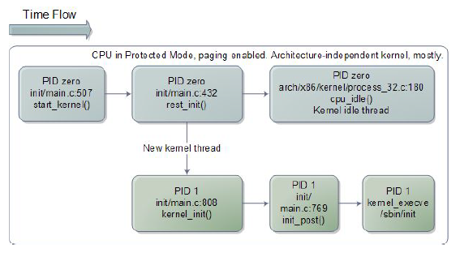

# Advanced Operative Systems and Virtualization

[[_TOC_]]

# Userspace Initialization

## Outline

1. init
2. runlevels/targets
   1. systemd
3. End of the boot process

# init

**Boot sequence**

1. *BIOS/UEFI Actual hardware setup*
2. *Bootloader Stage 1 Executes the stage 2 bootloader (skipped for UEFI)*
3. *Bootloader Stage 2 Loads and starts the kernel*
4. *Kernel Takes control and initializes the machine (machine-dependent operations)*
5. **Init (or systemd) First process: basic environment initialization**
6. *Runlevels/Targets Initializes the user environment*

The **main** **operations** carried out by **start_kernel() (init/main.c)** are:
1. *setup_arch()* that **initializes the architecture**
2. *build_all_zonelists()* - **builds the memory zones**
3. *page_alloc_init() / mem_init()* - the steady state allocator (**Buddy System**) is **initialized** and the **boot one removed**
4. *sched_init()* - **initializes the scheduler**
5. *trap_init()* - the final **IDT** is **built**
6. *time_init()* - the **system time is initialized**
7. *kmem_cache_init()* - the **slab allocator** is **initialized**
8. *arch_call_rest_init() / rest_init()* - prepares the **environment**
    1. *kernel_thread(kernel_init)* - **starts the kernel thread** for process 1 is created
        1. *kernel_init_freeable() -> prepare_namespace() -> initrd_load()* - **mounts** the **initramfs**, a temporary filesystem used to start the init process
        2. *run_init_process() -> kernel_execve()* - **Execute /bin/init**
    2. *cpu_startup_entry() -> do_idle()* - **starts the idle process**

### rest_init()

Obviously **we cannot run only the idle process**, otherwise we could not be able to spawn any
other process. For this reason we have to “leave” the infinite loop in pid 0.

A new **kernel** **thread** is **created**, referencing *kernel_init()* as its **entry** **point**. A **call** to
*schedule()* is issued, to **start scheduling the newly-created process**, this is **done** right **before**
PID 0 **calls** into **cpu_idle()** (before calling cpu_startup_entry()).

### Starting /sbin/init

**/sbin/init is the first userspace process ever started**. This process is commonly stored into the ramdisk, to speedup the
booting process. init will **have to load configuration files from the hard drive** and this means that the **VFS**, Device
Management, and Interrupt subsystems **must be initialized before** loading init.

# runlevels/targhets

**Boot sequence**

1. *BIOS/UEFI Actual hardware setup*
2. *Bootloader Stage 1 Executes the stage 2 bootloader (skipped for UEFI)*
3. *Bootloader Stage 2 Loads and starts the kernel*
4. *Kernel Takes control and initializes the machine (machine-dependent operations)*
5. *Init (or systemd) First process: basic environment initialization*
6. **Runlevels/Targets Initializes the user environment**

The main services that are run at startup regard:
- Hostname
- Timezone
- Check the hard drives
- Mount the hard drives
- Remove files from /tmp
- Configure network interfaces
- Start daemons and network services

|**levels**|**mode**|
|----------|--------|
|1 (s)| single user |
|2| multiuser no notworking |
|3| full multiuser |
|4| unused |
|5| x11 |
|6| Reboot |
|0| Halt |

The **runlevel** **describes** the **mode** according to which the **machine** **started**, **only one runlevel is
executed** (they are not executed in order). The machine for example started in runlevel 5 when
rebooting enters in runlevel 6. Runlevels actions and services may depend on the particular
Linux distribution installed

*Lower levels are used for maintenance or for recovering critical situations*

Runlevels exists from the **System V standard** (latest version of UNIX). The actual scripts are
located at /etc/rc.d/init.d/. In this folder we have the declaration of startup services, in
practice we have:
- Symbolic links to /etc/init.d scripts
- S## - Start scripts
- K## - Stop scripts
- /etc/sysconfig/: script configuration files

The services can be managed from the shell with the commands:
- chkconfig <script> on|off
- service <script> start|stop|restart

### /etc/inittab

**Describes which processes need to be run at which runlevel**
The file format is: *id:rl:action:process*
- **id**: uniquely identifies entry
- **rl**: what runlevels the entry applies to
- **action**: the type of action to execute
- **process**: process command line
- 
An example:
2:23:respawn:/sbin/getty 38400 tty2

## systemd

Systemd is progressively replacing the System V init architecture but it maintains the
compatibility with it, since the init scripts can still be read and used.

Systemd is based on the notion of "units" and "dependencies". However, systemd also offers
other services beyond the init system:

- **journald**, systemd-journald is a **daemon** responsible for **event logging**
- **logind**, systemd-logind is a daemon that **manages** **user logins** and seats in various ways
- **resolved**
- **timesyncd**
- **networkd**, networkd is a daemon to **handle** the **configuration** of the **network interfaces**
- **tmpfiles**, systemd-tmpfiles is a utility that **takes** **care** of **creation** and **clean-up** of **temporary files** and directories
- **timedated**, systemd-timedated is a daemon that can be used to **control** **time-related settings**
- **udevd**, udev is a device manager for the Linux kernel, which handles the /dev directory and all user space actions when adding/removing devices
- **systemd-boot**, systemd-boot is a **boot** **manager**, formerly known as gummibootC

Regarding the init, the concept of "runlevel" is mapped to "targets" in systemd jargon.
Runlevel is defined through a symbolic to one of the runlevel targets, for example:
- Runlevel 3 is mapped to /lib/systemd/system/multi-user.target
- Runlevel 5 is mapped to /lib/systemd/system/graphical.target

For changing runlevel you need to:
- remove current link /etc/systemd/system/default.target
- add a new link to the desired runlevel

### Units
Different unit types control different aspects of the operating system:
- **service**: handles **daemons**
- **socket**: handles network sockets
- **target**: logical **grouping of units** (example: runlevel)
- **device**: expose kernel devices
- **mount**: controls mount points of the files system
- **automount**: mounts the file system
- **snapshot**: references other units (similar to targets)

In the .service file you need to specify the unit section.
[Unit]
- **Description**: a meaningful description of the unit
- **Requires**: configures dependencies on other units
- **Wants**: configures weaker dependencies
- **Conflicts**: negative dependencies
- **Before**: this unit must be started before these others
- **After**: this unit must be started after these others (unlike Requires, it does not start the unit if not already active)

And other sections if needed.

[Service]
- Type = simple|oneshot|forking|dbus|notify|idle
- ExecStart
- ExecReload
- ExecStop
- Restart=no|on-success|on-failure|on-abort|always
[Install]
- Wantedby=
  
### Complete Example
##### */usr/lib/systemd/system/docker.service*

[Unit]
Description=Docker Application Container Engine
Documentation=https://docs.docker.com
After=network-online.target firewalld.service containerd.service
Wants=network-online.target
Requires=docker.socket containerd.service

[Service]
Type=notify
ExecStart=/usr/bin/dockerd -H fd:// --containerd=/run/containerd/containerd.sock
ExecReload=/bin/kill -s HUP $MAINPID
TimeoutSec=0
RestartSec=2
Restart=always
StartLimitBurst=3
StartLimitInterval=60s

[Install]
WantedBy=multi-user.target
20

# End of the boot process

