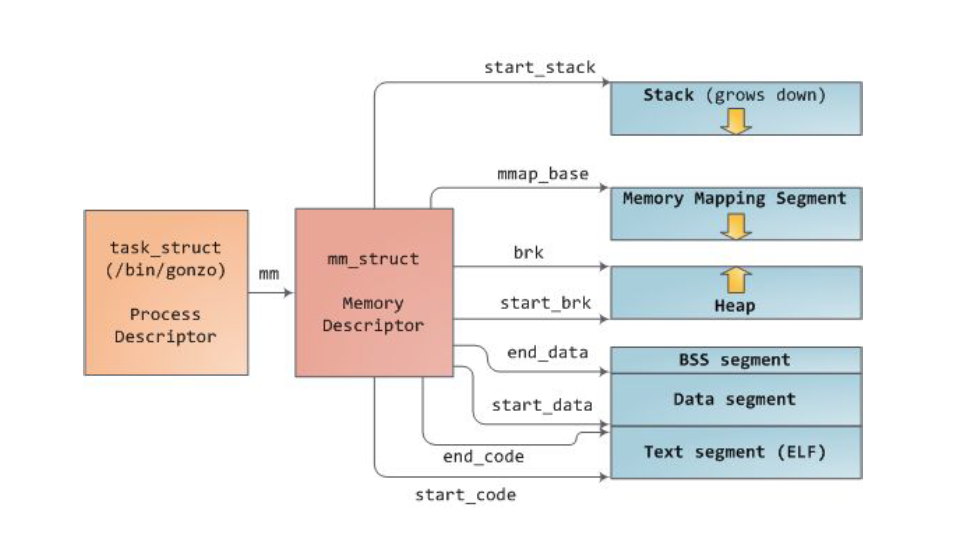
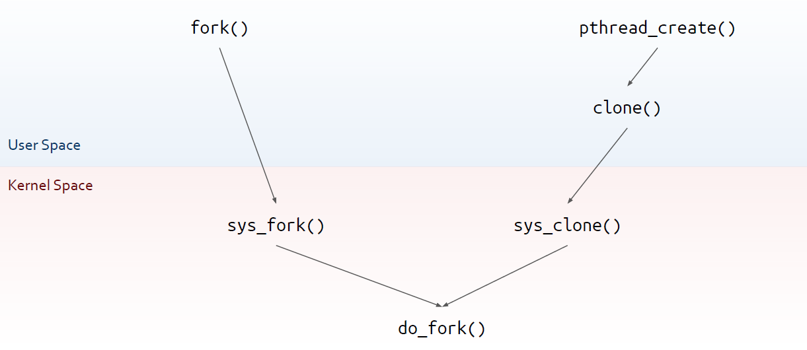

# Advanced Operative Systems and Virtualization

[[_TOC_]]

# Process Management

## Outline
1. Process Control Block
    1. Accessing the PCB
2. The fork()/exec() model
   1. Kernel Threads
3. Out Of Memory (OOM) Killer
4. Process Starting
   1. The ELF Format
   2. Dynamic Linking
   3. Initial Steps of Programs’ Life


# Process Control Block


The concept of a process is fundamental to any multiprogramming OS. The term **process** is often used with several different meanings, for us it **means** an **instance of a program in execution** (or even a set of data structures which describes how far the execution has progressed).

When a **process** is **created** is almost **identical** to its **parent**:
- it receives a logical copy of the parent’s address space
- it executes the same code of the parent, at next instruction after the fork()

But the child process has separate copies of the data (stack and heap) so that changes in the
child are invisible to the parent and vice versa.


While earlier versions of Unix supported this model, modern ones do not. They instead
supported multithreaded applications, in which a process is composed of several **user threads**
(or simply threads), each of which represents a an execution flow of the process (pthread
library).


**Older** versions of **Linux** did **not** **support** **multithreaded** **applications**, so from the kernel point of
view a multithreaded application was just a normal process. So threads were created, handled
and scheduled in User Mode. Therefore if a thread was blocked for a system call, every other
thread would be blocked.

Nowadays Linux uses **lightweight processes** that are independent from each other but at the
same time they can share resources (e.g. memory). They are mapped, in the end, to threads. A
**process** in **modern** versions of Linux is **just a group of lightweight processes**, also called a
**thread group** (created with pthread library).

### The Process Control Block

To manage processes, the kernel must have a clear picture of what each process is doing, for
instance, the priority, the state, the address space and so on. This is the role of the **process
descriptor** (also called Process Control Block - PCB).


### task_struct

The **struct task_struct** object **represents** the **Process Control Block** within the **Linux** Kernel.
This is declared in *include/linux/sched.h* and it is one of the **largest** **structures** in the **kernel** (almost 600 LOCs). 

Relevant members are:
- ```volatile long state```
- ```struct mm_struct *mm```
- ```struct mm_struct *active_mm```
- ```pid_t pid```
- ```pid_t tgid```
- ```struct fs_struct *fs```
- ```struct files_struct *files```
- ```struct signal_struct *sig```
- ```struct thread_struct thread /* CPU-specific state: TSS, FPU, CR2, perf events, ... */```
- ```int prio; /* to implement nice() */```
- ```unsigned long policy /* for scheduling */```
- ```int nr_cpus_allowed```
- ```cpumask_t cpus_allowed```

### Process State

The state field of a process descriptor describe what is currently happening to the process.
Possible states are always exclusive:
- **TASK_RUNNING** the process is either executing on CPU or waiting to be executed
- **TASK_INTERRUPTIBLE** the process is **sleeping** **until** some **condition** becomes true
- **TASK_UNINTERRUPTIBLE** like **TASK_INTERRUPTIBLE** but except that **raising** a **signal** to the process will leave the state unchanged
- **TASK_STOPPED** process has **stopped** (after **signal** SIGSTOP, SIGTSTP)
- **TASK_TRACED** process execution has **stopped by a debugger**

Then to the exit_state field we can have
- **EXIT_ZOMBIE** **process terminated but the parent did not** issued wait to retrieve the data, so the kernel cannot discard it
- **EXIT_DEAD** the parent issued wait

### The mm member

The field mm points to a mm_struct defined in include/linux/mm_types.h. The mm_struct is
used to manage the memory map of the process:
- virtual address of the page table (pgd member)
- a pointer to a list of vm_area_struct records (mmap field)

Each record tracks a user-level virtual memory area which is valid for the process. active_mm is
used to "steal" a mm when running in an anonymous process, and mm is set to NULL.
Non-anonymous processes have active_mm == mm.

### vm_area_struct

The **struct vm_area_struct describes a Virtual Memory Area (VMA)**. It contains:
- ```struct mm_struct *vm_mm```: the address space the structure belongs to
- ```unsigned long vm_start```: the start address in vm_mm
- ```unsigned long vm_end```: the end address
- ```pgprot_t vm_page_prot```: access permissions of this VMA
- ```const struct vm_operations_struct *vm_ops```: operations to deal with this structure
- ```struct mempolicy *vm_policy```: the NUMA policy for this range of addresses
- ```struct file *vm_file```: pointer to a memory-mapped file
- ```struct vm_area_struct *vm_next, *vm_prev```: linked list of VM areas per task, sorted by address


### Userspace Memory Management





### PCB Allocation

Processes are very dynamic entities whose lifetime ranges from a few milliseconds to months. For this reason the kernel must be
able to handle many processes at the same time and process descriptors are allocated in dynamic memory, rather than in the memory
permanently assigned to the kernel. Therefore PCBs can be dynamically allocated upon request.
**For each process, Linux packs two different data structures** in a single per-process memory area: thread_info and the Kernel
Mode process stack. The length of this area is usually **2 pages** (8,192Kbytes).


### Virtually Mapped Kernel Stack

**Kernel-level stacks** have always been the **weak** **point** in the **system design**. This is quite small: you must be careful to avoid overflows. **Stack overflows** (and also recursion overwrite) have been successfully used as attack vectors.

When an overflow occurs, the **Kernel is not easily able to detect it**. Even less able to counteract on it! Stacks are in the
ZONE_NORMAL memory and are contiguous but access is done through the MMU via virtual addresses


There is no need to have a physically contiguous stack, so Andy Lutomirski within its patch
proposed to allocate stack relying on vmalloc(). This had different benefits:
- resolved the problem of fragmentation (since you do not need anymore contiguous memory for the stack)
- it added graceful handling of overflows, killing the responsible process

But this had a big drawback since it introduced a 1.5μs delay in process creation which was
unacceptable. Instead of improving vmalloc subsystem, Linus suggested to add a per-CPU
cache of kernel-level stacks getting memory from vmalloc() has been introduced.

In the end it was also decided to move thread_info completely off the stack and its content
was moved to the task_struct.


## Accessing the PCB

current always refers to the currently-scheduled process, it is therefore architecture-specific.
It returns the memory address of its PCB (evaluates to a pointer to the corresponding
task_struct).


On early versions, it was a macro current defined in include/asm-i386/current.h it
performed computations based on the value of the stack pointer, by exploiting that the stack
is aligned to the couple of pages/frames in memory, therefore changing the stack's size
requires re-aligning this macro.

When thread_info was introduced, masking the stack gave the address to task_struct. To
return the task_struct, the content of the task member of task_struct was returned.
Later, current has been mapped to the static __always_inline struct task_struct
*get_current(void) function. It returns the per-CPU variable current_task declared in
arch/x86/kernel/cpu/common.c. The scheduler updates the current_task variable when
executing a context switch. This is compliant with the fact that thread_info has left the stack

```c
struct task_struct;

DECLARE_PER_CPU(struct task_struct *, current_task);

static __always_inline struct task_struct *get_current(void)
{
	return this_cpu_read_stable(current_task);
}

#define current get_current()
```


#### Up to 2.6

This function in include/linux/sched.h allows to retrieve the memory address of the PCB
by passing the process/thread pid as input.

```c
static inline struct task_struct *find_task_by_pid(int pid) {
    struct task_struct *p, **htable = &pidhash[pid_hashfn(pid)];
    for(p = *htable; p && p->pid != pid; p = p->pidhash_next);
    return p;
}
```

#### Since 2.6

find_task_by_pid has been replaced by:

```c
struct task_struct *find_task_by_vpid(pid_t vpid)
```

This is based on the notion of **virtual pid**. It has to do with userspace namespaces, to allow
processes in different namespaces to share the same pid numbers.


A **namespace** is a feature of the Linux kernel which partitions the available resources in such a
way **all** the **process** in the **same** **namespace** **see** the **same** amount of **resources**. At boot every
process belongs to the same namespace. Namespaces are used for implementing containers.
Namespaces are used in conjunction with cgroups, another kernel feature that limits the
usage of CPU/RAM/IO for a specific set of processes.

#### Up to 4.14

```c
/* PID hash table linkage. */
struct task_struct *pidhash_next;
struct task_struct **pidhash_pprev;
```

There is a hash defined as below in include/linux/sched.h
- ```#define PIDHASH_SZ (4096 >> 2)```
- ```extern struct task_struct *pid_hash[PIDHASH_SZ];```
- ```#define pid_hashfn(x) ((((x) >> 8) ^ (x)) & (PIDHASH_SZ - 1))```


#### Today

The **hash** **data** **structure** has been **replaced** by a **radix** **tree**.
- PIDs are replaced with Integer IDs (idr)
- idr is the kernel-level library for the management of small integer ID numbers


An idr is a sparse array mapping integer IDs onto arbitrary pointers. Look back at the data
structures lab.


# The fork()/exec() model

To create a new process, a couple of fork() and exec*() calls should be issued. In general
new process share everything with the parent so it would be inefficient to truly copy all the
data. To overcome this the Linux kernel:
- implements the **Copy-on-Write** that allows both **parent and child to read the same physical pages**, **whenever** **one** tries to **write** on a **physical page the kernel copies its content into a new physical page**;
- lightweight processes allow both parent and child to share many kernel data structures, such as the paging tables, open files struct and signals

Not every child need to share everything from the parent, for this reason right after a fork() we can issue an exec*().

### fork()
This function creates a new process. The return value is zero in the child and the process-id
number of the child in the parent, or -1 upon error.

Both processes start executing from the next instruction to the fork() call.



### Calling sys_clone() from Userspace

Lightweight processes are created by using a function named clone().

```c
long clone(unsigned long flags, void *child_stack, int *ptid,
            int *ctid, unsigned long newtls);
```

When using sys_clone(), we** must allocate a new stack** first. By convention, userspace
memory is always allocated from userspace. Indeed, a thread of the same process share the
same address space. Also, the TLS (Thread Local Storage) must be allocated in user space, this
is architecture-dependent, thus the unsigned long type. glibc offers a uniform function but
the implementation of the syscall entry points is slightly different on every architecture

### sys_fork() and sys_clone()

```c 
SYSCALL_DEFINE0(fork)
{
    return _do_fork(SIGCHLD, 0, 0, NULL, NULL, 0);
}

SYSCALL_DEFINE5(clone, unsigned long, clone_flags, unsigned long, newsp, int
__user *, parent_tidptr, int __user *, child_tidptr, unsigned long, tls)
{
    return _do_fork(clone_flags, newsp, 0, parent_tidptr,
    child_tidptr, tls);
}
```

### do_fork()

The do_fork() function makes use of an auxiliary function called copy_process() to set up the
process descriptor and any other kernel data structure for child’s execution. Here’s the main
steps:

1. allocates a new PID, a new PCB and a new kernel stack
2. copies PCB information/data structures by using copy_process(). The information copied depends on the passed flags.

### copy_process()

The function **implements** **several** **checks** on **namespaces**. Pending signals are processed
immediately in the parent process.
- p = dup_task_struct(current, node);
- setup_thread_stack(tsk, orig);
- copy_creds(p, clone_flags);
- copy_files(clone_flags, p);
- copy_fs(clone_flags, p);
- copy_mm(clone_flags, p); -> dup_mm()


## Kernel Threads

See slide

# Out Of Memory (OOM) Killer
It is implemented in mm/oom_kill.c. This module is **activated** (if enabled) when the **system runs out of memory**.

There are three possible actions:
- kill a random task (bad)
- let the system crash (worse)
- try to be smart at picking the process to kill


The OOM Killer picks a "good" process and kills it in order to reclaim available memory.

Entry point of the system is **out_of_memory()**. It **tries** to **select** the "**best**" **process** checking for different conditions:


- if a process has a **pending** **SIGKILL** or is **exiting**, this is automatically **picked** (check done  by task_will_free_mem())
- **Otherwise**, it issues a call to **select_bad_process()** which will return a process to be killed:
  - the picked process is then killed
  - if no process is found, a panic() is raised

### select_bad_process()

This **iterates** over all available **processes** calling oom_evaluate_task() on them, until a killable process is found. **Unkillable** **tasks** (i.e., kernel threads) are **skipped**, oom_badness() implements the heuristic to pick the process to be killed by computing the "score" associated with each process, the higher the higher the score the higher the probability of getting killed.

##### oom_badness()

A score of zero is given if:
- the task is unkillable
- the mm field is NULL
- if the process is in the middle of a fork

The score is then computed proportionally to the RAM, swap, and pagetable usage

```
points = get_mm_rss(p->mm) + get_mm_counter(p->mm, MM_SWAPENTS) + mm_pgtables_bytes(p->mm) / PAGE_SIZE;
```


# Process Starting

We all know how to launch the compiled program: './program'

The question is: **why does all this work**? What is the convention used between kernel and user space?

### starting a program from bash

```c
static int execute_disk_command (char *command, int pipe_in, int pipe_out, int async, struct fd_bitmap *fds_to_close) {
    pid_t pid;
    pid = make_child (command, async);
    if (pid == 0) {
        shell_execve (command, args, export_env);
    }
}
```

```c
pid_t make_child (char *command, int async_p) {
    pid_t pid;
    int forksleep;
    start_pipeline();
    forksleep = 1;
    while ((pid = fork ()) < 0 && errno == EAGAIN && forksleep < FORKSLEEP_MAX) {
        sys_error("fork: retry");
        reap_zombie_children();
        if (forksleep > 1 && sleep(forksleep) != 0)
            break;
        forksleep <<= 1;
    }
    
    /* ... */
    return (pid);
}
```

```c
int shell_execve (char *command, char **args, char **env) {
    execve (command, args, env);
    
    READ_SAMPLE_BUF (command, sample, sample_len);
    
    if (sample_len == 0)
        return (EXECUTION_SUCCESS);
    if (sample_len > 0) {
        if (sample_len > 2 && sample[0] == '#' && sample[1] == '!')
            return (execute_shell_script(sample, sample_len, command, args, env));
        else if (check_binary_file (sample, sample_len)) {
            internal_error (_("%s: cannot execute binary file"), command);
            return (EX_BINARY_FILE);
        }
    }
    longjmp(subshell_top_level, 1);
}
```

### exec*

exec*() changes the program file that an existing process is running:
- it first **wipes** out the memory state of the calling process
- it then goes to the filesystem to **find** the **program** file **requested**
- it **copies** this file into the program's memory and initializes register state, including the PC
- It **doesn't alter** most of the other fields in the PCB. The process calling exec*() (the child 
copy of the shell, in this case) can, e.g., change the opened files

Let’s see how exec*() is implemented.

### struct linux_binprm

The struct linux_binprm is in charge of keeping information about a binary file.


```c
struct linux_binprm {
    char buf[BINPRM_BUF_SIZE];
    struct page *page[MAX_ARG_PAGES];
    unsigned long p; /* current top of mem */
    int sh_bang;
    struct file* file;
    int e_uid, e_gid;
    kernel_cap_t cap_inheritable, cap_permitted, cap_effective;
    int argc, envc;
    char *filename; /* Name of binary */
    unsigned long loader, exec;
};
```

### do_execve()

vedi slide per codice

### search_binary_handler()

The function scans a list of binary file handlers registered in the kernel. If no handler is able to  recognize the image format, syscall returns the ENOEXEC error (“Exec Format Error”).

For ELF files we have in fs/binfmt_elf.c:
- load_elf_binary(), the function:
  - loads image file to memory using mmap;
  - reads the program header and sets permissions accordingly
  - elf_ex = *((struct elfhdr *)bprm->buf);


## The ELF Format

VB base

ELF: Executable and Linking Format

ELF defines the format of binary executables. There are four different categories:

- **Relocatable**, created by compilers and assemblers. Must be processed by the linker  before being run.
- **Executable**, all symbols are resolved, except for shared libraries’ symbols, which are resolved at runtime.
- **Shared object**, a **library** which is shared by different programs, contains all the symbols’ information used by the linker, and the code to be executed at runtime.
- **Core file**, a core dump.


ELF files have a twofold nature
- compilers, assemblers and linkers handle them as a set of **logical** sections;
- the system loader handles them as a set of **segments**.

### Relocatable File

A relocatable file or a shared object is a collection of sections. Each section contains a single kind of information, such as executable code, read-only data, read/write data, relocation entries, or symbols.


Each symbol’s address is defined in relation to the section which contains it. For example, a function’s entry point is defined in relation to the section of the program which contains it

### Section Header

```c
typedef struct {
    Elf32_Word sh_name; /* Section name (string tbl index) */
    Elf32_Word sh_type; /* Section type */
    Elf32_Word sh_flags; /* Section flags */
    Elf32_Addr sh_addr; /* Section virtual addr at execution */
    Elf32_Off sh_offset; /* Section file offset */
    Elf32_Word sh_size; /* Section size in bytes */
    Elf32_Word sh_link; /* Link to another section */
    Elf32_Word sh_info; /* Additional section information */
    Elf32_Word sh_addralign; /* Section alignment */
    Elf32_Word sh_entsize; /* Entry size if section holds table */
} Elf32_Shdr;
```

#### Types and Flags

Types:
- PROGBITS: The section contains the program content (code, data, debug information).
- NOBITS: Same as PROGBITS, yet with a null size.
- SYMTAB and DYNSYM: The section contains a symbol table.
- STRTAB: The section contains a string table.
- REL and RELA: The section contains relocation information.
- DYNAMIC and HASH: The section contains dynamic linking information.
Flags:
- WRITE: The section contains runtime-writeable data.
- ALLOC: The section occupies memory at runtime.
- EXECINSTR: The section contains executable machine instructions.

#### Examples

- .text: contains program’s instructions
  - Type: PROGBITS
  - Flags: ALLOC + EXECINSTR
- .data: contains pre-initialized read/write data
  - Type: PROGBITS
  - Flags: ALLOC + WRITE
- .rodata: contains pre-initialized read-only data
  - Type: PROGBITS
  - Flags: ALLOC
- .bss: contains uninitialized data. Will be set to zero at startup.
  - Type: NOBITS
  - Flags: ALLOC + WRITE


### Executable Files

Usually, an executable file has only few segments:
- A read-only segment for code.
- A read-only segment for read-only data.
- A read/write segment for other data.

Any section marked with flag ALLOC is packed in the proper segment, so that the operating  system is able to map the file to memory with few operations.

If .data and .bss sections are present, they are placed within the same read/write segment.

### Program Header

```c
typedef struct {
    Elf32_Word p_type; /* Segment type */
    Elf32_Off p_offset; /* Segment file offset */
    Elf32_Addr p_vaddr; /* Segment virtual address */
    Elf32_Addr p_paddr; /* Segment physical address */
    Elf32_Word p_filesz; /* Segment size in file */
    Elf32_Word p_memsz; /* Segment size in memory */
    Elf32_Word p_flags; /* Segment flags */
    Elf32_Word p_align; /* Segment alignment */
} Elf32_Phdr;
```

### Static relocation

A symbol can be:
- **strong**, a strong symbol replaces a weak one and if two strong symbols have the same  name the linker resolves in favour of the first; by default every symbol is strong
- **weak**, more modules can have a symbol with the same name of a weak one, the  declared entity cannot be overloaded by other modules; It is useful for libraries which  want to avoid conflicts with user programs.

## Dynamic Linking

The main() function is not the actual entry point for the program. glibc inserts auxiliary functions. The actual entry point is called _start.


The **Static** Relocation **works** at **linking** **time** but you obviously **do not want to include all the  libraries** that you use in your program in your executable file, this **because eats up memory**  and almost all the programs use the same set of libraries (e.g. the stdlib). Symbols that are not  included in the final executable file are resolved with the Dynamic Linking that is performed by the kernel when the program starts. 


The Kernel starts the dynamic linker which is stored in the .interp section of the program (usually /lib/ld-linux.so.2). If no dynamic linker is specified, control is given at address specified in e_entry.


Initialization steps:
- Self initialization
- Loading Shared Libraries
- Resolving remaining relocations
- Transfer control to the application


The **most important data structures** which are filled are:
- **Procedure Linkage Table (PLT)**, used to call functions whose address isn't known at link time
- **Global Offsets Table (GOT)**, similarly used to resolve addresses of data/functions

#### Data Structures

- .dynsym: a minimal symbol table used by the dynamic linker when performing relocations
- .hash: a hash table that is used to quickly locate a given symbol in the .dynsym, usually in one or two tries.
- .dynstr: string table related to the symbols stored in .dynsym

**These tables are used to fill the GOT table, that is populated upon need (lazy binding).**

The first PLT entry is special. Other entries are identical, one for each function needing resolution.
1. A jump to a location which is specified in a corresponding GOT entry
2. Preparation of arguments for a resolver routine
3. Call to the resolver routine, which resides in the first entry of the PLT

The first PLT entry is a call to the **resolver** located in the dynamic loader itself.

#### steps

When func is called for the **first time**:
1. PLT[n] is called, and jumps to the address pointed to it in GOT[n]
2. This address points into PLT[n] itself, to the preparation of arguments for the resolver.
3. The resolver is then called, by jumping to PLT[0]
4. The resolver performs resolution of the actual address of func, places its actual address into GOT[n] and calls func


## Initial Steps of Programs’ Life

So far the dynamic linker has loaded the shared libraries in memory. GOT is populated when the program requires certain functions. Then, the dynamic linker calls _start


### Userspace Life of a Program


### **Stack Layout at Program Startup**


