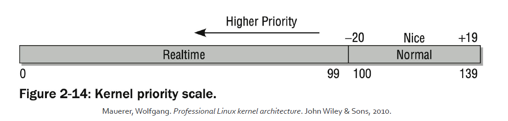
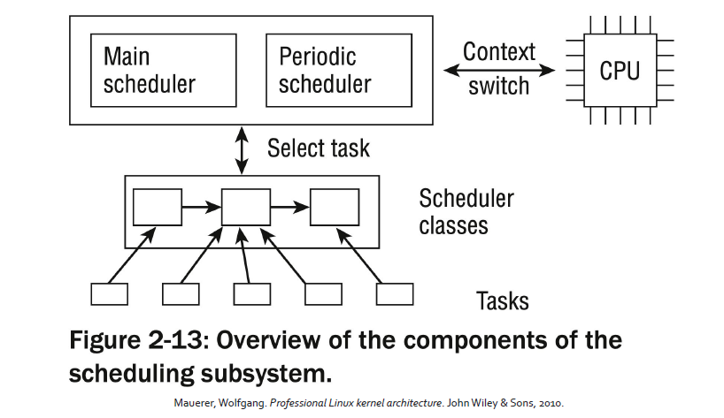

# Advanced Operative Systems and Virtualization

[[_TOC_]]

# Scheduling

## Outline
1. Introduction
2. Priorities and Weights
3. Scheduler Core
   1. Wait Queues
   2. Scheduler Entry Point
   3. Scheduler Algorithms
4. Context Switch

# Introduction

Like every time sharing system, Linux achieves the effect of an apparent simultaneous
execution of multiple processes by switching from one process to another in a very short time
frame.

The scheduling policy is concerned with **when** to switch and **which** process to choose.

The scheduling algorithm of traditional Unix operating systems must fulfill several conflicting objectives:
- fast process response time
- good throughput for background jobs
- no starvation
- reconciliation of the needs of low- and high- priority processes and so on

**Linux Scheduling** is based on the **time sharing technique**: several processes run in “time
multiplexing” because the CPU is divided into **slices**, one for each runnable process. Obviously
one CPU can run only one process at a given instant, therefore when the currently running
process is not terminated when its time slice or **quantum** expires, a process switch may take
place.

Time sharing relies on timer interrupts and is thus transparent to process, no additional code
needs to be inserted in the programs to ensure CPU time sharing.


# Priorities and Weights

In **Linux**, process **priority** is **dynamic**. The scheduler keeps track of what processes are doing
and **adjusts** their priorities **periodically**.

In this way, processes that have been denied the use of CPU for a long time interval are boosted by dynamically increasing their priority (and vice
versa).

Process in general are:
- **CPU Bound**, if require a lot of cpu time
- **I/O Bound**, if require a lot of I/O operations

**Or**, according to another classification:
- **interactive**, if they interact a lot with the user, therefore they spend much time waiting for keystrokes and mouse operations; these processes must be very responsive
- **batch**, if they do not need user interaction, since they run in background
- **real-time**, they have to follow strict scheduling requirements, they should be never blocked by a lower priority process (e.g. video, sound applications)

### Nice and RT

Unix demands for **priority** based scheduling. To each process is **associated** a “**nice**” **number** in [-20, 19]:

- **the higher the nice, the lower the priority**
- this tells how nice a process is towards others

There is also the notion of "real time" processes
- **Hard real time**: bound to **strict time limits** in which a task must be completed (**not supported in mainstream Linux**)
- **Soft real time**: there are **boundaries**, but don't make your life depend on it. Examples: burning data to a CD ROM, VoIP

## Priorities

In Linux, real time priorities are in [0, 99]. Here **higher value means lower priority**. Implemented according to the Real-Time. Extensions of POSIX.

Both nice and rt priorities are mapped to a single value in [0, 139] in the kernel:
- **0 to 99** are reserved to **rt priorities**
- **100 to 139** for **nice** priorities (mapping exactly to [-20, 19])

Priorities are defined in include/linux/sched/prio.h


##### Macros

```c
#define MAX_NICE 19
#define MIN_NICE -20
#define NICE_WIDTH (MAX_NICE - MIN_NICE + 1)
#define MAX_USER_RT_PRIO 100
#define MAX_RT_PRIO MAX_USER_RT_PRIO
#define MAX_PRIO (MAX_RT_PRIO + NICE_WIDTH)
#define DEFAULT_PRIO (MAX_RT_PRIO + NICE_WIDTH / 2)

/*
* Convert user-nice values [ -20 ... 0 ... 19 ]
* to static priority [ MAX_RT_PRIO..MAX_PRIO-1 ],
* and back.
*/
#define NICE_TO_PRIO(nice) ((nice) + DEFAULT_PRIO)
#define PRIO_TO_NICE(prio) ((prio) - DEFAULT_PRIO)

/*
* 'User priority' is the nice value converted to something we
* can work with better when scaling various scheduler parameters,
* it's a [ 0 ... 39 ] range.
*/
#define USER_PRIO(p) ((p)-MAX_RT_PRIO)
#define TASK_USER_PRIO(p) USER_PRIO((p)->static_prio)
#define MAX_USER_PRIO (USER_PRIO(MAX_PRIO))
```

### Priorities in task_struct

There are several fields for representing the priority in the task_struct:
- **static_prio** (**static**): priority given “statically” by a user (and mapped into kernel’s representation);
- **normal_priority** (**dynamic**): based on static_prio and scheduling policy of a process: tasks with the same static priority that belong to different policies will get different normal priorities. Child processes inherit the normal priorities from their parent processes when forked;
- **prio** (**dynamic**): it is the **priority considered by the scheduler**, it changes over the process execution keeping track **CPU bound processes to penalize, and I/O bound processes to boost**;
- **rt_priority** (**static**): the realtime priority **for realtime tasks** in [0, 99].

static means that is assigned at process startup but then it can be changed by issuing a
system call, dynamic means that the scheduler recomputes it during the process execution

**Slide contain code for weight**


Therefore for now we introduced that for a scheduling process we need:
- a set of dynamic and static priorities
- a load weight


# Scheduler Core

Every Linux process is always scheduled according to one of the following scheduling classes.
The policy is described in task_struct->policy:
- **SCHED_NORMAL** (also called SCHED_OTHER), **conventional time-shared process**, in general
has a soft priority mechanism over the 'nice' range of -20 to +19 (static priority of
100-139) which decides according to the priority which task goes first, and how much
timeslice it gets. This system **dynamically alters the priority** to allow interactive tasks to
go first, and is designed to prevent starvation of lower priority tasks with an expiration
policy
- **SCHED_RR**, is a **fixed real time policy** over the static range of 0-99 where a lower number
(higher priority) task will repeatedly go ahead of _any_ tasks lower priority than itself. It
is **called RR because if multiple tasks are at the same priority it will Round Robin between
those tasks**
- **SCHED_FIFO**, is a **fixed real time policy** the static range of 0-99 where a lower number
(higher priority) task will repeatedly go ahead of _any_ tasks with lower priority than
itself. **Unlike RR, if a task does not give up the cpu it will run indefinitely** even if other
tasks are the same static priority as itself.


Every Linux process is always scheduled according to one of the following scheduling classes:
- **SCHED_BATCH**, does **not preempt nearly as often as regular tasks would**, thereby allowing
tasks to run longer and make **better use of caches** but at the cost of interactivity. This is
well suited for batch jobs.
- **SCHED_IDLE**, even weaker than SCHED_BATCH
- **SCHED_DEADLINE**, implementation of the **Earliest Deadline First** (EDF) scheduling
algorithm, augmented with a mechanism (called Constant Bandwidth Server, CBS) that
makes it possible to isolate the behavior of tasks between each other. CBS has been
replaced with Greedy Reclamation of Unused Bandwidth (GRUB) from kernel 4.13.

### Scheduling Classes

For each scheduling class/policy a set of standard function is defined as follows, in this way in order to schedule a task the scheduler core uses always the same set of APIs. We have:

- **enqueue_task**(…) 
- **dequeue_task**(…) 
- **yield_task**(…) This function is basically just a **dequeue followed by an enqueue**, unless the compat_yield sysctl is turned on; in that
case, it places the scheduling entity at the right-most end of the red-black tree.
- **check_preempt_curr**(…) This function checks if a task that entered the runnable state should preempt the currently running task.
- **pick_next_task**(…) 
- **set_curr_task**(…) This function is called when a task changes its scheduling class or changes its task group.
- **task_tick**(…) This function is mostly called from time tick functions; it might lead to process switch. This drives the running preemption.

Scheduling can be activated in 2 ways: when a task goes to sleep (or yield the CPU) or by a
periodic mechanism.



### Scheduler Code Organization

General code base and specific scheduler classes are found in kernel/sched/
- core.c: the common codebase
- fair.c: implementation of the basic scheduler (CFS: Completely Fair Scheduler), it implements SCHED_NORMAL, SCHED_BATCH and SCHED_IDLE
- rt.c: the real-time scheduler implements SCHED_FIFO and SCHED_RR
- idle_task.c: generic entry points for the idle threads and implementation of the idle task scheduling class (not related to SCHED_IDLE) for scheduling the idle task (i.e. do_idle)

### Run queues

The **central data structure** of the core scheduler that is used to manage active processes is
known as **run queue**. **Each CPU has its own run queue**, and each active process appears on just
one run queue.

```c
struct rq {
    unsigned int nr_running;
    #define CPU_LOAD_IDX_MAX 5
    unsigned long cpu_load[CPU_LOAD_IDX_MAX];
    /* capture load from all tasks on this cpu */
    struct load_weight load;
    struct cfs_rq cfs;
    struct rt_rq rt;
    struct task_struct *curr, *idle;
    u64 clock;
    /* cpu of this runqueue */
    int cpu;
}
```

DECLARE_PER_CPU_SHARED_ALIGNED(struct rq, runqueues);
```c
#define cpu_rq(cpu) (&per_cpu(runqueues, (cpu)))
#define this_rq() this_cpu_ptr(&runqueues)
#define task_rq(p) cpu_rq(task_cpu(p))
#define cpu_curr(cpu) (cpu_rq(cpu)->curr) 
```


## Wait Queues

Defined in include/linux/wait.h **Wait Queues implement conditional waits on events**: a
process wishing to wait for a specific event places itself in the proper wait queue and
relinquishes control. Therefore a wait queue represents a set of sleeping processes, which are
woken up by the kernel when some condition becomes true.


Wait Queues changed many times in the history of the kernel. In the earlier version they
suffered from the "Thundering Herd" performance problem.

> In computer science, the thundering herd problem occurs when a large number of processes or threads waiting for an event are awoken when that event occurs, but only one process is able to handle the event. When the processes wake up, they will each try to handle the event, but only one will win. All processes will compete for resources, possibly freezing the computer, until the herd is calmed down again.

For solving the Thundering Herd problem the
kernel defines two kinds of sleeping processes:
- **exclusive**, are selectively woken up by the kernel
- **non-exclusive**, are always woken up by the kernel

```c
#define WQ_FLAG_EXCLUSIVE 0x01
    struct wait_queue_entry {
    unsigned int flags;
    void *private;
    wait_queue_func_t func;
    struct list_head entry;
};

struct wait_queue_head {
    spinlock_t lock;
    struct list_head head;
};
```

### APIs

- static inline void **init_waitqueue_entry**(struct wait_queue_entry *wq_entry, struct task_struct *p)
- static inline void **wait_event_interruptible**(wq_head, condition) - sleep until a condition gets true
- static inline void **wait_event_interruptible_timeout**(wq_head, condition, timeout) - sleep until a condition gets true or a timeout elapses
- static inline void **wait_event_hrtimeout**(wq_head, condition, timeout)
- static inline void **wait_event_interruptible_hrtimeout**(wq, condition, timeout)

slide of code pg 31

These functions wake up TASK_NORMAL = TASK_INTERRUPTIBLE + TASK_UNINTERRUPTIBLE
- wake_up(x)
- wake_up_nr(x, nr)
- wake_up_all(x)
- wake_up_locked(x)
- wake_up_all_locked(x)


These instead only TASK_INTERRUPTIBLE
- wake_up_interruptible(x)
- wake_up_interruptible_nr(x, nr)
- wake_up_interruptible_all(x)
- wake_up_interruptible_sync(x)


## Scheduler Entry Point

## Scheduler Algorithms

# Context Switch