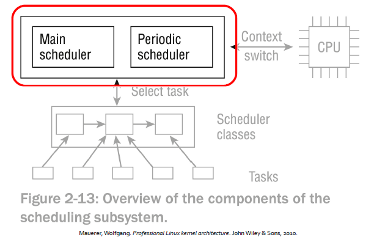
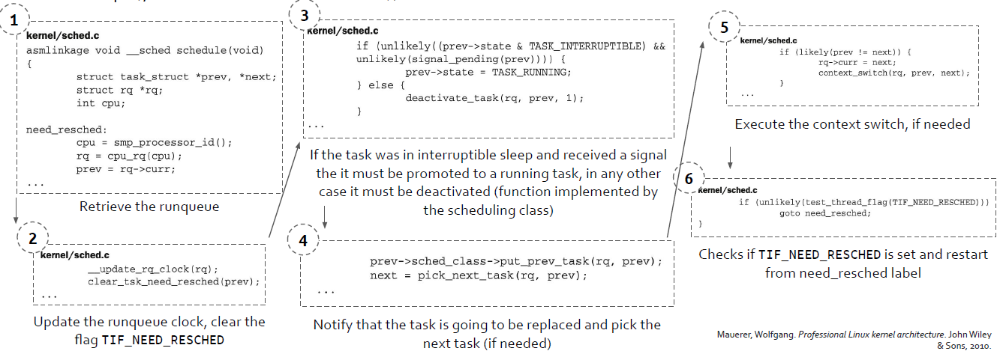
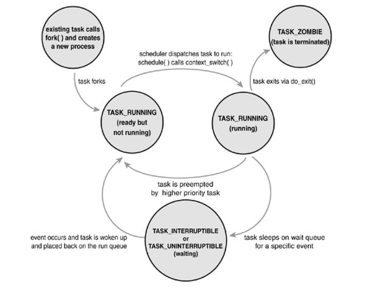
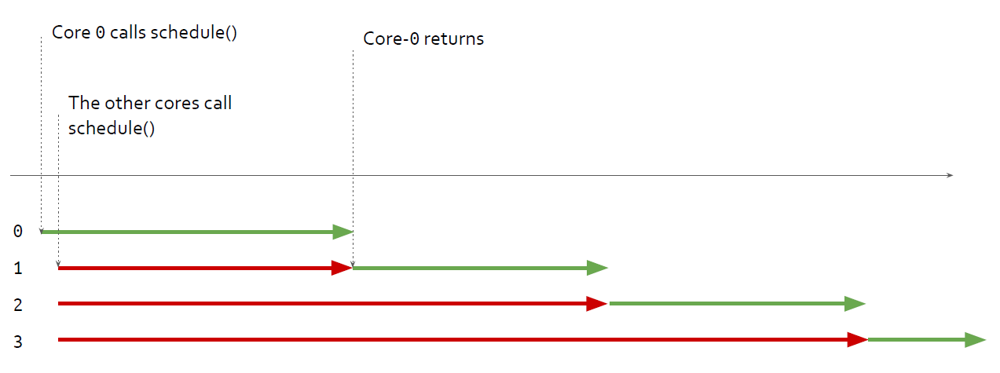
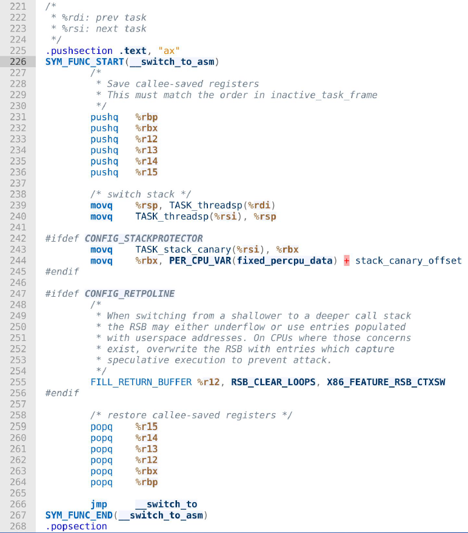

# Advanced Operative Systems and Virtualization

[[_TOC_]]

# Scheduling

## Outline
1. Introduction
2. Priorities and Weights
3. Scheduler Core
   1. Wait Queues
   2. Scheduler Entry Point
   3. Scheduler Algorithms
4. Context Switch

# Introduction

Like every time sharing system, Linux achieves the effect of an apparent simultaneous
execution of multiple processes by switching from one process to another in a very short time
frame.

The scheduling policy is concerned with **when** to switch and **which** process to choose.

The scheduling algorithm of traditional Unix operating systems must fulfill several conflicting objectives:
- fast process response time
- good throughput for background jobs
- no starvation
- reconciliation of the needs of low- and high- priority processes and so on

**Linux Scheduling** is based on the **time sharing technique**: several processes run in “time
multiplexing” because the CPU is divided into **slices**, one for each runnable process. Obviously
one CPU can run only one process at a given instant, therefore when the currently running
process is not terminated when its time slice or **quantum** expires, a process switch may take
place.

Time sharing relies on timer interrupts and is thus transparent to process, no additional code
needs to be inserted in the programs to ensure CPU time sharing.


# Priorities and Weights

In **Linux**, process **priority** is **dynamic**. The scheduler keeps track of what processes are doing
and **adjusts** their priorities **periodically**.

In this way, processes that have been denied the use of CPU for a long time interval are boosted by dynamically increasing their priority (and vice
versa).

Process in general are:
- **CPU Bound**, if require a lot of cpu time
- **I/O Bound**, if require a lot of I/O operations

**Or**, according to another classification:
- **interactive**, if they interact a lot with the user, therefore they spend much time waiting for keystrokes and mouse operations; these processes must be very responsive
- **batch**, if they do not need user interaction, since they run in background
- **real-time**, they have to follow strict scheduling requirements, they should be never blocked by a lower priority process (e.g. video, sound applications)

### Nice and RT

Unix demands for **priority** based scheduling. To each process is **associated** a “**nice**” **number** in [-20, 19]:

- **the higher the nice, the lower the priority**
- this tells how nice a process is towards others

There is also the notion of "real time" processes
- **Hard real time**: bound to **strict time limits** in which a task must be completed (**not supported in mainstream Linux**)
- **Soft real time**: there are **boundaries**, but don't make your life depend on it. Examples: burning data to a CD ROM, VoIP

## Priorities

In Linux, real time priorities are in [0, 99]. Here **higher value means lower priority**. Implemented according to the Real-Time. Extensions of POSIX.

Both nice and rt priorities are mapped to a single value in [0, 139] in the kernel:
- **0 to 99** are reserved to **rt priorities**
- **100 to 139** for **nice** priorities (mapping exactly to [-20, 19])

Priorities are defined in include/linux/sched/prio.h


##### Macros

```c
#define MAX_NICE 19
#define MIN_NICE -20
#define NICE_WIDTH (MAX_NICE - MIN_NICE + 1)
#define MAX_USER_RT_PRIO 100
#define MAX_RT_PRIO MAX_USER_RT_PRIO
#define MAX_PRIO (MAX_RT_PRIO + NICE_WIDTH)
#define DEFAULT_PRIO (MAX_RT_PRIO + NICE_WIDTH / 2)

/*
* Convert user-nice values [ -20 ... 0 ... 19 ]
* to static priority [ MAX_RT_PRIO..MAX_PRIO-1 ],
* and back.
*/
#define NICE_TO_PRIO(nice) ((nice) + DEFAULT_PRIO)
#define PRIO_TO_NICE(prio) ((prio) - DEFAULT_PRIO)

/*
* 'User priority' is the nice value converted to something we
* can work with better when scaling various scheduler parameters,
* it's a [ 0 ... 39 ] range.
*/
#define USER_PRIO(p) ((p)-MAX_RT_PRIO)
#define TASK_USER_PRIO(p) USER_PRIO((p)->static_prio)
#define MAX_USER_PRIO (USER_PRIO(MAX_PRIO))
```

### Priorities in task_struct

There are several fields for representing the priority in the task_struct:
- **static_prio** (**static**): priority given “statically” by a user (and mapped into kernel’s representation);
- **normal_priority** (**dynamic**): based on static_prio and scheduling policy of a process: tasks with the same static priority that belong to different policies will get different normal priorities. Child processes inherit the normal priorities from their parent processes when forked;
- **prio** (**dynamic**): it is the **priority considered by the scheduler**, it changes over the process execution keeping track **CPU bound processes to penalize, and I/O bound processes to boost**;
- **rt_priority** (**static**): the realtime priority **for realtime tasks** in [0, 99].

static means that is assigned at process startup but then it can be changed by issuing a
system call, dynamic means that the scheduler recomputes it during the process execution

**Slide contain code for weight**


Therefore for now we introduced that for a scheduling process we need:
- a set of dynamic and static priorities
- a load weight


# Scheduler Core

Every Linux process is always scheduled according to one of the following scheduling classes.
The policy is described in task_struct->policy:
- **SCHED_NORMAL** (also called SCHED_OTHER), **conventional time-shared process**, in general
has a soft priority mechanism over the 'nice' range of -20 to +19 (static priority of
100-139) which decides according to the priority which task goes first, and how much
timeslice it gets. This system **dynamically alters the priority** to allow interactive tasks to
go first, and is designed to prevent starvation of lower priority tasks with an expiration
policy
- **SCHED_RR**, is a **fixed real time policy** over the static range of 0-99 where a lower number
(higher priority) task will repeatedly go ahead of _any_ tasks lower priority than itself. It
is **called RR because if multiple tasks are at the same priority it will Round Robin between
those tasks**
- **SCHED_FIFO**, is a **fixed real time policy** the static range of 0-99 where a lower number
(higher priority) task will repeatedly go ahead of _any_ tasks with lower priority than
itself. **Unlike RR, if a task does not give up the cpu it will run indefinitely** even if other
tasks are the same static priority as itself.


Every Linux process is always scheduled according to one of the following scheduling classes:
- **SCHED_BATCH**, does **not preempt nearly as often as regular tasks would**, thereby allowing
tasks to run longer and make **better use of caches** but at the cost of interactivity. This is
well suited for batch jobs.
- **SCHED_IDLE**, even weaker than SCHED_BATCH
- **SCHED_DEADLINE**, implementation of the **Earliest Deadline First** (EDF) scheduling
algorithm, augmented with a mechanism (called Constant Bandwidth Server, CBS) that
makes it possible to isolate the behavior of tasks between each other. CBS has been
replaced with Greedy Reclamation of Unused Bandwidth (GRUB) from kernel 4.13.

### Scheduling Classes

For each scheduling class/policy a set of standard function is defined as follows, in this way in order to schedule a task the scheduler core uses always the same set of APIs. We have:

- **enqueue_task**(…) 
- **dequeue_task**(…) 
- **yield_task**(…) This function is basically just a **dequeue followed by an enqueue**, unless the compat_yield sysctl is turned on; in that
case, it places the scheduling entity at the right-most end of the red-black tree.
- **check_preempt_curr**(…) This function checks if a task that entered the runnable state should preempt the currently running task.
- **pick_next_task**(…) 
- **set_curr_task**(…) This function is called when a task changes its scheduling class or changes its task group.
- **task_tick**(…) This function is mostly called from time tick functions; it might lead to process switch. This drives the running preemption.

Scheduling can be activated in 2 ways: when a task goes to sleep (or yield the CPU) or by a
periodic mechanism.


### Scheduler Code Organization

General code base and specific scheduler classes are found in kernel/sched/
- core.c: the common codebase
- fair.c: implementation of the basic scheduler (CFS: Completely Fair Scheduler), it implements SCHED_NORMAL, SCHED_BATCH and SCHED_IDLE
- rt.c: the real-time scheduler implements SCHED_FIFO and SCHED_RR
- idle_task.c: generic entry points for the idle threads and implementation of the idle task scheduling class (not related to SCHED_IDLE) for scheduling the idle task (i.e. do_idle)

### Run queues

The **central data structure** of the core scheduler that is used to manage active processes is
known as **run queue**. **Each CPU has its own run queue**, and each active process appears on just
one run queue.

```c
struct rq {
    unsigned int nr_running;
    #define CPU_LOAD_IDX_MAX 5
    unsigned long cpu_load[CPU_LOAD_IDX_MAX];
    /* capture load from all tasks on this cpu */
    struct load_weight load;
    struct cfs_rq cfs;
    struct rt_rq rt;
    struct task_struct *curr, *idle;
    u64 clock;
    /* cpu of this runqueue */
    int cpu;
}
```

DECLARE_PER_CPU_SHARED_ALIGNED(struct rq, runqueues);
```c
#define cpu_rq(cpu) (&per_cpu(runqueues, (cpu)))
#define this_rq() this_cpu_ptr(&runqueues)
#define task_rq(p) cpu_rq(task_cpu(p))
#define cpu_curr(cpu) (cpu_rq(cpu)->curr) 
```


## Wait Queues

Defined in include/linux/wait.h **Wait Queues implement conditional waits on events**: a
process wishing to wait for a specific event places itself in the proper wait queue and
relinquishes control. Therefore a wait queue represents a set of sleeping processes, which are
woken up by the kernel when some condition becomes true.


Wait Queues changed many times in the history of the kernel. In the earlier version they
suffered from the "Thundering Herd" performance problem.

> In computer science, the thundering herd problem occurs when a large number of processes or threads waiting for an event are awoken when that event occurs, but only one process is able to handle the event. When the processes wake up, they will each try to handle the event, but only one will win. All processes will compete for resources, possibly freezing the computer, until the herd is calmed down again.

For solving the Thundering Herd problem the
kernel defines two kinds of sleeping processes:
- **exclusive**, are selectively woken up by the kernel
- **non-exclusive**, are always woken up by the kernel

```c
#define WQ_FLAG_EXCLUSIVE 0x01
    struct wait_queue_entry {
    unsigned int flags;
    void *private;
    wait_queue_func_t func;
    struct list_head entry;
};

struct wait_queue_head {
    spinlock_t lock;
    struct list_head head;
};
```

### APIs

- static inline void **init_waitqueue_entry**(struct wait_queue_entry *wq_entry, struct task_struct *p)
- static inline void **wait_event_interruptible**(wq_head, condition) - sleep until a condition gets true
- static inline void **wait_event_interruptible_timeout**(wq_head, condition, timeout) - sleep until a condition gets true or a timeout elapses
- static inline void **wait_event_hrtimeout**(wq_head, condition, timeout)
- static inline void **wait_event_interruptible_hrtimeout**(wq, condition, timeout)

slide of code pg 31

These functions wake up TASK_NORMAL = TASK_INTERRUPTIBLE + TASK_UNINTERRUPTIBLE
- wake_up(x)
- wake_up_nr(x, nr)
- wake_up_all(x)
- wake_up_locked(x)
- wake_up_all_locked(x)


These instead only TASK_INTERRUPTIBLE
- wake_up_interruptible(x)
- wake_up_interruptible_nr(x, nr)
- wake_up_interruptible_all(x)
- wake_up_interruptible_sync(x)


## Scheduler Entry Point

Scheduling can be activated in 2 ways: when a task goes to sleep (or yield the CPU) or by a
periodic mechanism.



### scheduler entry point

The entry point for the scheduler is schedule(void) in kernel/sched.c.
This is called from several places in the kernel:

- **Direct Invocatio**n: an explicit call to *schedule()* is issued
- **Lazy Invocation**: some hint is given to the kernel indicating that *schedule()* should be called soon (see need_resched)

These invocations can be triggered by the **Main** **Scheduler** or the **Periodic** **Scheduler**.

In general **schedule()** entails **3 distinct phases**, which depend on the scheduler implementation:
1. some **checks** on the current process (e.g., with respect to signal processing)
2. **selection** of the process to be activated
3. **context switch**

The function *scheduler_tick()* is **called** **from** *update_process_times()*, **called at every tick** of the current CPU (remind the Time Management chapter).

This function has two goals:
- managing scheduling-specific statistics
- calling the scheduling method of the class

### Main scheduler
The **main scheduler function** (*schedule()*) is **invoked** directly in **many points** in the **kernel** to allocate the
CPU to a process other than the currently active one. **After returning from system calls the kernel also
checks whether the flag TIF_NEED_RESCHED** of the current process is set (by the Periodic Scheduler for
example), and if it is checked *schedule()* is called




### Task states

The state field in the PCB tracks the current state of the process/thread. Values are defined in include/linux/sched.h:

- **TASK_RUNNING** the process is either executing on CPU or waiting to be executed
- **TASK_INTERRUPTIBLE** the process is sleeping until some condition becomes true
- **TASK_UNINTERRUPTIBLE** like TASK_INTERRUPTIBLE but they can be only woken up by the kernel, not by external signals
- **TASK_STOPPED** process has stopped (after signal SIGSTOP, SIGTSTP)
- TASK_PARKED
- TASK_DEAD
- **TASK_WAKEKILL** is designed to wake the process on receipt of fatal signals
- TASK_WAKING
- TASK_NOLOAD
- **TASK_NEW** the task has been just created
- TASK_STATE_MAX

Convenience macros for the sake of set_current_state:
- #define **TASK_KILLABLE** (TASK_WAKEKILL | TASK_UNINTERRUPTIBLE)
- #define **TASK_STOPPED** (TASK_WAKEKILL | __TASK_STOPPED)
- #define **TASK_TRACED** (TASK_WAKEKILL | __TASK_TRACED)
- #define **TASK_IDLE** (TASK_UNINTERRUPTIBLE | TASK_NOLOAD)

Convenience macros for the sake of wake_up():
- #define TASK_NORMAL (TASK_INTERRUPTIBLE | TASK_UNINTERRUPTIBLE)

All the PCBs registered in the runqueue are TASK_RUNNING



### **TASK_*INTERRUPTIBLE**

In case an operation cannot be completed immediately (think of a read()) the task goes to
sleep in a wait queue. While doing this, the task enters either the TASK_INTERRUPTIBLE or
TASK_UNINTERRUPTIBLE state. At this point, the kernel thread calls schedule() to effectively
put to sleep the currently-running one and pick the new one to be activated.

Dealing with TASK_INTERRUPTIBLE can be difficult when the syscall is interrupted for example:
- at kernel level, understand that the task has been resumed due to an interrupt
- clean up all the work that has been done so far
- return to userspace with -EINTR
- userspace has to understand that a syscall was interrupted (bugs here!)

Conversely, a TASK_UNINTERRUPTIBLE might never be woken up again (the dreaded D state in
ps). TASK_KILLABLE is handy for this (since 2.6.25), same as TASK_UNINTERRUPTIBLE except
for fatal sigs.

### Waking up sleeping tasks

The event a task is waiting for calls one of the **wake_up*()** functions on the corresponding
wait queue. A task is set to runnable and put back on a runqueue.

**If** the **woken** up **task** has a **higher priority than the other tasks** **on** the **runqueue**,
**TIF_NEED_RESCHED** is **flagged**.


## Scheduler Algorithms

### Brief History
- **v1.2**: **circular queue** for runnable task management that operated with a **round-robin**
**scheduling policy**. This scheduler was efficient for adding and removing processes (with a
lock to protect the structure)
- **v2.2**: **introduced** the idea of **scheduling classes**, permitting **scheduling policies** for
**real-time tasks**, **non-preemptible tasks**, and **non-real-time tasks**. The 2.2 scheduler also
included **support** for **symmetric multiprocessing** (SMP)
- **v2.4**: relatively simple scheduler that **operated in O(N)** time (*as it iterated over every
task during a scheduling event*), time divided into **epochs**, **inefficient for real-time tasks**
- **v2.6**: **O(1) scheduler**, was designed to **solve many of the problems with the 2.4**
scheduler—namely, the scheduler was **not required to iterate the entire task list to
identify the next task to schedule**, very **efficient** **but** the **code base was gigantic** and
obscure with magic constants, **difficult to maintain**. Due to the pressure of these
problems and **another proposal** for a scheduler **by Con Kolivas** (the **Rotating Staircase
Deadline Scheduler**), the **O(1)** was **replaced** by the **CFS** (in **v2.6.23**), that is **today** in the
**stable branch** of the kernel.


### **The O(n) scheduler**
###### Up to kernel 2.6.7

The scheduling algorithm used in earlier versions of Linux was quite **simple**: at every process switch the **kernel** **scanned** the **entire list of runnable processes** (O(n)), **computed** their **priorities** and **selected** the “**best**” **process** to run.

For running the algorithm, the time is divided into epochs, at the end of an epoch, every process has run once, using its own quantum if possible. If a process did not use the whole quantum, they have half of the remaining time slice added to the new timeslice.

```c
asmlinkage void schedule(void) {
    int this_cpu, c; /* weight */
    ...
    repeat_schedule:
    /* Default process to select.. */
    next = idle_task(this_cpu);
    c = -1000; /* weight */
    list_for_each(tmp, &runqueue_head) {
            p = list_entry(tmp, struct task_struct, run_list);
            if (can_schedule(p, this_cpu)) {
                int weight = goodness(p, this_cpu, prev->active_mm);
                if (weight > c)
                    c = weight, next = p;
        }
    }
}
```

###### The Goodness function
The goodness is computed as follows:
```
goodness (p)    = 20 - p->nice (base time quantum)
                + p->counter (ticks left in the time quantum)
                + 1 (if page table is shared with the previous process)
                + 15 (if SMP and p was last running of the same CPU)
```

Possible values:
- **-1000** **never select** this process to run
- **0** **out of time slice** (p->counter == 0)
- **>0** the goodness value, the **higher the better**
- **+1000** **real-time process, always select**

###### Epoch management

```c
...
/* Do we need to re-calculate counters? */
if (unlikely(!c)) {
    struct task struct *p;
    spin_unlock_irq(&runqueue_lock);
    read_lock(&tasklist_lock);

    for_each_task(p)
        p->counter = (p->counter >> 1) + NICE_TO_TICKS(p->nice);

    read_unlock(&tasklist_lock);
    spin_lock_irq(&runqueue lock);

    goto repeat_schedule;
}
...
```

###### Analysis

Disadvantages:
- a **non-runnable task** is also **searched** to determine its **goodness**
- **mixture** of **runnable/non-runnable** tasks into a **single** **runqueue** in any epoch
- Performance problems on SMP, as the length of critical sections depends on system load

Advantages:
- **perfect Load Sharing**
- **no CPU underutilization** for any workload type
- **no** (temporary) **binding** of threads to CPUs


###### Contention on SMP




### **The O(1) scheduler**
###### From kernel 2.6.8

The O(1) scheduler has been introduced from version 2.6.8 by Ingo Molnàr. The principal
characteristic of the algorithm is that schedules tasks in **constant time**, independently of the
number of active processes.

It introduced:
- the global priority scale which we discussed;
- **early preemption**: if a task enters the TASK_RUNNING state its priority is checked to see whether to call schedule();
- **static priority** for **real-time** tasks;
- **dynamic** **priority** for **other tasks**, recalculated at the end of their timeslice (increases interactivity).

###### Runqueues
As we already discussed, **each CPU has its own struct runqueue**, the concept has been
introduced with this scheduler. However, this data structure keeps **two pointers** (to 2
sub-runqueues): one to the **list of active** processes and one to the **list of expired** processes.
These are not just linked list, they are **pointers to ```c struct prio_array```**.

The ```c struct prio_array``` maintains an array of *list_head* for each possible value of the priority, so 140 linked lists and a bitmap.

```c
struct runqueue {
    /* number of runnable tasks */
    unsigned long nr_running;
    ...
    struct prio_array *active;
    struct prio_array *expired;
    struct prio_array arrays[2];
}

struct prio_array {
    int nr_active;
    unsigned long bitmap[BITMAP_SIZE];
    struct list_head queue[MAX_PRIO];
};
```

###### The job of the scheduler
The idea behind the **two sub-runqueues**, is simple: when a **task** on the **active** runqueue **uses** **all** of its **time slice** it’s **moved** to the expired runqueue. During this move the **time slice is recalculated** (and so its **priority**). 

If **no task** exists on the **active runqueue** the **pointers** for the active and the expired runqueues are **swapped**.

The scheduler always **chooses the task on the highest priority list to execute**. To make this process efficient, a bitmap is used to defined when tasks are on a given priority list. Therefore, on most architectures, the instruction find_first_bit_set() is used to find the highest priority bit set in one of five 32-bit words.

As a consequence, the **time** it takes to find a task to execute **depends** not on the number of active tasks but instead on the **fixed number of priorities**.

###### Prioritization

To prevent tasks from hogging the CPU and thus starving other tasks that need CPU access, the O(1) scheduler can dynamically alter a task's priority. It does so by penalizing tasks that are bound to a CPU and rewarding tasks that are I/O bound. I/O-bound tasks commonly use the CPU to set up an I/O and then sleep awaiting the completion of the I/O. This type of behavior gives other tasks access to the CPU.

Because **I/O-bound** tasks are viewed as **altruistic** **for CPU access**, their priority is decreased (a reward) by a maximum of five priority levels. CPU-bound tasks are punished by having their priority increased by up to five levels. Tasks are determined to be I/O-bound or CPU-bound based on an **interactivity heuristic**. A task's interactiveness metric is calculated based on how much time the task executes compared to how much time it sleeps. Note that because I/O tasks schedule I/O and then wait, an I/O-bound task spends more time sleeping and waiting for I/O completion. This increases its interactive metric.

### Cross-CPU Scheduling
Once a task lands on a CPU, it might use up its time slice and get put back on a prioritized queue for rerunning -- **but how might it ever end up on another processor**?

If all the tasks on CPU_i exit, the CPU_i stand idle while another CPU_j round-robins three, ten or several dozen other tasks. The 2.6 scheduler must, on occasion, see if cross-CPU balancing is needed. Every 200ms a CPU checks to see if any other CPU is out of balance and needs to be balanced with that processor. If the processor is idle, it checks every 1ms so as to get started on a real task earlier. 

### Staircase Scheduler
The Staircase scheduler was proposed by Con Kolivar, 2004 but none of its schedulers have been merged in the Kernel tree

The **goal** of the staircase scheduler is to **increase "responsiveness"** and **reduce the complexity of the O(1) Scheduler**. It is mostly based on dropping the priority recalculation, replacing it with a simpler rank-based scheme.

It is supposed to work better up to ~10 CPUs (tailored for desktop environments).

The **expired array is removed** and the **staircase data structure is used instead**. 

An expired process will be put back into the staircase, but at the next lower rank. It can, thus, continue to run, but at a lower priority. When it exhausts another time slice, it moves down again. And so on. The following little table shows how long the process spends at each priority level:


When a process reaches the end of the staircase (iteration 2), it gets the previous base priority -1 but with one more timeslice. If a process sleeps (i.e., an interactive process) it gets back up in the staircase.

This approach favors interactive processes rather CPU-bound ones.

### The Completely Fair Scheduler (CFS)
###### From v2.6.23

The Completely Fair Scheduler has been merged in October 2007. This is since then the default Scheduler. The CFS models an "ideal, precise multitasking CPU" on real hardware.

It is based on a red-black tree, where nodes are ordered by process execution time in nanoseconds. A maximum execution time is also calculated for each process.

The **main idea** behind the CFS is to **maintain balance** (fairness) in **providing processor time to tasks**. This means processes should be given a fair amount of the processor. When the time for tasks is out of balance (meaning that one or more tasks are not given a fair amount of time relative to others), then those out-of-balance tasks should be given time to execute

###### The Virtual Runtime

To determine the balance, the CFS maintains the amount of time provided to a given task in what’s called the **virtual runtime**. The smaller a task’s virtual runtime - meaning the smaller amount of time a task has been permitted access to the processor - the higher its need for the processor. The CFS also includes the concept of sleeper fairness to ensure that tasks that are not currently runnable (for example, waiting for I/O) receive a comparable share of the processor when they eventually need it.

But rather than maintain the tasks in a run queue, as has been done in prior Linux schedulers, the CFS **maintains a time-ordered red-black tree**. A red-black tree is a tree with a couple of interesting and useful properties. First, it’s self-balancing, which means that no path in the tree will ever be more than twice as long as any other. Second, operations on the tree occur in O(log n) time (where n is the number of nodes in the tree). This means that you can insert or delete a task quickly and efficiently


With tasks stored in the time-ordered red-black tree, tasks with the gravest need for the processor (lowest virtual runtime) are stored toward the left side of the tree, and tasks with the least need of the processor (highest virtual runtimes) are stored toward the right side of the tree. The scheduler then, to be fair, picks the left-most node of the red-black tree to schedule next to maintain fairness. The task accounts for its time with the CPU by adding its execution time to the virtual runtime and is then inserted back into the tree if runnable. In this way, tasks on the left side of the tree are given time to execute, and the contents of the tree migrate from the right to the left to maintain fairness. Therefore, each runnable task chases the other to maintain a balance of execution across the set of runnable tasks


###### Where have the priorities gone?

CFS doesn’t use priorities directly but instead **uses them as a decay factor** for the time a task is permitted to execute. Lower-priority tasks have higher factors of decay, where higher-priority tasks have lower factors of delay. This means that the time a task is permitted to execute dissipates more quickly for a lower-priority task than for a higher-priority task. That’s an elegant solution to avoid maintaining run queues per priority.


# Context Switch

Context switch starts with the function in kernel/sched/core.c

```c 
context_switch(struct rq *rq, struct task_struct *prev, struct task_struct *next, struct rq_flags *rf) 
```

The function does some checks on memory (*active_mm) and according to the situations
performs some operation. Remember that a context switch can happen in the following cases.

```c
/*
* kernel -> kernel   lazy + transfer active
*   user -> kernel   lazy + mmgrab() active
*
* kernel ->   user   switch + mmdrop() active
*   user ->   user   switch
*/
```

Then the function calls switch_to().

The switch_to() is architecture-specific and mainly executes the following two tasks:
- TSS update
- CPU control registers update

```c
#define switch_to(prev, next, last)					\
do {									            \
	((last) = __switch_to_asm((prev), (next)));		\
} while (0)
```

### switch_to()

As you can see:
- firstly the callee-saved register are pushed in the stack
- then the stack pointer is swapped
- in the end the callee-saved registers are popped from the stack (since they was pushed by the new process to be scheduled)

After these actions the control is passed to __switch_to that performs the switch of the FPU registers and of FS and GS registers.





But where the instruction pointer is set?