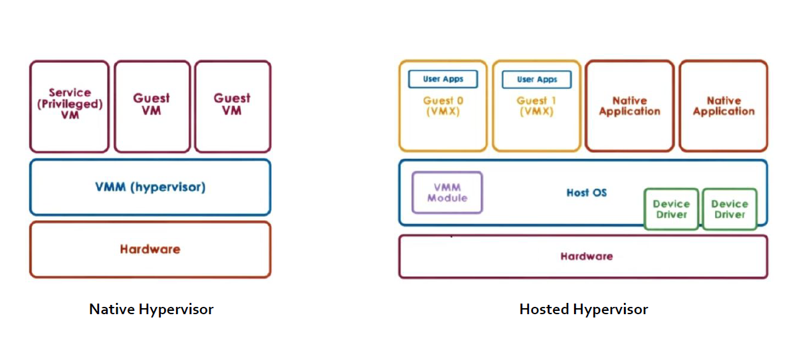

# Advanced Operative Systems and Virtualization

[[_TOC_]]

# Virtualization

## Outline
1. Introduction
2. Software-based Virtualization
   1. VirtualBox
3. Hardware-assisted Virtualization
4. Paravirtualization

# Introduction

Virtualization allows to show different resources from the physical ones. More operating
systems can be run on the same hardware.

A Virtual Machine is a mixture of software- and hardware-based facilities. The software
component that is in charge of managing the Virtual Machine is called the Hypervisor or VMM
(Virtual Machine Monitor).

The main advantages of the virtualization are:
- isolation of different execution environments (on the same hardware)
- reduction of hardware and administration costs

We can distinguish between:
- **host system**: the real system where (software implemented) virtual machines run
- **guest system**: the system that runs on top of a (software implemented) virtual machine

The roles of the Hypervisor are:
- managing hardware resources provided by the host system
- making virtualized resources available to the guest system in a correct and secure way

There are two kinds of hypervisors:
- Native Hypervisor: runs with full capabilities on bare metal. It resembles a lightweight virtualization kernel operating on top of the hardware.
- Hosted Hypervisor: it runs as an application, which accesses host services via system calls

We can have two kinds of virtualizations:
- **software-based**
- **hardware-assisted**

### software-based
the guest application code runs **directly** on the processor, while the guest privileged
code is **translated** and the translated code runs on the processor.

The translated code is slightly larger and usually runs more slowly than the native version. As a
result, guest applications, which have a small privileged code component, run with speeds very close
to native. Applications with a significant privileged code component, such as system calls, traps, or
page table updates can run slower in the virtualized environment

### hardware-assisted
certain processors provide hardware assistance for CPU virtualization. When
using this assistance, the guest can use a **separate** mode of execution called **guest mode**. The guest
code, whether application code or privileged code, runs in the guest mode. On certain events, the
processor exits out of guest mode and enters root mode. The hypervisor executes in the root mode,
determines the reason for the exit, takes any required actions, and restarts the guest in guest mode.

When you use hardware assistance for virtualization, there is **no need to translate the code**. As a
result, system calls or trap-intensive workloads run very close to native speed. Some workloads, such
as those involving updates to page tables, lead to a large number of exits from guest mode to root
mode. Depending on the number of such exits and total time spent in exits, hardware-assisted CPU
virtualization can speed up execution significantly.

# Software-based Virtualization

The instruction of the virtual machine are executed by the native physical CPU in the host
platform, but a subset of the instruction set must be emulated.

No particular hardware component plays a role in virtualization, but there are different problems:
- what if ring 0 is required for guest activities?
- there could be the risk to bypass the VMM resource management policy in case of actual ring 0 access

The solution: **ring de-privileging**

A technique to let the guest kernel run at a privilege level that “simulates” 0

Two main strategies:
- **0 / 1 / 3 Model**:
  - VMM runs at ring 0
  - Kernel guest runs at ring 1 (not typically used by native kernels)
  - Applications still run at ring 3
  - This is the most used approach
- **0 / 3 / 3 Model**:
  - VMM runs at ring 0.
  - Kernel guest and applications run at ring 3.
  - too close to emulation, too high costs

### 0/1/3 Model

**Applications** (running at **ring 3**) **cannot** alter the state of the **guest operating system** (running
at **ring 1**). The **guest operating system cannot** access privileged instructions and data
structures of the **host operating system** we guarantee the isolation of guest systems. Any
exception must be trapped by the **VMM** (at **ring 0**) and must be properly handled (e.g. by
reflecting it into **ring 1** tasks).

Issues to cope with:
- Ring aliasing
- Virtualization of the interrupts
- Frequent access to privileged resources

### Ring aliasing
An OS kernel is designed to run at ring 0, while it is actually being run at ring 1 for guest
systems. This can create problems for instructions that was specifically designed for running in
Ring 0 and they cannot work anymore:
- **Privileged instructions**: generate an exception if not run at CPL 0 (e.g. hlt, lidt, lgdt, invd, mov %crx).
- **I/O sensitive instructions**: they generate a trap if executed when CPL > IOPL (I/O Privilege Level) (e.g. cli, sti)

The generated trap (general protection fault) must be handled by the VMM, so as to finally
determine how to handle it (emulation vs interpretation).

## VirtualBox

Based on **hosted hypervisor** with ad-hoc kernel facilities, via classical special devices (**0/1/3 model**).

Pure software virtualization is supported for x86:
- Fast Binary Translation (code patching) the kernel code is analysed and modified before being executed
- Privileged instructions replaced with semantically equivalent blocks of code

### Execution Modes and Context

Virtualbox lives in two contexts:
- **Guest context** (GC): execution context for the guest system. It is based on two modes:
  - Raw mode: native guest code runs at ring 3 or 1
  - Hypervisor mode: VirtualBox runs at ring 0
- **Host context** (HC): execution context for userspace portions of VirtualBox (ring 3)
  - the running thread implementing the VM lives in this context upon a mode change
  - critical/privileged instructions are emulated in this context upon a GPF (General Protection Fault, e.g. due to ring aliasing)

# Hardware-assisted Virtualization

### VT-x
Intel Vanderpool Technology, referred to as VT-x, represents Intel’s virtualization technology
on the x86 platform. Its goal is simplify VMM software by closing virtualization holes by
design.

- Ring Compression (lack of OS/Applications separations if only 2 rings are used)
- Non-trapping instructions (some instructions at ring 1 are not trapped, for example popf)
- Excessive trapping

Eliminate need for software virtualization (i.e paravirtualization, binary translation).

# Paravirtualization

The VMM offers a virtual interface (hypercall API) used by guest OS to access resources. To run
privileged instructions, hypercalls are executed.

There is a need to modify the code of the guest OS but VMM is simplified since there is no
need to account for traps generated by virtualized OS.