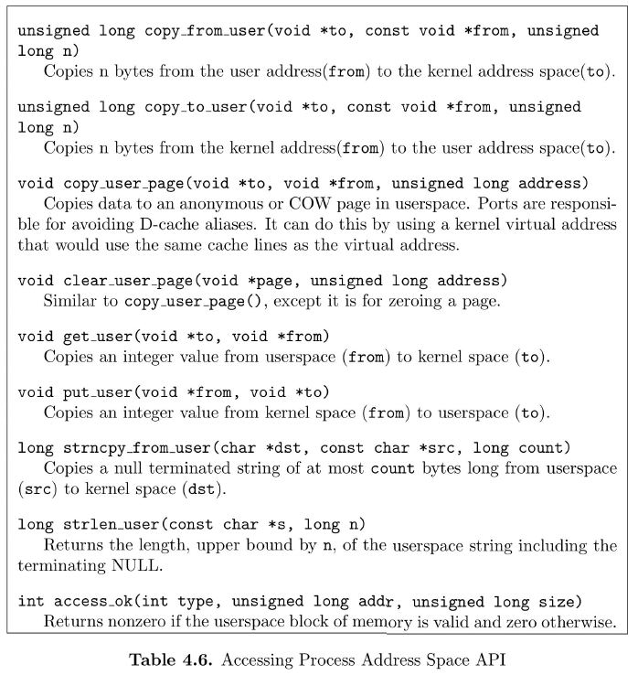

# Advanced Operative Systems and Virtualization
# Memory Management

## Outline
1. **Memory Representation**
2. **The Buddy System**
3. **High Memory**
4. **Memory Finalization**
5. **Steady-state memory allocation**
   1. Fast Allocations & Quicklists
   2. SLAB Allocator
   3. CPU Caches
   4. Large Allocations & vmalloc
6. **User & Kernel Space**


# Memory Management

During the boot, the Kernel relies on a **temporary** memory manager. (During the boot, the Kernel relies on a temporary memory manager. The rationale is that there are not many memory requests during the boot)

At steady state the **boot allocator can no more be used**, because **allocations/deallocations are frequent** and memory must be used wisely, accounting for hardware performance.

## NUMA (Non-Uniform Memory Access)
As anticipated, in modern computer architectures allows to see **memory organized in nodes**. This because the momory access latency heavily depends on the distance between the CPU and the memory banks.

###### little recap
In the Linux Kernel **each node** is represented by the **struct pg_data_t** and all nodes are kept in a NULL terminated **linked list called pgdat_list**. Each node is linked to the other with the field **pg_data_t->node_next**. In **UMA** architectures we **only one pg_data_t** referenced by **contig_page_data**.

```c
typedef struct pglist_data {
    zone_t node_zones[MAX_NR_ZONES];
    zonelist_t node_zonelists[GFP_ZONEMASK+1]; // Preferred zone allocation order
    int nr_zones;
    struct page *node_mem_map; // Pointer to the first page of the array of frames of the node
    unsigned long *valid_addr_bitmap;
    struct bootmem_data *bdata;
    unsigned long node_start_paddr; // Starting physical address of the node (PFN)
    unsigned long node_start_mapnr;
    unsigned long node_size; // Total number of pages in the node
    int node_id;
    struct pglist_data *node_next;
} pg_data_t;
```

## Zone
Each node is divided in a number of blocks called zones. A zone is described by the **struct zone_struct typedef as zone_t**. On x86 there are
three kinds of zone:
- **ZONE_DMA** directly mapped by the kernel in the lower part of memory, it is **destined to ISA** (Industry Standard Architecture) devices, in x86 first 16 MB.
- **ZONE_NORMAL** is directly mapped by the kernel into the upper region of the linear address space. In x86 from 16MB to 896MB.
- **ZONE_HIGHMEM** is the **remaining** available **memory** and it is **not directly mapped by the kernel**.

The **Page table** is usually **located** at the **top beginning of ZONE_NORMAL**. To access memory between 1GB and 4GB the kernel temporarily maps pages from high memory to **ZONE_NORMAL** (ZONE_NORMAL is fixed in size).


|              | x86                | x86_64          |
|--------------|--------------------|-----------------|
| ZONE_DMA     | First 16MB         | First 16MB      |
| ZONE_DMA32   | -                  | First 4GB       |
| ZONE_NORMAL  | From 16MB to 896MB | From 4GB to end |
| ZONE_HIGHMEM | From 896MB to end  | -               |
| ZONE_MOVABLE | User Defined       | User Defined    |


Please remind that for example in x86_64 if we have only 2GB of RAM, all the RAM will be ZONE_DMA32. If instead we have 16GB the kernel will allocate memory by following possible flags you pass and the available memory type. See also /proc/pagetypeinfo.


Zones are initialized after the kernel page tables have been fully set up by **paging_init()**. The goal is to determine what parameters to send to:
- **free_area_init()** for UMA machines
- **free_area_init_node()** for NUMA machines

```c
typedef struct zone_struct {
    spinlock_t lock;
    unsigned long free_pages;
    zone_watermarks_t watermarks[MAX_NR_ZONES];
    unsigned long need_balance;
    unsigned long nr_active_pages,nr_inactive_pages;
    unsigned long nr_cache_pages;
    free_area_t free_area[MAX_ORDER];
    wait_queue_head_t *wait_table;
    unsigned long wait_table_size;
    unsigned long wait_table_shift;
    struct pglist_data *zone_pgdat;
    struct page *zone_mem_map;
    unsigned long zone_start_paddr;
    unsigned long zone_start_mapnr;
    char *name;
    unsigned long size;
    unsigned long realsize;
} zone_t;
```

## Zone Watermarks
When **available** **memory** in the system is **low**, the pageout **daemon kswapd** is woken up to **start freeing pages**.

Each **zone** has **three watermarks** called **pages low**, **pages min** and **pages high**, which help track how much pressure a zone is under.
- **pages low** When the pages low number of free pages is reached, **kswapd** is **woken** **up** by the buddy allocator
- **pages min** When pages min is reached, the **allocator** will do the **kswapd work** in a **synchronous** fashion
- **pages high** After kswapd has been woken to start freeing pages, it will not consider the zone to be “balanced” when pages high pages are free


## Core Map

The Core Map is an **array of mem_map_t** structures defined in include/linux/mm.h and kept in **ZONE_NORMAL**. **The struct page is associated to every physical frame available in the system.**

```c
// page flags
#define PG_locked 0
#define PG_referenced 2
#define PG_uptodate 3
#define PG_dirty 4
#define PG_lru 6
#define PG_reserved 14

typedef struct page {
    struct list_head list; // List head to which the page belongs. A page may belong to different lists
    struct address_space *mapping; // Address space (e.g. inode)
    unsigned long index; // index to which the page belongs
    struct page *next_hash; 
    atomic_t count; // Usage counter, if zero the page may be free’d
    unsigned long flags; // Page flags:
    struct list_head lru;
    struct page **pprev_hash;
    struct buffer_head * buffers;
#if defined(CONFIG_HIGHMEM) || defined(WANT_PAGE_VIRTUAL)
    void *virtual;
#endif /* CONFIG_HIGMEM || WANT_PAGE_VIRTUAL */
} mem_map_t;
```

### How to manage flags


### On UMA
Initially we have the **core map pointer, mem_map** defined in **mm/memory.c**. The **pointer initialization** is done within the function **free_area_init()**. After the initialization each entry will keep the value 0 within the count field and the value 1 into flags for the **PG_RESERVED** flag. Therefore we do not have any virtual reference to the frame and the frame is reserved. The un-reserving is done by the **mem_init()** function.

### On NUMA
There’s **not a global mem_map array** since **every node** keeps its **own map** in its own memory. The **map** is **pointed** by **pg_data_t -> node_mem_map** but the **map organization** is the **same**.

# The Buddy System
The **kernel subsystem** that **handles** the **memory allocation** for contiguous page frames is called **zoned page frame allocator**.


## Fragmentation
When allocating groups of contiguous page frames, the algorithm that we need to design, must deal with a well-know problem called **External Fragmentation**. 

We allocate #1, #2, #3,
#4 and #5 consecutively, then we deallocate #2 and #4. Where can we put a new allocation request for a size of #2 + #4 for example? We have that memory available but it is **not** **contiguous**.

```
[--#1--][#2][-#3-][#4][--------#5--------]
[--#1--]    [-#3-]    [--------#5--------]

        [#2][#4]
        [  #?  ]
```

There are two approaches to solve the problem:
1. **paging circuitry** to **map** group of **non-contiguous pages** into intervals of **contiguous linear addresses**
2. develop a suitable technique to **keep track** of the existing blocks of **free contiguous page frames**, **avoiding** as much as possible **the need to split up large free block** to satisfy a request for a smaller one

The Linux kernel prefers the second, for 3 good reasons:
- in **some cases we really need contiguous pages**, not only contiguous linear addresses (e.g. DMA)
- **frequent page table modifications** lead to **higher average memory access times**, e.g. flushing the TLB
- **large chunks of physical memory** can be accessed with 4MB pages, **reducing TLB miss** and speeding up access times

## Buddy System
The technique followed by the Linux kernel for solving external fragmentation is based on the well-known buddy system algorithm.

The Buddy System keeps all the free pages grouped into 11 lists of blocks that contain groups of 1,2,4,8,16,32,64,128,256,512 and 1024 contiguous frames. 1024 page frames correspond to 4MB of memory.

The data structures used by the algorithm are:
- the **mem_map** array, that is the **core map** that we already discussed. Actually, each zone is concerned with a subset of the mem_map elements
- an **array of eleven elements** of **free_area_t**, one for each group size. This array is stored in the **free_area** field of the zone descriptor and contains the linked list of free page blocks and a pointer to a bitmap (*map), in which each bit represents a **pair of buddies**. The bit is set to 0 when both buddies are full or free, and 1 when only one buddy is used.


### Allocation
Suppose that you want to allocate 256 contiguous page frames, the algorithm check if there is a free 256 block, if not it checks in the list of 512. If it exists it allocates 256 pages for satisfying the request and the other 256 are added into the list of free 256-page-frame blocks. If there is no free 512-page block the kernel looks for next larger block, 1024. If it exists, it allocates 256 of the 1024 page frames to satisfy the request, then inserts the first 512 of the remaining 768 into the list of free 512-page-frame blocks and the last 256 pages frames into the list of free 256-page-frame blocks.

### Deallocation
When freeing memory, the kernel attempts to merge a pair of buddy blocks of size b together into a single block of size 2b. Only if (i) they have the same size, (ii) they are contiguous, (iii) the physical address of the first block is multiple of 2 ⨉ b ⨉ 212.

**During the allocation and deallocation interrupts must be disabled and this is node by using a particular kind of spinlock (we will see later in the course).**

# High Memory
On x86 the **kernel directly maps only ZONE_DMA** and **ZONE_NORMAL** for a **total of 896MB**, but obviously machines started to have more than 4GB of RAM. 

Due to the fixed limit 3GB/1GB of the address space, the kernel cannot map directly more than 896MB, for this reason all the memory mapping that exceeds that size are temporarily and they refer to the High Memory concept.

## PKMap
The kernel virtual address spaces from address PKMAP_BASE to FIXADDR_START is reserved for a PKMap, namely a **Persistent Kernel Map** located near the end of the address space.

There are about 32MB of page table space for mapping pages from high memory into the usable space.

For mapping pages, a simple **PT of 1024 entries is stored at the beginning of the PKMap area** to allow the **temporary** (very short time) **mapping** of up to 1024 pages from high mem with functions **kmap()** and **kunmap()**. That page is initialized at the end of pagetable_init() function.

The current state of page table entries is managed by a simple array called pkmap_count with LAST_KMAP (= PTRS_PER_PTE = 1024 or 512 when PAE is enabled) entries.

### APIs
- **kmap()** it **permits a short-duration mapping** of a **single page**, requires global synchronization
- **kmap_atomic()** **permits a very short duration mapping** of a **single page** but it is **restricted to the CPU** that issued it and the **task must be on that CPU until the termination**, usage is discouraged
- **kunmap()** **decrements the associated page counter**. When the counter is 1 the mapping is not needed anymore but the CPU has still cached that mapping, for this reason **TLB must be flushed manually**
- **kunmap_atomic()** unmaps a page that has been mapped atomically

# Memory Finalization
## Reclaiming Boot Memory
The finalization of memory management is done within the function **mem_init()** which is in charge of **destroying the bootmem allocator**, calculating the dimensions of low and high memory and printing out an informational message to the user. On x86 the principle function called by mem_init is **free_pages_init()**.

The free_all_bootmem is called by each NUMA node and in the end it calls free_all_bootmem_core which does the following.

For each unallocated pages known to the allocator of that node
- clears the **PG_RESERVED** bit
- set usage **count** to 1
- call **__free_pages()** so that the buddy allocator can build its free lists

**Free all pages used for the bitmap and give them to the buddy allocator.**

When free_all_bootmem returns all the pages in **ZONE_NORMAL** have been given to the buddy allocator, the rest of **free_pages_init** initializes the high memory.

At this point, the boot memory allocator is no longer required, and the buddy allocator is the main physical page allocator for the system. Note also that not only is the data for the boot allocator removed, but also all code that was used to bootstrap the system. **free_all_bootmem()** is marked by **__init()**.

# Steady-state memory allocation

In general, in a kernel, we can recognize two kinds of memory allocation contexts at steady-state.
- **Process Context** allocation that has been requested through a system call, typical of userspace processes. Within this context, if the request cannot be served, the process is put on wait by following also a **priority-based approach**
- **Interrupt Context** that refers to an allocation due to a interrupt handler. Within this context, if the request cannot be served there’s no waiting time and the approach is **not priority based**


Within the kernel, the following functions for memory allocation can be used, they are declared at <linux/malloc.h>.
Memory allocation requests created with these functions are managed by the Buddy Allocator.

```c
// Allocate a single page and return struct address
struct page * alloc_page(unsigned int gfp_mask)

// Allocate 2^order number of pages and return a struct page
struct page * alloc_pages(unsigned int gfp_mask, unsigned int order)

// Allocates a dingle page, zeros it and returns a virtuall address
unsigned long get_free_page(unsigned int gfp_mask)

// Allocates a single page and returns a virtuall address
unsigned long __get_free_page(unsigned int gfp_mask)

// Allocate 2^order number of pages and return a virtual address
unsigned long  __get_free_pages(unsigned int gfp_mask, unsigned int order)

// Allocate 2^order number of pages from the DMA zone and return a struct page
struct page *  __get_dma_pages(unsigned int gfp_mask, unsigned int order)

// frees an order number of pages from the given page
void __free_pages(struct page *page , unsigned int order)

// frees a single page 
void __free_page(struct page *page)

// frees a page from he given virtual address
void __free_pages(void *addr)

```

**Remember that within the Buddy Allocator, the caller needs to remember the allocated size and the address. If you pass a wrong void* addr to free_page() you could corrupt the kernel.**


## NUMA Policies
When we have a **NUMA architecture**, the function **__get_free_pages()** calls **alloc_page_node()** specifying a NUMA policy. A **NUMA policy** determines from which node the memory will be allocated. This support was added in kernel 2.6.

###### **set_mempolicy()**
The function set_mempolicy sets the NUMA memory policy of the calling process
```c
#include <numaif.h>
int set_mempolicy(int mode, unsigned long *nodemask, unsigned long maxnode)
```

Where mode can be:
- **MPOL_DEFAULT** allocate on node of the CPU that issued the command
- **MPOL_BIND** strictly allocate to the specified nodemask
- **MPOL_INTERLEAVE** interleaves allocation to the specified nodemask nodes
- **MPOL_PREFERRED** sets the preferred node(s) for the allocation as nodemask

nodemask points to a bit mask of node IDs that contains up to maxnode bits

###### **mbind()**
The function mbind() assigns a NUMA policy to the specified set of memory addresses
```c
#include <numaif.h>
long mbind(void                  *addr    , unsigned long   len    , int        mode,
           const unsigned long   *nodemask, unsigned long   maxnode, unsigned   flags)
```

###### **move_pages()**
This function moves the specified pages of the process pid to the memory nodes specified by
nodes. The result of the move is reflected in status. The flags parameter indicates constraints
on the pages to be moved.
```c
#include <numaif.h>
long move_pages(int         pid  , unsigned long   count , void   **pages, 
                const int  *nodes, int            *status, int      flags)
```

## Fast Allocations & Quicklists
In general, within the kernel, fixed size data structures are very often allocated and released. The Buddy System that we presented earlier clearly does not scale:
- this is a classic case of frequent logical contention
- the buddy system on each NUMA node is protected by a (spin)lock
- internal fragmentation can rise too much

Allocation and release of page tables requires a frequent allocation and deallocation of the same fixed size structures. The functions that allows us to create page tables like
- pgd_alloc(), pmd_alloc() and pte_alloc()
- pgd_free(), pmd_free() and pte_free()


They relies on Kernel-level **fast allocators**.

There are two fast allocators in the kernel:
- **quicklists**, used only for paging
- **SLAB Allocator**, used for other buffers. There are three implementations of the SLAB allocator:
  - the SLAB: implemented around 1994
  - the SLUB: the unqueued SLAB allocator, default since 2.6.23
  - the SLOB: Simple List Of Blocks, if the SLAB is not enabled this is the fallback

### Quicklists
Quicklists are used for **implementing** the **page table cache**. For the three functions **pgd/pmd/pte_alloc()** we have three quicklists pgd/pmd/pte_quicklist **per CPU**. Each architecture implements its own version of quicklists but the principle is the same.

One method is the one of using the LIFO approach. During the **allocation**, one **page is popped off** the list, and during **free**, **one is placed as the new head** of the list. This is done while keeping a count of how many pages are used in the cache.

If a **page is not available in the cache**, then it will be **allocated** by using the **Buddy System**. Obviously, a large amount of free pages can exist in these caches, for this reason they are **cut out** by using a watermarking strategy.


###### **likely() and unlikely()**
The **likely()** and **unlikely()** are used for the branch prediction mechanism of the CPU. **Branch prediction allows to optimize the CPU pipeline and increasing the performance of the CPU**. The likely instruction will tell the compiler that the if condition will likely hit and the CPU can prepare the pipeline for that jump. The converse is for unlikely. When an likely branch will not be hit then the entire CPU pipeline will be flushed. This will have an impact on performances but it will rarely happen.
 
## SLAB Allocator
The general idea behind the SLAB allocator is to have caches of commonly used objects kept in a initialized state available for use by the kernel.

The SLAB allocator consists of a variable number of caches, linked together by a doubly linked list called cache chain. Every cache manages objects of particular kind (e.g. mm_struct). Each cache maintains a block of contiguous pages in memory called slabs.

The purpose of the SLAB allocator is threefold:
1. allocating small blocks of memory to help **eliminate internal fragmentation**caused by the Buddy System
2.** caching commonly** used **blocks** so that the system does not wait time allocating, initializing and destroying object  
3. **better usage** of **L1** and **L2** caches by aligning objects

###### aim #1 
Two sets of caches are maintained for allocating objects from 2^5 (32KB) to 2^17 (131’072KB) bytes. One for DMA and one for standard allocation. These caches are called **size-N** (or **size-N(DMA)**), where N is the size of the allocation and they are allocated with the function
**kmalloc()**.

###### aim #2
When a new slab is created a number of objects are packed into it and initialized using a constructor if available. When an object is free’d, it is left in a initialized state so the next allocation will be faster

###### aim #3 - Coloring
If there is space left over after objects packed into a slab, the remaining space is used to color the slab. Coloring is used for having objects in different line of CPU caches which helps ensure that objects from the same slab cache will unlikely flush each other.


###### **APIS**
Creates a new cache and adds it to the cache chain
```c
kmem_cache_t * kmem_cache_create(const char *name, size_t size, size_t offset, unsigned long flags, 
                                 void (*ctor)(void*, kmem_cache_t *, unsigned long), 
                                 void (*dtor)(void*, kmem_cache_t *, unsigned long))
```

Allocates a single object from the cache and return it to the caller
```c
void * kmem_cache_alloc(kmem_cache_t *cachep, int flags)
```

Frees an object and return it to the cache
```c
void * kmem_cache_free(kmem_cache_t *cachep, void *objp)
```

Allocate a block of memry from one of the sizes cache
```c
void * kmalloc(size_t size, int flags)
```

Free a block of memory allocated with kmalloc
```c
void * kfree(const void *objp)
```

Destroys all objects in alla slabs and frees up all associatd memory before removing the cache from the chain
```c
int kmem_cache_destroy(kmem_cache_t * cachep)
```


## CPU Caches
Caches lines are generally small (32/64 bits), the macro L1_CACHE_BYTES sets the number of bytes for the L1 cache.

Independently of the mapping scheme, close addresses fall in the same line but cache-aligned addresses fall in different lines. We need to cope with cache performance issues at the level of kernel programming (typically not of explicit concern for user level programming).

Performance issues
- **common members access**: most-used members in a data structure should be placed at its head to maximize cache hits. This should happen provided that the slab- allocation (kmalloc()) system gives cache-line aligned addresses for dynamically allocated memory chunks
- **loosely related fields** should be placed sufficiently distant in the data structure so as to avoid performance penalties due to false cache sharing. The Kernel also need to face with cache aliasing.

### Cache False Sharing
This example explains the Cache False Sharing problem.

```c
struct foo {
    int x;
    int y;
};

static struct foo f;

/* The two following functions are running concurrently: */

int sum_a(void){
    int s = 0;
    for (int i = 0; i < 1000000; ++i)
        s += f.x;
    return s;
}
void sum_b(void){
    for (int i = 0; i < 1000000; ++i)
        ++f.y;
}
```

Suppose that the sum_a and sum_b function
run concurrently. sum_b modifies only the y
value but doing this invalidates the cache,
sum_a is therefore obliged to reload from
memory the entire structure foo even if f.x
will be always the same.

For this reason, loosely related fields should be
located in the struct as much distant as
possible, in order to fall in different cache lines
and prevent the Cache False Sharing issue.

### Cache Aliasing
Cache aliasing occurs when multiple mappings to a physical page of memory have conflicting caching states, such as cached and uncached. Due to these conflicting states, data in that physical page may become corrupted when the processor's cache is flushed. If that page is being used for DMA by a driver, this can lead to hardware stability problems and system lockups.

In general we have a Cache Aliasing issue when the same physical address is mapped with different virtual addresses. Therefore, if your cache is indexed by the virtual address you will load the same physical addresses multiple times. This problem is typical in ARM architectures

### Cache Flush Operation

Cache flushes automation can be partial (similar to TLB), therefore there are function declared in the kernel which deal with cache flushing operations and they are implemented according to the specific architecture. In some cases, the flush operation uses the physical address of the cached data to support flushing (“strict caching systems”, e.g. HyperSparc). Hence, TLB flushes should always be placed after the corresponding data cache flush calls.

| Flushing Full MM  | Flushing Range   | Flushing Page   |
|--------------|--------------------|-----------------|
| flush_cache_mm()       | flush_cache_range()     | flush_cache_page() |
| Change all page tables | Change page table range | Change single PTE  |
| flush_tlb_mm()         | flush_tlb_range()       | flush_tlb_page()   |


### Cache flush APIs


## Large Allocations & vmalloc

It is preferable when dealing with large amounts of memory to use physically contiguous pages in memory both for cache-related and memory-access-latency reasons. Unfortunately, due to external fragmentation problems with the buddy allocator, this is not always possible. 

Linux provides a mechanism through **vmalloc()** where non-contiguous physical memory can be used that is contiguous in virtual memory. If you remember the Linux virtual memory layout, the area is limited (128MB).


On x86, due to the limited size of the VMALLOC area, that kind of memory allocation is used sparingly, only for swap information and for mounting external kernel modules.


### kmalloc() vs vmalloc()
Allocation size:
- **Bounded** for **kmalloc** (cache aligned): the boundary depends on the architecture and theLinux version. Current implementations handle up to 8KB
- **64/128 MB** for **vmalloc**

Physical contiguousness
- Yes for kmalloc
- No for vmalloc

Effects on TLB
- None for kmalloc
- Global for vmalloc (transparent to vmalloc users)

# User & Kernel Space
## Kernel Page Table Isolation (KPTI)
It is a protection mechanism introduced in Kernel 4.15 for facing the Meltdown vulnerability. The idea is that the Kernel address space when in user mode is reduced and contains only a small subset of pages, essential for calling the kernel facilities from user space (system calls).


## User/Kernel Level Data Movement


