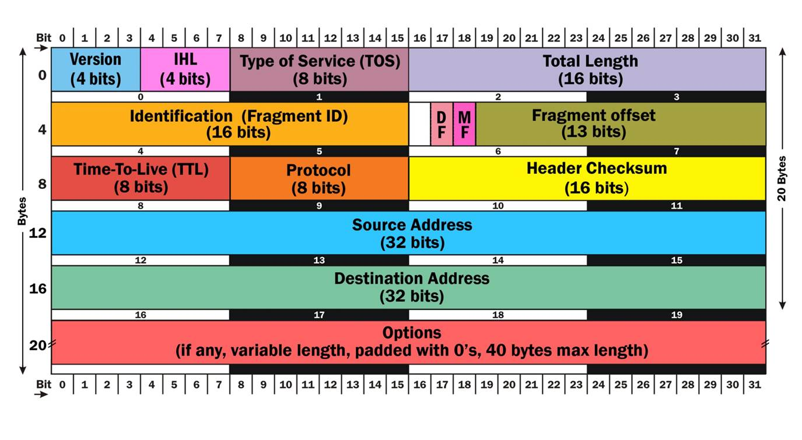
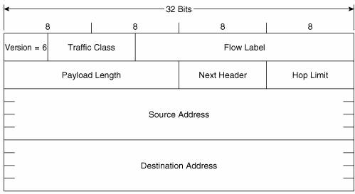

# PND's notes 2020

## Ethernet vs IP addresses
Ethernet has **physical** addresses. You can not(ish) change the MAC address of your NICs, an Ethernet address **tells WHO** you are, but does not tell
anything on WHERE you are.

IP has **logical** addresses, you can change IP address of your NIC. It is like your home address: it changes if you go somewhere. IP addresses are used to identify and reach networks and
hosts.

if you want to say something to somebody, if both of you are in the same room, you can simply call his/her name and he/she will answer (Directly connected -> Many protocols for each layer Local address), but If you are NOT in the same room, you have to know where he/she is, before sending the message AND the message has to LEAVE the room through the door (Remote address). **How to know if one IP is the same network than you? Subnet mask**. Subnet mask **defines boundary between network portion and the host portion** of the IP address.

There are three types of IP addresses:
- Unicast (one to one)
- Broadcast (one to all)
- Multicast (one to many) (Class D) 224.0.0.0 to 239.255.255.255 for IPv4

### routable and non-routable ip
Routable addresses need to be unique on the Internet. Non-routable address ranges are defined in RFC1918. The Internet Assigned Numbers Authority (IANA) has reserved the following three blocks of the IP address space for private internets:
- 10.0.0.0        -   10.255.255.255  (10/8 prefix)
- 172.16.0.0      -   172.31.255.255  (172.16/12 prefix)
- 192.168.0.0     -   192.168.255.255 (192.168/16 prefix)

### COMMAND BASE FOR IPv4
``` ip link show #Show interfaces ```  
``` ip link set eth0 (up|down) #Bringing interface up/down ```  
``` ip link set eth0 address 00:11:22:33:44:55 #Set MAC address ```  
``` ip address show [dev eth0] #Show IP address ```  
``` ip address (add|del) 10.0.0.1/8 dev eth0 #Add/remove IP address ```  
``` ip address flush [dev eth0] #Flush any IP address (remove the assigned address/es) ```  
``` ip route (list|flush) #List/flush routing table ```  
``` ip route (add|del) 100.0.0.0/8 via 10.0.0.1 set next hop ```  
``` ip route (add|del) default via 10.0.0.1 #set default route ```  
``` ip route (add|del) 10.0.0.0/24 dev eth0 #direct forwarding ```  
``` ip neigh show [dev eth0] #show ARP chace ```  
``` ip neigh flush dev eth0 #flush ARP chace ```  
``` ip neigh (add|del|change|replace) to 10.0.0.2 lladdr 00:11:22:33:44:55 dev eth0 nud “state_name0 #Add/del/change/replace ARP cache entry ```  
state_name: permanent, stale, noarp, reachable”


## Layering concepts

communication between host  -> organized in task -> each assigned to a __layer__.

Each layer
- offers a service to layer **above**
- exploits the services of layer **below**

The task involves the excange of messages that follow a set of rules know as **protocol**.

## Encapsulation Decapsulation

Each layer adds some protocol information and provides data to the layer below. Each protocol in the destination reads the appropriate protocol information and forwards the data to the layer above.

### Layered Architectures
- ISO/OSI (7 layers)
- TCI/IP (4 layers)

common idea: **packet switched network**

Each layer has a type of address:
- application layer : www.cybersecurity.uniroma1.it
- transport layer: (port number), [0..65535]
- internet layer: IP addressthat identify a nic
- datalink layer: MAC address also identify a nic

### Layer ideal representation
- **Transport**: the illusion of direct end-to-end connection between processes in arbitrary systems.
- **Network**: transferring data between arbitrary nodes.
- **Data Link** ransferring data between directly connected systems (via direct cable or shared medium).

Each layer has a type of address:
- **Application layer**: Internet name, eg. **www.sapienza.it**
- **Transport layer**: **Port number**, in the range [0..65535]
- **Internet layer**: **IP address** that identifies a network card
- **Datalink layer**: **MAC address**, also identifies a network cards

### ports

source -> **randomly chosen by os!!**
destination -> **determines the required service**

### TCP / UDP
|connection | connectionless|
|-|-|
|syn->||
|<-syn+ack|data->|
|ack->||

### Services tcp/upd
|TCP|UDP|
|----|----|
|Ftp|Dns|
|Ssh|Dhcp|
|Telnet|Tftp|
|Smtp|Snmp|
|Http|Rip|
|Imap||
|Ssl||

# How to prevent packet capture
- Dynamic address inspection: Implemented in switches: Dynamic Address Resolution nspection (DAI) validates ARP packets.IP-to-MAC address binding inspection, drop invalid packets.
- DHCP snooping: Implemented in switches: distinguishes between trusted and untrusted ports and uses a database of IP-to-MAC. Ports that show rogue activity can also be automatically placed in a disabled state.


# IPV6 Addressing

Benefits of ipv6
- Larger address space
- Stateless autocunfiguration
- End-to-end reachability whitout nat 
- Better mobility support
- Peer-to-peer networking  (easier for VoIP or QoS)

# IPv6 Address notation

2001:0DB8:AAAA:1111:0000:0000:0000:0100

2001 -> 16 bits (hexadecimal)

Rules for compressing
- Omitting Leading 0s
- Double colums :: (all 0s inside)

## IPv6 address type

- 2001:DB8::/32 - (GUA) RFC 2839 and RFC 6890 range of addresses for documentation
- Unicast (2000::/3) -> (3FFF::)
- Link-Local (FF80::/10) -> (FEBF::)
- Loopback ::1/128
- Multicast Assigned (FF00::/8) 

## Link-Local
- Used to communicate with other devices on the link
- Only have to be unique on the link
- An IPv6 device must have at least a link-local address
- Not included in the IPv6 routing table.

Link-local addresses can be created, Automatically(FE80+EUI-64 or Random 64 bits) or Static (manual) configuration – Common practice for routers.

### EUI64
MAC ADDRESS 00:11:22:33:44:55  
INTERFACEID 0021:22FF:FE33:4455 (the 0000 00**1**0 0000 0000 reversed ) 

**Used as a source IPv6 address before a device gets one dynamically**

## Multicast info (FF00::/8)
|1111 1111| [Flag (4 bits)]  [Scope (4 bits)] |...|||||||

Scope is  a 4-bits field used to define the range of the multicast packet.
- 1 Interface-Local Scope
- 2 Link-Local scope
- 5 Site-Local scope
- 8 Organization-Local scope
- E Global Scope

Flag  
- 0 - Permanent, well-known multicast address assigned by IANA.
- Includes both assigned and solicited-node multicast addresses.
- 1 - Non-permanently-assigned, “dynamically" assigned multicast address.
- An example might be FF18::CAFE:1234, used for a multicast application
with organizational scope.

__IPv6 does not have broadcast address__

### Global Unicast Address

3-1-4 Rule

Global Routing Prefix - Subnet prefix - Interface Id 

## SLAAC

Stateless Address Auto Configuration  
ICMPv6 Neighbor Discover defines 5 different packet types:
- Router Solicitation Message
- Router Advertisement Message
**Used with dynamic address allocation**

- Neighbor Solicitation Message
- Neighbor Advertisement Message
**Used with address resolution (IPv4 ARP)**

- Redirect Message
**Similar to ICMPv4 redirect message Router-to-Device messaging**

- Option 1: SLAAC – No DHCPv6
- Option 2: SLAAC + Stateless DHCPv6 for DNS address
- Option 3: All addressing except default gateway use DHCPv6

### SLAAC Option 1 – RA Message
**ROUTER MESSAGE**
- To: FF02::1 (All-IPv6 devices)
- From: FE80::1 (Link-local address)
- Prefix: 2001:DB8:CAFE:1::
- Prefix-length: /64

**ACTION IN THE HOST**
- Prefix: 2001:DB8:CAFE:1::
- Prefix-length: /64
- Default Gateway: FE80::1
- Global Unicast Address: 2001:DB8:CAFE:1: + Interface ID  
**DHCP NOT USED**

But SLAAC is stateless, no entity (DHCPv6 server) maintaining a state address-to-device mappings. **How can we guarantee the address is unique?** Duplicate Address Detection (DAD):
- SEND Neighbor Solicitation
- Neighbor Advertisement is recived? 
    - NO unique address
    - YES duplicate address
    
### Option 2: SLAAC + Stateless DHCPv6 for DNS address
**O Flag = 1, M Flag = 0**  
**ROUTER MESSAGE**
- idem to up and v
- Other Configuration Flag: 1
idem but at the end host search for DHCP server in the network for DNS addresses

### Option 3: All addressing except default gateway use DHCPv6
**O Flag = 0, M Flag = 1**  
**ROUTER MESSAGE**
- idem to up and v
- Other Configuration Flag: 1

**ACTION IN THE HOST**
- Default Gateway: FE80::1
- Global Unicast Address:DHCP  
host search for DHCP server in the network for configuration

# DHCPv6 Prefix Delegation Process

## in IPv4 
ISP only has to deliver a public IPv4 address for Home router interface. DHCPv4 and RFC 1918 private address space is used for home network. NAT is used for translation.

## in IPV6
1. First, HOME’s ISP facing interface needs an IPv6 address
1. Similar to any IPv6 client it may dynamically get an address using:
    - SLAAC
    - Stateless DHCPv6
    - Stateful DHCPv6
1. For the Home lan he send a DHCPv6-PD REQUEST
1. It receive a DHCPv6-PD REPLY
    - Here is a separate IPv6 prefix for you to give out to your LAN. 2001:DB8:CAFE:9:: (DNS, domain name)
1. It send RA with this informations

# IPv6 vs IPv4






IPv6 takes advantage of 64-bit CPUs.
Simpler IPv6 Header.
Fixed 40 byte IPv6 header.

IPv4 contains IHL (internet header leght) IPv6 have fixed header (40 bite) lenght so there isn't in his header.
And some little optimization.

IPv6 Next Header. In this place IPv4 had a Protocol parameter. For both protocols, the field indicate the type of the following header.
Common value:
- 6  = TCP
- 17 = UDP
- 58 = ICMPv6

IPv6 **doesn't have checksum header**, and doesn't have the padding because is fixed at 40 byte.

options added after the first header  setting the next header to indicate the presence of an extension header with some more option and info. So the options are computed only by the destination instead hop by hop  as in IPv4.

## IPv6 Extension header
 **Next Header** identifies: 
1. The protocol carried in the data portion of the packet
1. The presence of an extension header

**Extension headers** are optional and follow the main IPv6 header. It provide flexibility and features to the main IPv6 header for future enhancements without having to redesign the entire protocol. Allows the main IPv6 header to have a fixed size for more efficient processing. 

**OPTIONS**
Next Header Value (Decimal) | Extension Header Name | Extension Header Description
:---:|---|---
0 | Hop-by-Hop Options | Used to carry optional information, which must be examined by every router along the path of the packet
43 | Routing | Allows the source of the packet to specify the path to the destination
44 | Fragment | Used to fragment IPv6 packets
50 | Encapsulating Security Payload (ESP) | Used to provide authentication, integrity, and encryption.
51 | Authentication Header (AH) | Used to provide authentication and integrity.
60 |  Destination Options | Used to carry optional information that only needs to be examined by a packet’s destination node(s).

**IPv4 options vs. IPv6 extensions**

- IPv4 options : processed in each router slow down packets
- IPv6 extensions (except Hop-by-Hop) are processed only by the destination.

# Link-Local attacks
- network sniffing
- ARP poisoning
- IPv6 Neghbor Dyscovery threats
- IPv6 Rogue RA (RA spoofing)
- Rogue DHCP

## Network sniffing

Sniffer must be along the path or al least in the same network.
- non switched lan (LAN with HUB)
- lan with switches. Breaking switch segmentation (MAC FLOODING)
- possible man in the middle

## ARP spoofing
we all know what is it. **POSSIBLE MITM**

## IPv6 Neighbor Discovery
similar to arp only in IPv6. **POSSIBLE MITM**

## ICMPv6 redirect
similar to ICMPv4. Inform  an originating host of the IP address of an router that is on the **local-link** but is closer to the destination. **POSSIBLE MITM**

# EXAMPLES
## Rogue RA

When an IPv6 enabled system recives a router advertisement, if SLAAC is enabled, it will be parto of another network and **will receive a new route**, optionally a default gateway...

In the and, with control of DNS and IPv6, the attacker can:
- sniff all client traffic;
- attempt MITM attack;
- Impersonate servers/systems and capture user credentials;
- gain access into the other networks of the system;

## DHCP rogue server (DHCO starvation)

- Anyplave where macof works, you can dos a network by requesting all the avaiable DHCP adresses;
- Once all the addressses ar gone the attacker can now provide a rogue DHCP server to provide ip to clients;
- Since DHCP tresponse include DNS servers and default gateway entries, the **attacker can pretend to be anyone**;
- All the MITM are now possible;

# Firewalllzzzzz

- Stateless firewall: Bad idea. Very complex to write rules.
- Stateful firewall: Can keep tracks of enstablished connections.

## Common firewall weaknesses
- No content inspection causes the problems (Software weakness (e.g. buffer overflow, and SQL injection exploits)) or Protocol weakness (WEP in 802.11)
- No defense against DOS and insider attacks
- Firewall failure has to be prevented (Firewall cluster for redundancy)

But Next Generation firewalls (NG-Firewalls) try to include additional features not only traffic filtering, but also:
- Intrusion Detection System
- VPN gateway
- Deep Packet Inspection
- Traffic shaping

## What is a DMZ
DMZ (demilitarized zone). 

Computer host or small network inserted as a “neutral zone” between a company’s private network and the outside public network

Network construct that provides secure segregation of networks that host services for users, visitors, or partners

DMZ use has become a necessary method of providing a multilayered, defense-in-depth approach to security


## Iptables
Command to see the rules:
>.  
> iptables -L \
> iptables -L -n -v --line-numbers  
> .

Iptables chain:
 - **FORWARD**
 - **INPUT**
 - **OPUTPUT**

 To remove all rules:
 > iptables -F 

 Useful Commands:
 iptables switches|Description
 ---|---
 -t tables|Specifies the table (filter if not given)
 -j target|Jump to the target (it can be another chain)
 -A chain |Append rule to a specific chain
 -F |Flush a chain
 -P policy | CHange the default policy (ACCEPT \| DROP \| REJECT)
 -p protocol|Match the protocol type (TCP \| UDP \| ICMP ...)
 -s ip-address|Match the source ip
 -d ip-address|Match the destination ip
 -p tcp --sport port|Match the tcp source port (also work for UDP)
 -p tcp --dport port|Match the tcp destination port (also work for udp)
 -i interface-name|**Match** input interface (from which the packet enters)
 -o interface-name|**Match** output interface (from which the paket exits)
--icmp-type type|Match specific icmp packets type
-m module|Uses an extenzsion module
-m state --state s|Enable connection tracking. (NEW \| ESTABLISHED \| RELATED \| INVALID)
-m multiport|Enable specification of several port eith one single rule
-m mac --mac-source|Match packets with a specific source MAC address


*RELATED: The packet is the starting of a related transaction like FTP*


 ### Examples stateless rules
 > iptables -A input  -p icmp -icmp-type echo-request -j DROP  
 > iptables -A input -p tcp --destination-port 80 -j ACCEPT  
 >   
 >Allow both 80 and 443 for the webserver on inside.
 > iptables -A forward -s 0/0 -i eth0 -d 192.168.1.58 -o eth1 -p TCP --sport 1024:65535 -m multiport --dport 80,443 -j ACCEPT  
 >  
 >The return traffic from webserver is allowed, but only if session are opened:  
 >iptables -A forward -s 0/0 -i eth0 -d 192.168.1.58 -o eth1 -p TCP -m state --state ESTABLESHED -j ACCEPTED

 # NAT (Network address translation)
## NAT command
### DNAT
iptables -t nat -A PREROUTING -p tcp -d 80.182.53.192 -dport 80 -j DNAT -to-destination 10.0.0.2:80  
iptables -t nat -A PREROUTING -p tcp -d 80.182.53.192 -dport 110 -j DNAT -to-destination 10.0.0.3:110  
iptables -t filter -P FORWARD ACCEPT  
echo 1 > /proc/sys/net/ipv4/ip_forward  
#### la sintassi  DNAT
iptables -t nat -A POSTROUTING -o (interfaccia sulla extranet) -s (intranet/mask) --source-address

### MASQUERADE 
iptables -t nat -A POSTROUTING -o ppp0 -j MASQUERADE    
iptables -t filter -P FORWARD ACCEPT  
echo 1 > /proc/sys/net/ipv4/ip_forward  

### sourceNAT
#### la sitassi SNAT
iptables -t nat -A POSTROUTING -p (protocol {tcp | udp })  
- -s (source address)
- –sport <source porta>
- -d (destination)
- –dport <dest port>
- -j SNAT
- –to-source (source address modificato)
> iptables -t nat -A POSTROUTING -o ppp0 -j SNAT -to-source 150.92.48.25  
    
### port redirect
> iptables -t nat -A PREROUTING -d 192.168.1.1 destination-port 80 -j REDIRECT -to-port 10000  

## Routed vs Transaparent firewall modes.  
In **routed** mode, a firewall is a hop in the routing process. It **is** a router responsible of is own internal networks.  
In **transparent** mode, a firewall works with data at Layer 2 (Data link layer (MAC)) and is not seen as a router hop to connected devices (it can be implemented by bridged NICs).

## Routable IP Addressing
- Routable adresses need to be unique on the internet to be **PUBLICLY** rechable -> **public IP adresses**
- Non-routable adresses -> **private IP addresses**
    - **RFC 1819**
        - 10.0.0.0 - 10.255.255.255 (10/8 prefix)
        - 172.16.0.0 - 172.31.255.255 (172.16/12 prefix)
        - 192.168.0.0 - 192.168.255.255 (192.168/16 prefix)
    - Loopback addresses
        - 127.0.0.0 - 1727.255.255.255 (127/8 prefix)
    - Shared address space
        - 100.64.0.0 - 100.127.255.255 (100.64/10 prefix)
## Network Address Translation (NAT)
Translate the address (f.e.: between incompatible IP addressing). NAT **is a routed firewall**: it can filter requests from hosts on WAN side to host on LAN side, allows host requests from the LAN site to reach the WAN side. But does not expose LAN hosts to external  port scans.  
## NAT goals
1. Provate network uses just one IP address provided by ISP to connect to the Internet.
1. Can change  address of devices in private network without notifying outside world.
1. Can change ISP without change the address of the devices on the internal network.
1. Devices on the internal network are not visible  by outside world (a security plus).

### Source NAS (SNAT)
Translate **outgoing** IP source addresses on the packet header from the internal host to the wan ip addresses. The session is **masqueraded** as coming from the NATting device. The **NAT table** is where associations between requests ans internal IP addresses are kept.

Types of NAT:
- Basic (internal ip -> multiple external ip) not common due to shortage of IPv4 eddresses.
- NAPT Network address port translation (internal ip -> single ip external port).

NAPT router block by default all incoming ports by default (many applyvation have had problems with NAPT in the past).

### Destination NAT (DNAT)
Enables servers located **inside** the firewall/router LAN to be accessed by clients located outside. The service appears to be hosted by the firewall/router. It also called **port forwarding** or **virtual server**.

## NAT with iptables
four built-in-tables
1. MANGLE (PREROUTING, INPUT, OUTPUT, FORWARD, POSTROUTING) -> manipulate bit in TCP header ( not for nat not for packet filter ).
1. FILTER (INPUT, OUTPUT, FORWARD) -> packet filtering ( used for filtering packets ).
1. NAT (DNAT, SNAT, MASQUERADE, REDIRECT)-> network address translation ( used for nat (DNAT, SNAT, MASQUERADE, REDIRECT) ).
1. RAW -> exceptions to connections tracking.


# VPN Virtual Private Network

Important subsidiary goal: **usability** If a solution is too difficult to use, it will not be used -> poor usability leads to no security

Security goal of a vpn
- Traditional
    - Confidentiality of data
    - Integrity of data
    - Peer Authentication
- Extended
    - Replay protection
    - Access control
    - Traffic analysis protection

Usability goals: **Trasparency** VPN shuld be invisible to users, software, hardware. **Flexibility** VPN can be used between users, applications, host, sites. **Simplicity** VPN can be actually used.

- Site-to-site security.
- Host-to.site security.
- Host-to-host security.

It looks best to introduce security in the:
- Transport layer **Protection end-to-end between processes**.
- Network layer  **protect end-to-end between systems (IPsec)**.

bacause:
implemented at->|pysical layer|datalink|network(ipsec)|transport(opnvpn)|application
---|---|---|---|---|---
Confidentiality             |on cable                       |on link(virtual cable) |between hosts/sites|between apps/hosts/sites|between users/apps
Integrity                   |on cable                       |on link                |between hosts/sites|between apps/hosts/sites|between users/apps
Authentication              |none                           |none                   |for host or site|for user, host, sites|user
Reply connection            |none                           |none                   |between hosts/sites|between apps/hosts/sites|between apps
Traffic analisys protection |on cable                       |on link                |host/site info exposed|protocol/host/site info exposed|all but data exposed
Access control              |physical access                |physical access        |to host/site|user/host/site|only data access secured
Trasparency                 |full transparecy               |full                   |user and SW possible|user and SW possible|only user trasparency
Flexibility                 |hard to add new sites          |hard to add new sites  |may need SW or HW mod|HW or SW mod|SW mod
Symplicity                  |excellent                      |excellent              |**OK** site to site **NO OK** host to site|**OK** site to site **OK** host to site|depends on application

So best VPN on **Transport** or **Network** layer.

## SSL tunneling

Tunneling  is an operation of a network connection on top of another network connection. It allow two hosts or sites to communicate trough another network that they do not want to use directly. The site so site tunneling **enables a PDU to be trasported from one site to another whitout its content being processed by host on the route**. Idea: encapsulate the whole PDU in another PDU sent out on the network connecting twho sites.

Instead a **secure tunneling** enables a PDU to be transported from one site to another whitout its content beeing seen or chenged by hosts on the route. Idea: Encrypt the PDU and then encapsulate it in another PDU sent out on the network connecting the two sites. (**Note that the host-to-host communication does not need to use IP**). **Note: dst. address in IP header is for dst. edge router.**

Tunneling offers the basic level to provide a VPN.

## Secure Socket Layer
SSL3.0 has become TLS standard (RFC2246) with small changes. Applies security on the Transport layer. If implemented on boundary routers or proxy can provide a tunnel between two sites (Tipically LAN). Placed on top of TCP so no need to change TCP/IP stack or OS. **It provide a secure channel (byte stream)** and optional server authentication whit pubblik key certificates.

Certificates func:
1. Google richiede un certificato a Comodo
1. Comodo verifica che è davvero Google che sta effettuando la richiesta.
1. Google invia a Comodo la propria chiave pubblica.
1. Comodo utilizza la propria chiave privata per firmare digitalmente la chiave pubblica di Google.
1. Comodo dà a Google la chiave pubblica firmata, questa rappresenta ora il certificato SSL/TLS di Google.
1. Ti colleghi col tuo browser al sito web di Google.
1. Google invia al browser il certificato SSL/TLS.
1. Utilizzando la chiave pubblica di Comodo, che si trova nell'archivio dei certificati radice del tuo browser, viene verificata la firma di Comodo sul certificato SSL/TLS di Google.
1. Viene generata una chiave segreta e si utilizza la chiave pubblica di Google, ovvero il certificato, per crittografarla.
1. Viene inviata la chiave segreta crittografata a Google.
1. Google decrittografa la chiave segreta con la propria chiave privata e la trattiene.
1. Il tuo browser e Google utilizzano la chiave segreta condivisa per crittografare le comunicazioni.

### SSL protocol Architecture

Adds extra layer between T- and A-layers, and extra elements to A-layer.
- **Record Protocol**: Protocol offering basic encryption and integrity services to applications
- **Application Protocols**: control operation of the record protocol
    - **Handshake**: Used to authenticate server (and optionally client) and to agree on encryption keys and algorithms.
    - **Change cipher spec**: Selects agreed keys and encryption algorithm until further notice.
    - **Alert**: Transfers information about failures

### SSL/TLS Handshake Protocol
4-phase “Client/Server” protocol to establish parameters of the secure connection (**"Client” is the initiator**):
1. **Hello**: Establishment of security capabilities: Client sends list of possibilities, in order of preference. Server selects one, and informs Client of its choice. Parties also exchange random noise for use in key generation.
1. **Server authentication and key exchange**: Server executes selected key exchange protocol (if needed). Server sends authentication info. (e.g.X.509 cert.) to Client.
1. **Client authentication and key exchange**: Client executes selected key exchange protocol (mandatory). Client sends authentication info. to Server (optional).
1. **Finish**: Shared secret key is derived from pre-secrets exch. in 2, 3. Change Cipher Spec. protocol is activated. Summaries of progress of Handshake Protocol are exchanged and checked by both parties.

**SSL/TLS Security Capabilities**

Conventionally expressed by a descriptive string, specifying:
- Version of SSL/TLS (EX: ``` TLS -> (Latest version of) TLS ```)
- Key exchange algorithm (EX: ``` RSA -> RSA key exchange ```)
- Grade of encryption (previous to TLSv1.1) (EX: ``` WITH -> (merely filler...) ```)
- Encryption algorithm (EX: ``` AES_128 -> 128-bit AES encryption ```)
- Mode of block encryption (if block cipher used) (EX: ``` CBC -> Cipher Block Chaining ```)
- Cryptographic checksum algorithm (EX: ``` SHA ->  Use HMAC-SHA digest ```)

**SSL/TLS Heartbeat**
It is an extension (RFC 6520) that allows to keep an established session alive (That is, as soon as the data exchange between two endpoints terminates, the session will also terminate).

To avoid the re-negotiation of the security parameters for establishing a secure session, we can keep using the same parameters even if there is no exchange of data (It introduces two messages: **HeartbeatRequest** and **HeartbeatResponse**).

## SSL VPN Architecture
Two primary models
 - **SSL Portal VPN** Allow remote users to:
    - Connect to VPN gateway from a Web browser
    - Access services from Web site provided on gateway
 - **SSL Tunnel VPN** (More capabilities than portal VPNs) Allow remote users to:
    - Access network protected by VPN gateway from
    - Web browser allowing active content
    
## VPN device placement
Main options for placement:
- VPN functionality in firewall
- VPN device in internal network
- Single-interface VPN device in DMZ
- Dual-interface VPN device in DMZ

### VPN-enabled firewall
Advantages:
- No holes in FW between external VPN device and internal network
- Traffic between device and internal network must go through FW
- Simple network administration since only one “box” to administer

Disadvantages:
- Limited to VPN functionality offered by FW vendor
- FW directly accessible to external users via port 443.
- Adding VPN functionality to FW can introduce vulnerabilities

### SSL VPN in internal network
Advantages:
- Only single rule for single address to be added to FW.
- No “holes” needed in FW between VPN device and internal network
- VPN traffic is behind FW, so protected from attacks by machines in DMZ.

Disadvantages:
- VPN traffic passes through FW on tunnel, so it is not analyzed.
- Unsolicited traffic can be sent into internal network from outside to internal VPN device.
- Internal network is compromised if VPN device is compromised

### SSL VPN In DMZ
Advantages:
- Internal network protected against compromised VPN device
- Traffic between device and internal network must go through FW.
- IDS in DMZ can analyze traffic destined for internal network

Disadvantages:
- Numerous ports open in FW between device and internal hosts
- Decrypted traffic from device to internal network must be sent through DMZ.
- FW bypassed when user traffic is destined for hosts in DMZ

### Dual interfaces VPN device in DMZ
Clients connect to external device interface, internal traffic uses internal interface

Advantages:
- All advantages of placing VPN device DMZ
- Unencrypted traffic to internal hosts is protected from other hosts in DMZ.
- Only FW interface connected to device’s internal interface needs to permit traffic from VPN device

Disadvantages:
- Numerous ports open in FW between device and internal hosts.
- May introduce additional routing complexity.
- FW bypassed if split tunneling is not used and user traffic is destined for hosts in DMZ

# IPsec
Is a network layer protocol suite for providing security over ip. Is part of IPv6, and an addon for IPv4. It can handle all tree possible security architectures:
**Feature**|**Gateway to Gateway**|**Host to Gateway**|**Host to Host**
---|:---:|:---:|:---:
Protection between client and local gateway| NO | N/A Client is VPN endpoint | N/A Client is VPN endpoint
Protection between VPN endpoints           | YES | YES | YES
Protection between remote gateway and remote server (behind gateway) | NO | NO | N/A Client is VPN endpoint
Trasparenct to users | YES | NO | NO
Trasparency to user's systems | YES | NO | NO
Trasparency to servers | YES | YES | NO

## IPsec services
Basic functions, provided by separate (sub-)protocols:
- **Authentication Header (AH)**: Support for data integrity and authentication of IP packets
- **Encapsulated Security Payload (ESP)**: Support for encryption and (optionally) authentication.
- **Internet Key Exchange (IKE)**: Support for key managenent etc.  

**Service**|**AH**|**ESP(encrypt only)**|**ESP(encrypt+authentication)**
---|:---:|:---:|:---:
Access Control| **+**|**+**|**+**
Connectionless Integrity|**+**||**+**
Protection between VPN enpoints|**+**||**+**
Data origin authentication|**+**||**+**
Reject replayed packets||**+**|**+**
Payload confidentiality||**+**|**+**
Metadata confidentiality||partial|partial
Traffic flow confidentiality||(\*)|(\*)

**approfondisci autenticazione con IPsec**

IPsec vs TLS: TLS is much more flexible because is in the upper levels. IPsec has to run in kernel space. IPsec much more complex and complicated to manage with.
But crypto is insufficient for web security. Trust: what dpes the server really know about the applications ? Unless client-side certificates are used, absolutely nothing. SSL provide a secure pipe. **Someone** is at the other end, but you don't know who. Usually there isn't user authentication in SSL, but in the application layer. **SSL the client knowledge of the server** the client receives the server's certificate, but a certificates means that someone has attested to the **binding of some name to a public key**. Who has done the certification ? Is it the right name ? **Every browser has a list of built-in CA** Hundreds of certificate authorities. Do you trust them all to be honest and competent? Do you even know them all ? **IT'S ALL MATTER OF TRUST**. So the cryptography itself seems correct, the human factors are dubious. Most user don't know what certificate is, or how to verify one.   

## IPsec vs TLS
- TLS much more flexible because is in the upper levels
- TLS also provides application end-to-end security, best for web applications(HTTPS)
- IPsec hast to run in kernel space
- IPsec much more complex and complicated to manage with

**Crypto is insufficient for Web security**. One issue: linkage between crypto layer and applications. Trust: what does the server really know about the client? Unless client-side certificates are used, absolutely nothing. SSL provides a secure pipe. “Someone” is at the other end; you don’t know who.

**SSL: the Client’s Knowledge of the Server** The client receives the server’s certificate but a certificate means that someone has attested to the binding of some name to a public key who has done the certification? Is it the right name?

**(SSL) The cryptography itself seems correct but the human factors are dubious**

## Fundamentals of tunneling
- tun -> encapsulate IP layer
- tap -> encapsulate Ethernet layer

useful commands 

check our local interfaces ```ip link```

create a new tun interface ```ip tunnel add tun0 mode ipip remote \<ipaddressR\> local \<ipaddressL\>```

activate tun interface ```ip addr tun0 up 10.0.0.1/30 mtu 1500```  

Openvpn static key: generate key on one side ```openvpn --genkey --secret secret.key``` 

Exchange the secret.key file with scp

## Setup of IPsec Security Policies
host a : fec0::1  
host b : fec0::2
### Example: IPv6 connection with ESP and Transport Mode

Configuration at Host A:  
```spdadd fec0::1(src Ip) fec0::2(dst ip) any(uppp layer protocol) -P out(policy for outogoing pkt) ipsec esp/transport//require```  
``` spdadd fec0::2 fec0::1 any -P in(policy for incoming pkt)  ipsec esp/transport//require; ```

Configuration at Host B:  
```spdadd fec0::2 fec0::1 any -P out ipsec esp/transport//require;```  
```spdadd fec0::1 fec0::2 any -P in ipsec esp/transport//require; ```

### IPv6 connection with ESP/Transport applied first and AH/Transport applied next
Configuration at Host A:
```spdadd fec0::1 fec0::2 any -P out ipsec esp/transport//require ah/transport//require;```  
```spdadd fec0::2 fec0::1 any -P in ipsec esp/transport//require ah/transport//require;```  
  

Configuration at Host B:
```spdadd fec0::2 fec0::1 any -P out ipsec esp/transport//require ah/transport//require;```  
```spdadd fec0::1 fec0::2 any -P in ipsec esp/transport//require ah/transport//require;```  

### Example ESP Tunnel for VPN
Configuration at Gateway A(10.0.1.0/24 (VPN))(172.16.0.1):  
```spdadd 10.0.1.0/24 10.0.2.0/24 any -P out ipsec esp/tunnel/172.16.0.1-172.16.0.2/require;```  
```spdadd 10.0.2.0/24 10.0.1.0/24 any -P in ipsec esp/tunnel/172.16.0.2-172.16.0.1/require;```  

Configuration at Gateway B(10.0.2.0/24 (VPN))(172.16.0.2):  
```spdadd 10.0.2.0/24 10.0.1.0/24 any -P out ipsec esp/tunnel/172.16.0.2-172.16.0.1/require;```  
```spdadd 10.0.1.0/24 10.0.2.0/24 any -P in ipsec esp/tunnel/172.16.0.1-172.16.0.2/require;```  


### Manual setup of Security Associations
Manually setting up an AH SA:  

basic syntax: add src dst proto spi -A authalgo key;  
```add fec0::1 fec0::2 ah 700 -A hmac-md5 0xbf9a081e7ebdd4fa824c822ed94f5226;```  
```add fec0::2 fec0::1 ah 800 -A hmac-md5 0xbf9a081e7ebdd4fa824c822ed94f5226;```  

Manually setting up an ESP SA:

basic syntax: add src dst proto spi -E encalgo key;  
```add fec0::1 fec0::2 esp 701 -E 3des-cbc 0xdafb418410b2ca6a2ba144561fab354640080e5b7a;```  
```add fec0::2 fec0::1 esp 801 -E 3des-cbc 0xdafb418410b2ca6a2ba144561fab354640080e5b7a;```  

# Proxies

## Benefits of forwarding proxy
- Authentication, Authorization, Auditing, whitelisting, blacklistings...
- Caching
    - Problems:
        - how long is it possible to to keep a document in cache and still be shure that is up-to-date ?
        - how to decide if the document are worth caching and for how long ?
    - Solutions:
        - HEADS http request (very inefficent);
        - *if-modified-since* request header;

forwarding other non-HTTP request ?
- HTTP tunneling;
- HTTP CONNECT;
- The proxy enstablishes the TCP connection and becomes the middle point; 

### HTTP CCONNECT
allow to use of any protocol that use TCP. IDEA: The proxy simply recives the destination host the clients want to connect to and enstablishes a connection on its behalf. Then, when the connection is enstablished, the proxy server continues to proxy the TCP stream **unmodified** to and from the client. Clearly the proxy can perform Authentication before accepting to foreward the data stream.

Proxy can be used to filter content (COntent-filtering Proxy). After user authentication HTTP proxy control the content that can may be relayed (virus malware, facebook...).

## SSL bump
It consists in using the requested host name to dynamically generate a server certificate and then impersonate the named server. Remember that we start the TLS handshake using an IP address and the hostname is sent in the HTTP request...

but with the same webserver can host multiple websites. If HTTPS is used, the SSL/TLS connection requires a certificate to be sent by the server, but which certificate has to be sent? The hostname is within the HTTP traffic but it is encrypted. **SNI is the solution** Server Name Indication (SNI) is an extension to TLS by which a client indicates which hostname it is attempting to connect to at the start of the handshaking process. **It is in clear text**. This allows a server to present multiple certificates on the
same IP address and TCP port number and hence allows multiple secure (HTTPS) websites (or any other service over TLS) to be served by the same IP address without requiring all those sites to use the same certificate.

**SNI implications** An eavesdropper can see which site is being requested

## Reverse proxy
- Forward proxy operates on behalf on the client;
- Reverse proxy operates on behalf on the server;

- Typical functions:
    - Load balancing;
    - Chace static content;
    - Compresson;
    - Accessing several servers into the same URL space;
    - Securing of the internal servers;
    - Application level controls;
    - TLS acceleration;

### Internal server protection
The reverse proxy receives the requests form the clients and then issues new, prim and proper requests to the real server. No direct connection with the outside also means defense against DOS. Can support HTTPS with server that only support HTTP. Can add AAA to services that not have them (Example an IoT device behind a firewall that must be accessible form the outside).


# Intrusion Detection System (IDS) 
An intrusion detection system aims (obiettivo) at detecting the presence of intruders before serius damage is done. Second generation of IDS are IPS (Intrusion Prevention System), also produce **responses** to suspicius activity, for example, by modifying firewalls rules or blocking switches ports. 
- IDS -> **report** intrusion so is out of band -> **passive**
- IPS -> **Block** intrusion so is in line -> **active**  
List of activities monitored by IDS/IPS:
- Atented and succesful breach
    - recoinassance
    - pattern of specific commands in application session (login should contain auth command)
    - Content types with different field of application protocols (buff ove)
    - Network packet pattern between protected servers and outside world
    - Priviledge escalation
- Attacks by legitimate users/insiders
    - illegitimate use of root privileges
    - Unauthorized access to resources and data
    - Command and program execution
- Malware
    - Rootkits/Trojans/Spyware
    - Viruses, zombie and worms
    - Scripts
    - Polimorphic and Metamorphic viruses
- DOS attacks

## Types of IDS
- **HIDS -> Host based IDS**
    - monitor events in a single host to detect suspicius activity
    - Typically deployed on critical host offering public services
    - Advantage -> better visibility into behaviour of individual applications running on the host
- **NIDS -> Network based IDS**
    - Analyses network, transport and application protocol activity
    - Often placed behind a router or firewall that is the entrance of a critycal asset
    - Advantage -> single NIDS/IPS can protect many host and detect global patterns
- **WIDS -> Wireless IDS**
    - Analyses wireless network protocol activity (not T or A layers)
    - Tipically deploied on or near an organization's wireless network

## HIDS
Only monitors traffic on one specific system (no promiscuos mode). It looks for unusual events or patterns that may indicate problems, Ex software changes, changes configurations, unexpected activity, unauthorized access and activity etc.
## NIDS
Usually operated in a promiscuos mode -> sniffers. Can have multiple NICs to monitor multiple network segments. Areusually connected to switches whit ports mirrored (or in SPAN mode, **S**witch **P**ort **AN**alizer) all the traffic generated whitin ALL the ports of the switches are replicated on the mirrored port where the NIDS is placed. Often has different sensors plaved in different network (Distributed detection system).

## Other tipes of IDS
- File integrity checkers (ex Tripwire) -> monitor changes to key system config files.
- Flow based IDS (ex NetFlow) -> tracks network connections, enstablish patterns of normal traffic.
    - Alert when unusual traffic is generated
    - Can give a good overall situational view on large network.
- Hybrid detection capabilities
    - Augmet or replace signature-base detection
    - Usually anomaly/behavior based detection (Pseudo-artificial intelligence)
    - Often require a trainig periods to establish a baseline

# How to recognize an intrusion 
Behavior-based (anomaly detection) or Signature detection (misuse detection). **Learn and classify anomalies**, Behavior is tipically described in terms of set of features. The feature set shuld describe all relevant aspectsof the behavior to be recognized. Anomaly detection require some form of learning, usually based on data mining in actual osservations. **(A too large feature set means that both traning and classification will take unecessary long time )**.

# Signature based IDS principles
Basucally is a packet sniffer on steroids. Signature -> payloads of packets, timing, etc. **SNORT** is one of the best known intrusion detectors. Easy to learn easy t use, rules stored in **/etc/snort/rules** directory. It can't inspect encrypted raffic (SSL/VPNs), not all attacks arrive from the network, record and process huge amount of traffic.

**can’t inspect encrypted traffic (VPNs, SSL)**  
**not all attacks arrive from the network**  
**record and process huge amount of traffic**  

# Honeypot
Is a security resouce whose value lies in it being attacked, probed or compromised. A **honeypot** is usually a single computer, a **honeynet** is a network of computers usually protected by a firewall to regulate traffic. IDEA attract the attackers.

# Example of IDS rule evasion
We want to detect"*USER root*" in packet stream. Scanning for it in every packet is not enough, becouse attacker can split attack string into several packets; this will defeat stateless NIDS. Even recording prevous packet's text is not enough, the attacker can send packets out of order and even full reassembly  of TCP state is not enough, because the attacker can manipulate checksums, TTL, fragmentation, so that certain packets are seen by IDS but dropped by receivind application.

# Signature vs behavior
- Signature -> còlearly indicates the detected attack method.
- Behavioral-based alerts -> indicate: attack type, rule violated, statistical profile violated.
Behavioral protection **cannot** identify the specific attack  or exploit that was blocked. So **COMBINE**.

Best solution is to combine both signature and behavioral rules.
- no false positives
- no false negatives

# OBSERVATION
Legitimate traffic in real networks contains anomalies. Protocol anomalies come from custom applications that use off-the-shelf protocol libraries, but use them in unexpected ways. Behavioral anomalies come from exceptional, but often critical, buisness processes.
  
# Security Information and Event Management (SIEM) (ex. SPLUNK)
it should be providing the following collection of services:
- Log management
- IT regulatory compliance
- Event correlation
- Active response
- Endpoint security
 
Once logs are stored, you can build filters or rules and timers to audit (monitor against a standard) and validate compliance, or to identify violations of compliance requirements imposed upon the organization.

It can provide a more complete picture of the health status of the system to rule out specific theories on the cause of given events and it can activate procedures (Active response) after the identification of given (security) events.

Log correlation generally make use of “supporting data” (data collected by other sources that can be imported into the SIEM to make comparative determinations). They can be used as weights to prioritize and escalate alerts. Correlation engines usually are the most distinguishing feature of SIEM (And also what the vendors want to sell…).
Before they have to perform event normalization (Message logs are in standard formats, but are not homogeneous, “drop” from one vendor firewall, “block” from another)
 
### Operational interface
Dashboards and maps (present information in a way that administrators can understand at glance).

It is a graphical and organized representation of alerts, event data, and statistical information. It allows administrators to see patterns, understand trends, identify unusual activity

# Penetration testing and vulnerability assessment
 see ETH
 
 ## Vulnerability assessment vs. Penetration testing
 Vulnerability assessment:
 - the process of identifying and quantifying vulnerabilities within a system
 
 Penetration testing:
 - the process of evaluating the security of a computer system or network by simulating an attack from malicious outsiders and malicious insiders
 
 ## Methodologies
 Different processes and methodologies are available to perform security assessments
 - OSSTMM
 
 Provide a standardized approach to conduct penetration tests
 
 An OSSTMM audit is an accurate measurement of security at an operational level that is void of assumptions and anecdotal evidence. Consistent and repeatable.
 
 # INFO

- IPv6 equivalent of an IPv4 broadcast address within a network (FF02::1)
- destination address of a ICMPv6 Router Solicitation (FF02::2)

# Open Question
### List and detail which are the characteristics a host needs to have in a LAN for being the next hop for a given destination network.

**Directly connected, in forwarding mode, properly configured, with (at least) a default route set (possibly in another NIC)**

The next hop specifies the most optimal router in its routing path. For be the next hop an host should be in the optimal path to reach the destination host or it must be in the routing table.

### Describe the 3-1-4 rule for /64 GUA in IPv6 and explain why you think it is useful.

**GUA are (2000::/3), so very huge and hard to manage, possibly any network mask size. Then, ISP generally assign 3 hextet for the prefix, 1 hextet for the subnet and 4 for the ID interface, so that every organization can have 2^16 subnets and 2^64 hosts, while using the Interface ID.**

IPv6 consist of 128 bits (8 part of 16 bits). For the GUA the 8 part are divided in: First 3 part represent the router prefix, the next one is the subnet id and the last 4 parts represent the interface identifier. This is useful because we can constuct our ip knowing the router prefix, using SLAAC or similar.

### Describe the main differences between IPv4 and IPv6 about the mechanism of IP-MAC address resolution.

**No broadcast, only multicast (solicited node multicast address),  ICMPv6 instead of ARP, LUA addresses**

IN the IPv4 the resolution forn the couple of IP-MAC it's used ARP protocol, with ARP request or reply. Instead in the IPv6 it's used NDP (Neoghbor Discovery Protocol), with the pachet ICMPv6 RouterSollecitation, RouterAdvertisement, NeighborSollecitation(request of the address), NeighborAdvertisement(response with the address).

### Considering the above figure, mention the possible attacks host a1 could mount if the addressing of the network is based on IPv6.

**MITM realized with ARP poisoning, ICMP redirect, ICMP rogue Router  Advertisement, DHCP rogue server**

Host a1 could make an MITM using the redirect Message ICMPv6 to set a new route rom the host, or a rogue RA or a DHCP rogue server.

### You have to setup a network with 30 hosts and allow all of such hosts to reach the Internet. Moreover, 2 of them have to also be reachable from the Internet. You only have one public IP address assigned from your ISP. Explain the type of mechanisms you would use to properly configure your network.

**Source NAT (Masquerade) and Destination NAT (port forwarding/virtual server), and subdivision of nat in DMZ and INTERNAL for security reason and a proxy in DMZ to give access to HTTP/S**

I should split the network in at least two subnetwork. One of this is the DMZ where I will position the two host that has to be reachable from the internet. The router/firewall must secure this two subnetwork and must accept traffic from outside only if the destination are the two host in the DMZ. In the orther subnetwork are the internal host that has only to reach the outside. In the DMZ I also will place an proxy to reach internet. The router has to Nat all the network and must do port forwarding dor the pc in the DMZ.

split network to at least 2 subnetwork > 1 to DMZ (put here the host reachable from the outside and a proxy to control traffic html outside and reverse proxy to controll trafic to 2 host reachab;e) > roter/firewall secure the 2 subnetwork, all natted and the 2 reachable with port forwarding.

### Explain the most important differences on having a VPN that protects data at transport-level and one that protects data at network-level.

**Network more performant (IPsec), more transparent to the upper layers, harder to setup. In tunnel mode, differences are removed**

The critical part in a VPN in Network layer is the trasparency, because is not so easy to grant this protection in a alredy established network. In son that much flexible and trasparent. In network level there are two level of addresses and the virtual address packet is encrypted. Instead in trasport level vpn is used SSL/TLS it provide a secure channel (completely flexible)

### Describe pros and cons of transparent proxies.

**+ No need to configure the clients, all pro for a proxy(cache, filter info etc), -impossible to intercept encrypted traffic without warnings**

To end user transparent proxy is a MITM. So no need to configure the host to use it. It can be used for caching, so for an optimization of the requast to internet. It can filtering the traffic and it can do DDoS protection. HTTPS make the traffic indecipherable to anyone who intercept, but typically DNS traffic are not enrypted so it can at least see werw thw traffic is going. Some trasparent proxy  like SQUID can handle HTTPS traffic in different ways, in some scenario, network adminitrator set up HTTPS interception on transparent proxy. The proxy act like a MITM whit its own HTTPS certificate authorities. 

NO configuration, Caching, Filter traffic, DDoS protection, MITM, HTTPS interception.

### Detail how a signature-based IDS works.

**Searches for patterns while monitoring. Nework IDS, bit-pattern in every packet, patterns are signatures, when found rise alarm. Important to normalize packets(defragmentation or decryption). Host IDS, event-pattern in the system.**

Signature based IDS detect attacks by looking for specific pattern in the traffic. Known malicius istruction sequences used by attackers or byte sequences in network traffic.Important to normalize packets (defragmentation or decryption)

### Explain how a SIEM can help to meet the IT Regulatory Compliance of an organization.

**It helps automatically producing reports and operating security checks, controls that generally are requirements of audit, law and regulations**

A SIEM can help because it can do Data aggregation, Correlation, Allerting. 
And so it's more fast look for something wrong in the organization.

### Explain the main differences between a MAC address and an IP address.

**MAC address indetifies the NIC card(who), the ip identifies where the NIC is**

MAC 6byte, IPv4 4byte, IPv6 16bytes. The MAC is provided by the NIC manufactorer. The IP is provided by the ISP.MAC operate at the data link layer, IP operate at network layer.

### Explain why the NAT mechanism is also said to provide some kind of security to the NAT’d network.

**Because the inner private IPs are masquered, so no one can see it from the outside and by default it doesn`t accept connection from the outside**

NAT mechanism provide some kind of security because the host natted are hidden and not reachable from the outside, you can make teh host reacable using port forwarding.

### Enumerate and briefly describe the type of VPN implementations you know. Highlight pros and cons.

**IPsec(N-lay) good for HtoS instead openVPN(T-lay) is good for StoS and for HtoS. In theory IPsec more fast. + N-layer more trasparent nut harder to setup. T-layer +easy to setup - due to the upper layer is less trasparent**

IPsec and OpenVpn. Ip sec is good for site to site buto not forn host to site instead OpenVpn is good for site to site and also for host to site.
In theory IPsec shuld be more fast than OpenVpn but it depends from the configuration and how offload we have.

### Enumerate the types of outcomes you can have when a network IDS evaluates a sample. 

**It can have 4 outcomes, false positive, true positive, false negative, true negative.** 

### Describe what a reverse proxy is and what can provide.

**is a proxy that work fro the server. Can provide AAA services, encryption, load alancimg and more** 

An reverse proxy is a proxy that work fom the server. So it recive all the request or part of the request to the server, and sort them to the detination. It also can add some AAA mechanism to other host. Example it can provide authentication or HTTPS entryption to an host thath doesn't have.

### Explain the differences between an IPv6 Global address and an IPv6 Link-local address.

**Global address is for communication over the internet, Link local addresses is for communication over the link space. GUA(2000::/3), Link-Local (FF80::/10)**

The Global address is userd for reach host between network, instead the link local address is used only in the subnet. Unicast (2000::/3) -> (3FFF::) Link-Local (FF80::/10) -> (FEBF::).

### Enumerate and briefly describe the mechanisms of IPv6 to dynamically assign Global Unicast addresses to the hosts of a network.

**Host send RouterSollecitation, Router respond with RouterAdvertisement (SLAAC, SLAAC+DHCPv6, or statefud DHCPv6). RA contains the prefix of the subnet and the linklocal address of the router set as default gateway**

The host send a Router Sollecitation requesting a new IPv6 and the router reply with a Router advertisement, can be used SLAAC SLAAC+DHCPv6 or stateful DHCPv6, in the case of the SLAAC the RA contain the Prefix aka the first 8 bytes of the IPv6 address than the host concatenate that to the interface ID that can be calculated by EUI-64 or using a random value.

### Explain the benefits of encapsulation.

**The benefits are that Encapsulation make manteinance easy because code change can be made indipendently.**

### Explain the differences between source NAT and destination NAT.

**SNAT for outcoming connections, DNAT for incoming connections)**

Source NAT is when an entire network appears to outside as a single IP (or multiple if NAT has more than one ip) but this ip is not the ip of the host in the network. Instead the destination dat is when we want reach an natted ip from the outside and we use the DNAT mechanism aka port forwarding.

### You have to setup a VPN in a company composed of two networks: DMZ and INTERNAL. Where would you place the VPN gateway device? Explain your motivations for your choice.

**VPN devices with dual interfaces in DMZ client connected to external devices and internal clients from internal card + All advantages of placing VPN device DMZ, Unencrypted traffic hyde from the host in the dmz**

VPN in the DMZ because we assume the DMS less secure than the internal network and so the DMS is more resdtricted and more controlled.

### Explain why it is important to have a code in the Common Vulnerabilities and Exposures for a given vulnerability and how this canhelp the writing of a detection rule for a IDS.

**Besause for signature-base IDS we must known how the exploit work, besause so we can recognise pattern in the traffic in our network**

### Why it is important to have a methodology for performing security assessments? Mention at least one known methodoloy.

**Methodologies as OSSTMM are important because they provide a STANDARDIZE approach for have a consistent and repetable test**

Ome metodologies is OSSTMM. It provide a STANDARDIZE appoach to conduct a pentest and it's important becouse with a method we have a consisten and repetable test.

### Explain how a proxy that uses HTTP CONNECT works.

**The proxy enstablish an triple handshake to create a connection to the server rewuired from the HTTP connect and then forward the traffic to that host.**

### Describe the mechanism of the extension headers in IPv6

**Extension header if indicated in the next header provide an extension to the main header in the IPv6 packets that provide flexibility to IPv6**

Extension header (indicated in nextHeader) allow the IPv6 header to have fixed size for efficiency and provide flexibility without having to redesign the entire protocol

