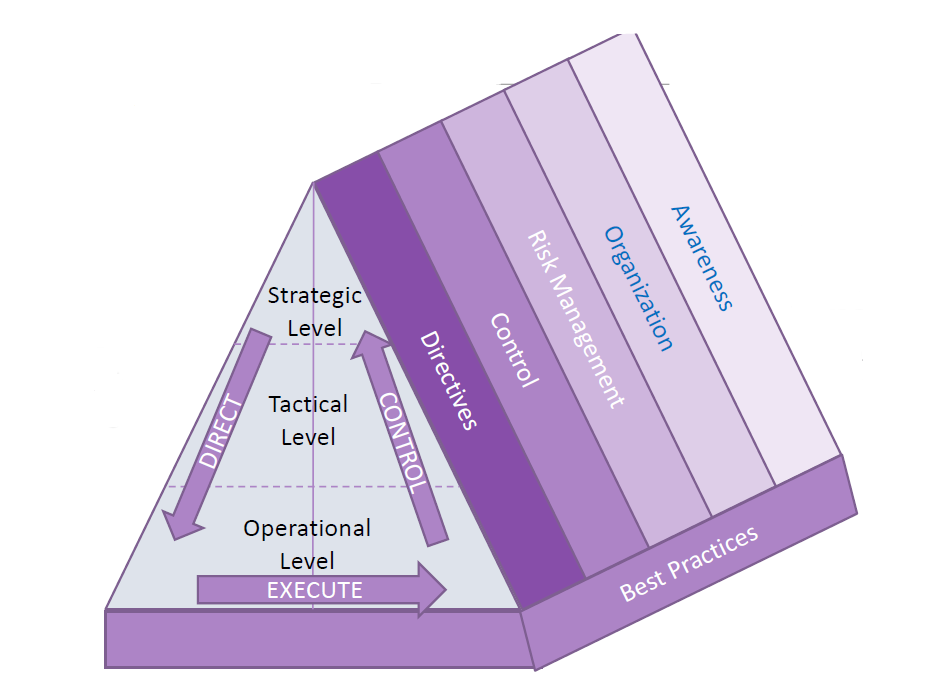
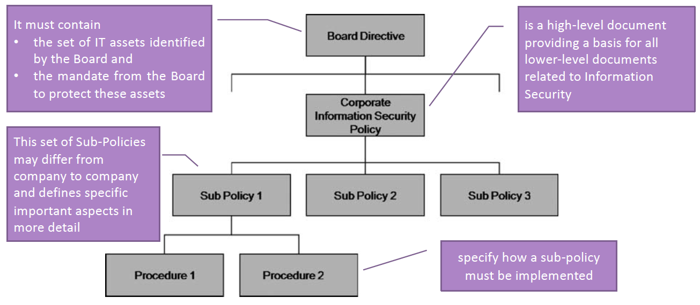
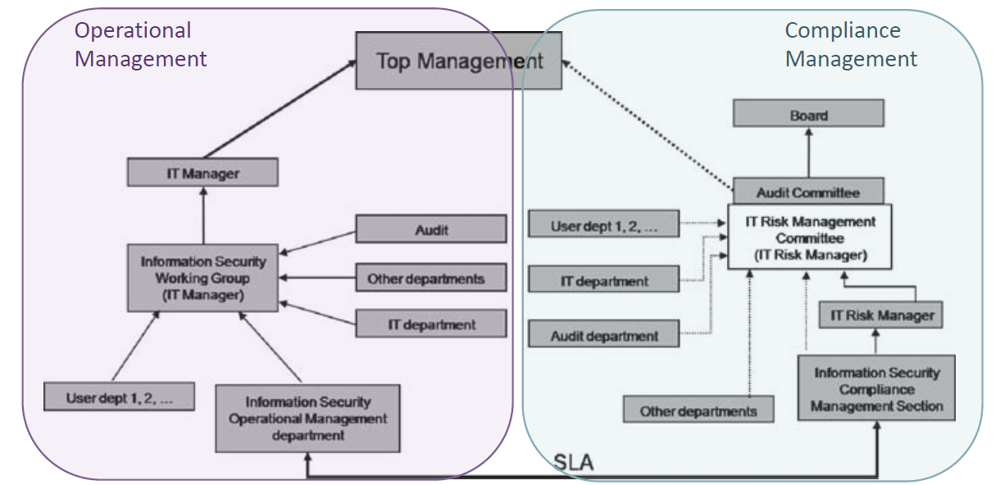

# Lecture 02 (A model for Information Security Governance)

## What is the Imformation Security Governance (ISG)
The ***ISG*** is: "The process of establishing and maintaining a framework and supporting
management structure and processes to provide assurance that information security
strategies are aligned with and support business objectives, are consistent with
applicable laws and regulations through adherence to policies and internal controls,
and provide assignment of responsibility, all in an effort to manage risk."

ISG must ensure cost-effetiveness
- NO OVERPROTECTION causing unecessary expenses
- NO UNDERPROTECTION causing risk to materialize and inpact the company

### The Front dimension - Core part
It represents the execution of processes and actions and the influence of the
Direct and Control loop on these processes. It is based on two core principles:

1. It covers the 3 well known level of management (strategic, tactical, operational) (what, how, things done)
2. Across these three levels there are very distinc actions (Direct, Execute and Control).

#### Direct part

|                                         | STRATEGIC                                                                                                                                                        | TACTICAL                                                                                                                                                       | OPERATIONAL                                                                                                                                            |
|-----------------------------------------|------------------------------------------------------------------------------------------------------------------------------------------------------------------|----------------------------------------------------------------------------------------------------------------------------------------------------------------|--------------------------------------------------------------------------------------------------------------------------------------------------------|
| What does it mean  Direct at this level | Identify assets, their relevance and their required level of protection                                                                                          | Directives are ‘expanded’ into sets of relevant information security policies, company standards and procedures                                                | Inputs are expanded into sets of administrative guidelines and administrative procedures and technical measures are physically implemented and managed |
| INPUT                                   | - External factors (legal and regulatory prescriptions and other external risks) - Internal factors (company’s strategic vision, IT role, competitiveness, etc ) | - a set of Directives indicating (at high level) what the Board expects must be done as far as the protection of the company’s information assets is concerned | - policies, procedures and standards                                                                                                                   |
| OUTPUT                                  | - a set of Directives indicating (at high level) what the Board expects must be done as far as the protection of the company’s information assets is concerned   | - policies, procedures and standards                                                                                                                           | - operating procedures specifying how things must be done. It forms the basis of execution on the lowest level                                         |

#### Control part 
> “you can only manage what you can measure”

- To properly Control (manage) we need to measure…
- To measure, we need to know which information and data to collect

This ‘measurability’ characteristic must be at the centre of all directives, policies,
standards and procedures produced during the ‘Direct’ part of the model

|                                          | OPERATIONAL                                                                                    | TACTICAL                                                                                               | STRATEGICAL                                                                                        |
|------------------------------------------|------------------------------------------------------------------------------------------------|--------------------------------------------------------------------------------------------------------|----------------------------------------------------------------------------------------------------|
| What does it mean  Control at this level | measurement data is extracted from a wide range of entities (either automatically or manually) | measurement and monitoring against the requirements of the relevant policies, procedures and standards | Situational Awareness                                                                              |
| INPUT                                    | Measurements                                                                                   | Specialized reports can be created on this level using this extracted operational data.                | Tactical Management reports, indicating levels of compliance and conformance                       |
| OUTPUT                                   | Specialized reports can be created on this level using this extracted operational data.        | Tactical Management reports, indicating levels of compliance and conformance                           | Reports reflecting compliance and conformance to relevant directives including risk considerations |

### ISO 27002
Is an international standard designed to ne used by organization that intend to:

1. select controls within the process of implementing an Information Security Management System based on ISO/IEC 27001
2. implement commonly accepted information security controls
3. develop their own information security management guidelines

- **Control**: Defines the specific control statement, to satisfy the control objective.
- **Implementation Guidance**: Provides more detailed information to support the implementation of the control and meeting the control objective. The guidance may not be entirely suitable or sufficient in all situations and may not fulfil the organization’s specific control requirements.
- **Other Information**: Provides further information that may need to be considered, for example legal considerations and references to other standards. If there is no other information to be provided this part is not shown

### ISO 27001
It is an International Standard and specifies the requirements for establishing,
implementing, maintaining and continually improving an ISMS within the context
of the organization.

It also includes requirements for the assessment and treatment of information
security risks tailored to the needs of the organization.

The requirements set out in this International Standard are generic and are
intended to be applicable to all organizations, regardless of type, size or nature.

### ISO 27001 vs ISO 27002
**ISO 27001**: very specific and strict, and spells out, in detail, what a company must comply 
with and have in place to be formally certified.

**ISO 27002**: is a ‘guideline’ document, and advises companies on what they should have
in place as far as their Information Security Management is concerned, in
order to follow ‘Best Practice

guides a company to structure its Information Security Management
according to the experience of other companies

rather high level, and does not drill down to very detailed specifics

## The Depth Dimension - Expanded Part

### Directive
**Objective**: To provide management direction and support for information security 
in accordance with buisness requirements and relevant laws and regulations

**Information Security Policy Architecture (ISPA)**

In order to comply with the requirements of having a documented Direct process, it is
important to define a methodology to create, manage and distribute policy related
documents.

**Corporate Information Security Policy (CISP)**

1. The CISP must indicate Board and executive management support and commitment and it must be clear that the CISP flows from a higher-level directive
2. The CISP must be accepted and signed by the CEO or equivalent officer
3. The CISP must not be along document, nor must it be written in a technical form.
4. The CISP should not change very often, and must be ‘stable’
5. For the reason mentioned above, the CISP must not contain any references to specific technologies, and must be ’technology neutral’
6. The CISP must indicate who is the owner of the Policy, and what the responsibilities of other relevant people are
7. The CISP must clearly indicate the Scope of the Policy, that is, all people who will be subject to the Policy
8. The CISP must refer to possible (disciplinary) actions for non-conformance to the CISP and its lower-level constituent policies
9. The CISP must be distributed as widely as possible in the company, and must be covered in all relevant awareness courses
10. The CISP must have a Compliance Clause

### Control
Compliance check is the main scope of the Control part of the model.

**Objective**: To avoid breaches of legal statutory, regulatory or contractual obligations 
related to information security and of any security requirements.

**Compliance Clauses**
Compliance clauses need to be provide a clear metric that can be
evaluated and assessed

Traditionally, Compliance monitoring is done by performing periodic ICT Audit
sessions
- ICT risks are evaluated
- An audit report is produced and its results compared with compliances clauses

Unfortunately, specifying compliance clauses in not an exact science and very
few guidelines are available.

Some of them are:
- Compliance Clauses must be clear and precise (e.g., a clause like “Employees must take 
  Information Security seriously” is vague… What does it mean “seriously”?)
- Compliance Clauses should express a way to measure its satisfaction

### Risk management
Risk Management is the process to identify and assess all potential risks as well as
introducing controls that should mitigate all these risks to acceptable low levels.

Today, in most circumstances, risk has two factors associated with it:
- a probability or frequency aspect
- a magnitude of gains or losses (impact) aspect

Thus, the aim of risk management is to determine:
1. what the impact will be if the risk does materialize and
2. how often (probability or frequency) this risk might materialize

Risk = Threat * Probability * Impact = Likelihood * Impact

**How reduce the risk?**
1. Reduce the potential impact or the risk
2. Reduce the probability or frequency of the risk
3. A combination of both of the above

### Organization
In any company, the way Information Security is organized is very important

An approach for organization of Information Security is that there must be at
least two components in the organization
1. One looking after the day-to-day operational aspects related to it,
2. one which is responsible for the compliance monitoring function

Activities included in this dimension are, for example:
1. Logical access control management
2. Identification and authentication management. i.e., the real actions of adding to, changing and deleting from the user ID database and password files
3. Firewall management
4. Virus and malicious software management. i.e., installing and updating antivirus software;
5. Handling antivirus and related types of security incidents
6. Setting and updating the security settings and configurations of workstations and servers
7. Ensuring availability through UPS systems
8. Ensuring backups and secure storage of backups

### Awarness (Consapevolezza)

Recall: All the levels are involved in the Information Security Governance Process

Information Security procedures, guidelines and practices must be drafted and
conveyed to ALL users of information and IT in the organization.

Thus, ALL information workers must be made aware (and trained) of the
Information Security policy as well as the associated procedures, guidelines and
practices.

**Information Security Education, Training and Awareness (SETA) should be extensions of the general knowledge that employees already have to do their jobs.**
The objective is to teach each of them to do their jobs securely.

The objectives of a SETA Programme are to:
1. Improve awareness of the importance and need to protect organizational information resources;
2. Acquire the necessary skills and know-how to do their jobs more securely;
3. Create an understanding and insight into why it is important to protect organizational information assets.

#### The Conscious Competence Learning Model

**Consciouns**: saper fare la cosa;
**Competence**: saper fare la cosa in maniera sicura.
