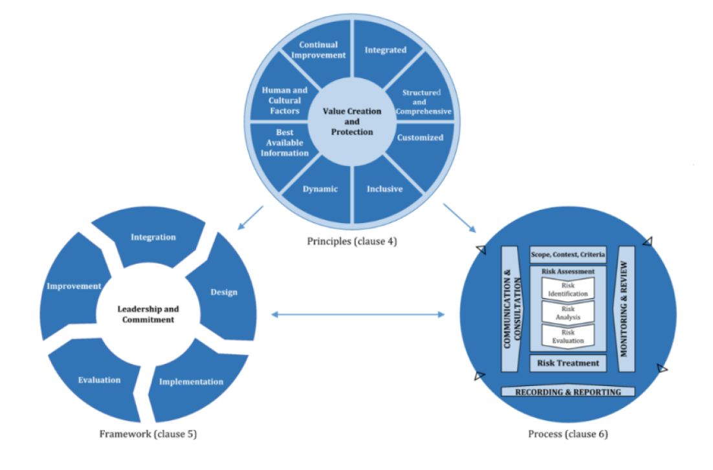
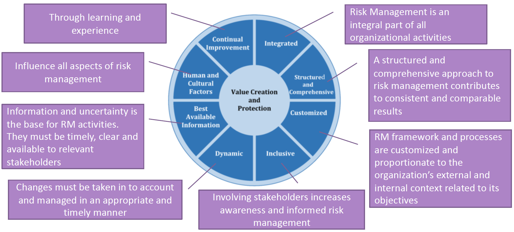
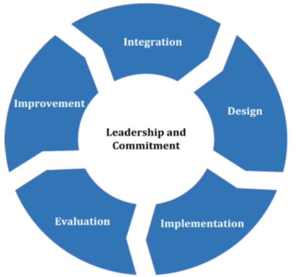
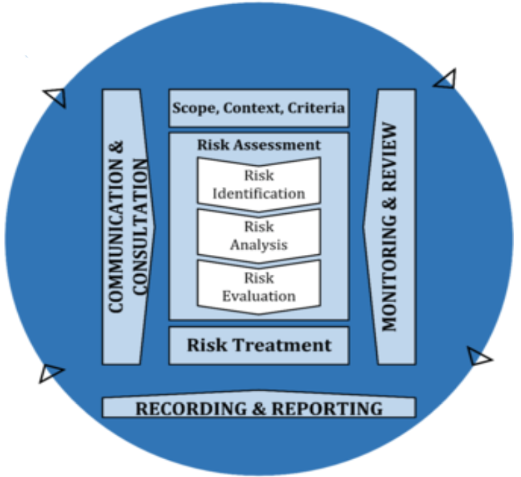
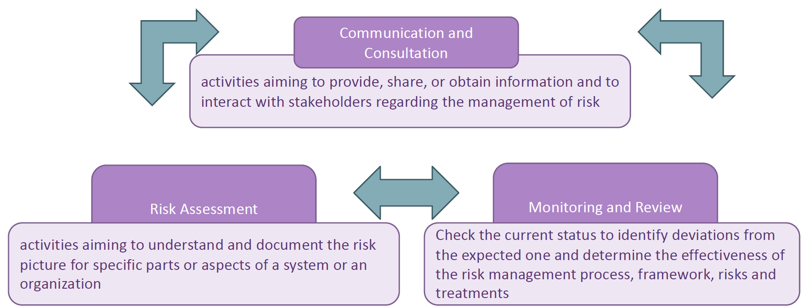
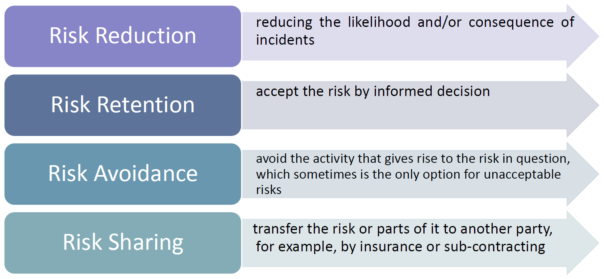

# Lecture 04 (AN INTRODUCTION TO RISK MANAGEMENT)

Informally a risk is the potential that something goes wrong and thereby causes harm or loss.

More formally a risk is the likelihood of an incident and its consequence for an asset

**Rischio**: la probabilita che qualcosa accada;
**Incidente**: è un evento che danneggia e riduce il valore di un bene;
**Conseguenze**: è l'impatto che un incidente ha su un assessment;
**assessment**: qualsiasi cosa di valore per l'azienda.

## A Standard for Risk Management: ISO 31000

ISO 31000 provides guidelines on managing risk. Can be customized to any organization and its context. 

It can be used throughout the life of the organization and can be applied to any activity, including decision-making at all levels. **ISO 31000 cannot be used for certification purposes**, but does provide guidance for internal or external audit programmes.

Last Release was in 2018 and it is composed of three main parts: principles, framework and processes.

### ISO 31000 - principles

The main **principles** that are common for all the ones are **value creation and protection**. Because we want to reduce the loss of our company in terms of money caused by the incident. So **we need to know what is a value** for our company and **how to protect it from damage**.

### ISO 31000 - framework

The **purpose** of the framework is to **assist** the organization in integrating risk management **into significant activities and functions**. 

The **effectiveness depends on the framework integration into the governance of the organization**, including decision-making.

We can se the framework as a cycle composed by 5 activityies.
And at the center there are **Leadership and commitment**

Leadership and commitment means that all the steps are supported if there is a leader in the process and all the people in the organization are committed to risk management.

Customization is fundamental because all the organizations are different. The ISO suggests the steps but the organization has to decide how and when to implement them.

### ISO 31000 - processes

This part **suggests how to structure processes** involved in the risk management activities.

There are the collateral tasks as “**communication and consultation**” and the “**monitoring and review**” process that are **vertical for the entire process**, it is used during the entire process and there is another collateral task, the “recording and reporting” part that is fundamental for the process itself.

The real management activities is the central part defined by: “Scope, Context, Criteria” (also called “Context establishment”), “Risk Assessment” (also divided into “Risk Identification”, “Risk Analysis” and “Risk Evaluation”) and “Risk Treatment”.

### Risk Management General Process

#### Communication and Consultation
The communication and consultation process is composed by 4 sub process:
- **Establish a Consultative Team**: We need to identify which are the parties that should be involved in the process. So who are the person that should be contancted and should participate in the activityies. It includes:
  - Identify the stakeholders
  - Identify a communication procedure 
  - Role and responsability
  - All this is formalized in Communication and Consultation Policies.  
- **Define a Plan for Communication and Consultation**. In this case we need to indentify the way in wich the communicaton will be spread.
- **Ensure Endorsement of the Risk Management Process**
  - good procedures for communication and consultation help to ensure endorsement of and support for the risk management process
  - it is important to achieve a common agreement on and mutual understanding of how risk should be managed
- **Communicate Risk Assessment Results**. Communicating the results helps those with a vested interest to understand the basis on which decisions are made and why particular actions are required. This, in turn, helps to ensure endorsement of risk treatment plans from key stakeholders.

#### Risk Assessment
The risk assessment process is divided in 5 steps:

- Step 1: Context Establishment
- Step 2: Risk Identification
- Step 3: Risk Analysis
- Step 4: Risk Evaluation
- Step 5: Risk Treatment

##### Context Establishment 
GOAL **Identify** and **Describe** the Context of the Risk Assessment process

We need to identify (and document) the context relevant for the assessment and this can be splitted in:
- **external context**: description of societal, legal, regulatory, and financial environment and of the relationships with external stakeholders
- **internal context**: description of relevant goals, objectives, policies, and capabilities that may determine how risk should be assessed

##### Risk Identification

Risk identification is the **set of activities aiming to identify, describe, and document risks and possible causes of risk**.

A risk is always associated with an incident and there are three elements without which there can be no risk.

- **Without assets** (element to be impacted that has value for the organization) there is nothing to harm, 
- **Without vulnerabilities** (what can be exploited by the attacker for creating the damage) there is no way to cause harm 
- **Without threats** (the way that the attacker can exploit the vulnerability) because there are no way to exploit the vulnerability or nobody is intended to damage the asset, there are no causes of harm.

So we have to conduct the risk identification with respect to the identified assets by identifying threats and understanding how the threats may lead to incidents (and thereby risks) by exploiting vulnerabilities

##### Risk Analysis

The **risk analysis is the activity aiming to estimate and determine the level of the identified risks**.

The risk level is derived from the combination of the likelihood and consequence (impact)

Likelihood estimation is to determine the frequency or probability of incidents to occur using the defined likelihood scale

It requires the use of techniques for gathering empirical data. Many of the risk-modelling techniques (i.e., Bayesian networks, attack trees, and CORAS diagrams) support the likelihood estimation and documentation. Usually an organization uses reports generated by other companies or cyber security companies in order to estimate the probability of a particular event such as phishing attacks, DDoS or whatever.

Very often, because it is a difficult task, we are going to understand how risks are most likely to arise, and which threat sources are most important. And in this way we try to estimate the likelihood that threat sources initiate threats and try to estimate the likelihood that such threats may lead to incidents

The consequence estimation should be conducted by a walk-through of all identified incidents and assigning the estimates with the involvement of personnel representing the party or someone who can judge consequences on behalf of the party. Because we have to always keep in mind that the consequences must be evaluated in the terms of money or time lost with a business perspective.

##### Risk Evaluation
The risk evaluation is the **set of activities involving the comparison of the risk analysis results with the risk evaluation criteria to determine which risks should be considered for treatment**.

##### Risk Treatment
The risk treatment is the **set of activities aiming to identify and select means for risk mitigation and reduction**.

In principle, we should seek to treat all risks that are unacceptable, but in the end this **is a question of cost and benefit**, no matter the risk level. If a low risk is very cheap to eliminate, we might do so even if the risk in principle is acceptable and if the **cost of treating a very high risk is unbearable** there may be no other option than to **accept it**.

The risk treatment activity, therefore, should **involve both the identification and the analysis of treatments**. The analysis should take into account that **some treatments can create new risks**, and that **some groups of treatments can reduce the isolated effect of each other**.

There are four main options for risk treatment:

##### Monitoring and Review

Monitoring is the continual checking, supervising, critically observing, or determining the current status **in order to identify deviations from the expected or required status**.

The **review** activity is to determine the suitability, adequacy, and effectiveness of the risk management process and framework, as well as risks and treatments.